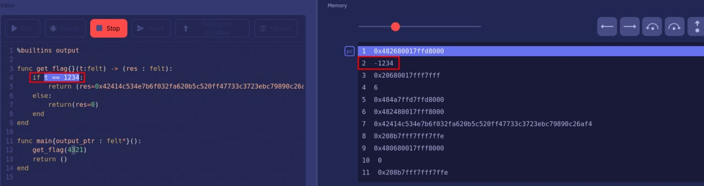

## 题目

Simple cairo reverse

starknet-compile 0.9.1

[:material-download: `cairo_reverse.zip`](static/cairo_reverse.zip)

## 解题思路

- `get_flag` 需要知道 `t` 的值，试图直接在 `contract_compiled.json` 找 `t` 来获得对应值无果
- [Cairo Playground](https://www.cairo-lang.org/playground/) 可以进行编译调试，发现 `Memory` 部分与 `contract_compiled.json` 中 `program` 的 `data` 部分高度相似
- 替换 `CENSORED` 部分为任意值，使用 Playground 调试 `get_flag`，可知 `0x800000000000010fffffffffffffffffffffffffffe2919e3d696087d12173e` 对应 `t` 的负值

    ```cairo
    %builtins output

    func get_flag{}(t:felt) -> (res : felt):
        if t == 1234:
            return (res=0x42414c534e7b6f032fa620b5c520ff47733c3723ebc79890c26af4 + t*t)
        else:
            return(res=0)
        end
    end

    func main{output_ptr : felt*}():
        get_flag(4321)
        return ()
    end
    ```

    

- Cairo 中整型的范围在 $[0, P)$，其中 $P$ 为素数，标准值为 $2^{251}+17\cdot 2^{192} + 1$[^1]
- 通过模 $P$ 来求 `t`

    ```py
    >>> from Crypto.Util.number import long_to_bytes
    >>> base = 0x42414c534e7b6f032fa620b5c520ff47733c3723ebc79890c26af4
    >>> P = 2 ** 251 + 17 * 2 ** 192 + 1
    >>> mt = 0x800000000000010fffffffffffffffffffffffffffe2919e3d696087d12173e
    >>> t = -mt % P
    >>> long_to_bytes(base + t * t)
    b'BALSN{read_data_from_cairo}'
    ```

- 当然也可以使用 [thoth](https://github.com/FuzzingLabs/thoth) 来 Decompile

### Flag

> BALSN{read_data_from_cairo}

[^1]: [Introduction to Cairo — Field elements](https://www.cairo-lang.org/docs/how_cairo_works/cairo_intro.html?highlight=integer#field-elements)