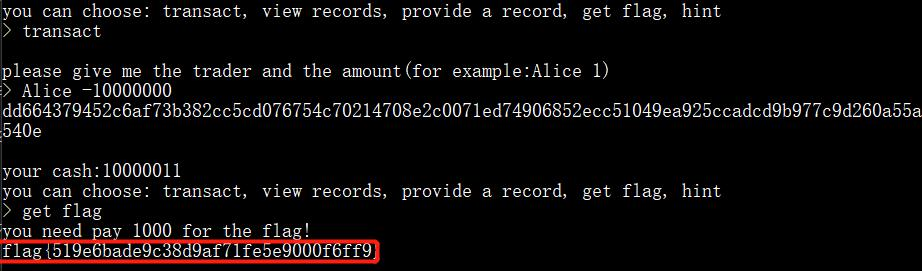

## 解题思路

- `nc`连过去，要求输入三个字符， 其与剩下的随机字符串进行 SHA256 加密的结果等于等号后的随机字符串
    ```bash
    $ nc 39.101.134.52 8005
    sha256(XXX+f2DXa00fbrrtXrZAV) == fad0b6f4dc03f907b999f15db8b467b17139189d2cc61f9fc37e213d91d0a2aa
    Give me XXX:
    ```
- 使用 Python 破解
    ```py
    from hashlib import sha256
    import itertools

    table = 'abcdefghijklmnopqrstuvwxyzABCDEFGHIJKLMNOPQRSTUVWXYZ0123456789'

    for ch in itertools.permutations(table, 3):
        m = ''.join(ch) + 'f2DXa00fbrrtXrZAV'
        h = sha256(m.encode()).hexdigest()
        if (h == 'fad0b6f4dc03f907b999f15db8b467b17139189d2cc61f9fc37e213d91d0a2aa'):
            print(m[0:3])
    ```
- 进入系统后，要求输入名字，随便输一个就可以
    ```bash
    Welcome to the challenge!


    give me your name:yanhui

    your cash:10
    you can choose: transact, view records, provide a record, get flag, hint
    ```
- 首先选择`get flag`查看，提示现金不足
  ```bash
  > get flag
  you need pay 1000 for the flag!
  don't have enough money!
  ```
- 查看`hint`，给出了`transact`的加密方式
    ```bash
    def transact_ecb(key, sender, receiver, amount):
        aes = AES.new(key, AES.MODE_ECB)
        ct = b""
        ct += aes.encrypt(sender)
        ct += aes.encrypt(receiver)
        ct += aes.encrypt(amount)
        return ct
    ```
- `view records`给出的是经过加密的交易记录，`provide a record`则给出`My system is secure if you can give me other records, the receiver can also get the money.`
- 首要目标是要获得足够的现金，看看交易
    ```bash
    > transact

    please give me the trader and the amount(for example:Alice 1)
    > Alice 1
    16afee8cc0a88bf0478fefe229e68418a9a0627e2da31f1d055e01d7000a3b3a1794bbe06d2ed80b02b1c90ba2c4606f

    your cash:9
    you can choose: transact, view records, provide a record, get flag, hint
    > transact

    please give me the trader and the amount(for example:Alice 1)
    > Alice 0
    16afee8cc0a88bf0478fefe229e68418a9a0627e2da31f1d055e01d7000a3b3ab55eefd708d39ed2b4ce4d561c34e5ec

    your cash:9
    ```
- 输入金额为 $0$ 的话，交易也可以成功进行！尝试一下负数，看能不能获得现金
    ```bash
    > transact

    please give me the trader and the amount(for example:Alice 1)
    > Alice -1
    dd664379452c6af73b382cc5cd076754c70214708e2c0071ed74906852ecc510f2f0bd5754e02a2b03c635178e0200c5

    your cash:11
    ```
- 发现可以成功增加持有现金，并没有被过滤之类的，获得足够现金之后就可以『购买』Flag 了！【之前还以为要考虑 ECB 加密……】
