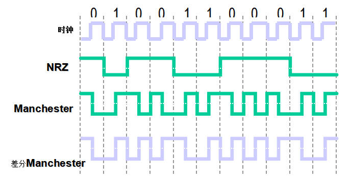

## 解题思路

- 给了一串密文 `2559659965656A9A65656996696965A6695669A9695A699569666A5A6A6569666A59695A69AA696569666AA6` 和一张提示图片<br>

- 图片里是 01 串，不管怎么说先把密文按十六进制转换成二进制字符串吧！
    ```
    0010010101011001011001011001100101100101011001010110101010011010011001010110010101101001100101100110100101101001011001011010011001101001010101100110100110101001011010010101101001101001100101010110100101100110011010100101101001101010011001010110100101100110011010100101100101101001010110100110100110101010011010010110010101101001011001100110101010100110
    ```
- 接着，是图片里最明显的 Manchester 编码的解码。有点奇怪，有一位没解出来？(ΦˋωˊΦ)问题不大，反正只有两种情况，要么是 0，要么是 1
    ```
    ?1000010010010100100010001111011010001000110100101100110010011010110000101101110011000110110100001100101011100110111010001100101011100100110001101101111011001000110010101111101
    ```
- 当第一位填 0 时，转换成十六进制再对应到 ASCII 码可得 Flag：`BJD{DifManchestercode}`