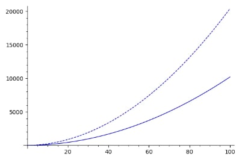

## 解题思路

- 在 PoW 之后有两个判断，枚举一下就可以知道答案

    ```
    Hello Everyone, let's start to learn Equations!
    Now I have an elliptic curve equation: (x+1)^2 == 2(y+1)^2 - 3^2
    First, tell me if there is a solution to this equation?[Y/N] Y
    Great!
    Then, tell me whether this equation has an infinite number of solutions?[Y/N] Y
    Very well!
    ```

- 接下来才是重点，需要给出 $202$ 组解 ΣΣΣ(Φ ωΦ||¡)

    ```
    Now, please find me the solutions to 202 point{(x, y) where x > 0, y > 0}
    ```

- 一开始以为是根据 `elliptic curve equation: (x+1)^2 == 2(y+1)^2 - 3^2` 找对应椭圆曲线及其上的点，但是椭圆曲线一般是 $y^2=x^3+ax+b$ 的形式，$(x+1)^2 == 2(y+1)^2 - 3^2$ 怎么变形都不像
- 后来意识到椭圆曲线方程可能指点的坐标为整数，直接用 `z3` 解方程应该行

    ```py
    from z3 import *
    x, y = Ints('x y')
    s = Solver()
    s.add((x + 1) ** 2 == 2 * (y + 1) ** 2 - 9)
    s.add(x > 0, y > 0)
    for _ in range(202):
        s.check()
        m = s.model()
        print(f'{m[x]}, {m[y]}')
        s.add(x > m[x], y > m[y])
    ```

- 但是获得了几组解之后，速度就慢下来了 :( 想着画一下曲线图（其实没必要 > <），总之就是两条增长速度不一样的曲线

    ```sage
    g1 = plot((x + 1) ** 2, 0, 100)
    g2 = plot(2 * (x + 1) ** 2 - 9, 0, 100, linestyle="--")
    (g1 + g2).show()
    ```

    

- 再回过头看看已经获得的解，很有规律的感觉(ŏωŏ)

    ```
    (2, 2)
    (20, 14)
    (122, 86)
    (716, 506)
    (4178, 2954)
    (24356, 17222)
    ```

- 当 $i\ge 2$ 时，满足 $x_i=6\times x_{i-1}-x_{i-2}+4$, $y_i=6\times y_{i-1}-y_{i-2} + 4$

```py
from hashlib import md5
import itertools
import pwn

table = 'abcdefghijklmnopqrstuvwxyzABCDEFGHIJKLMNOPQRSTUVWXYZ0123456789'

conn = pwn.remote('39.104.61.18', 12113)
target = conn.recvline_contains('md5').decode().strip()
base = target[target.find('+') + 2:target.find(')')]
target = target[-5:]

for ch in itertools.permutations(table, 4):
    m = ''.join(ch) + base
    h = md5(m.encode()).hexdigest()
    if (h[:5] == target):
        conn.sendafter('>', f'{m[:4]}\n')
        break

conn.sendafter('equation?[Y/N]', 'Y\n')
conn.sendafter('solutions?[Y/N]', 'Y\n')

ans = [(2, 2), (20, 14)]
while len(ans) < 202:
    x, y = (ans[-1][0] * 6 - ans[-2][0] + 4), (ans[-1][1] * 6 - ans[-2][1] + 4)
    ans.append((x, y))

for r in ans:
    conn.sendafter('x=', f'{r[0]}\n')
    conn.sendafter('y=', f'{r[1]}\n')
    print(conn.recvline())
conn.interactive()
```