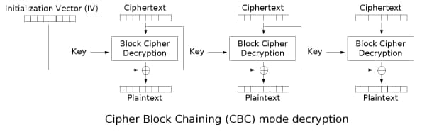
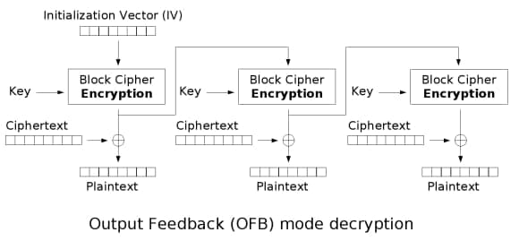
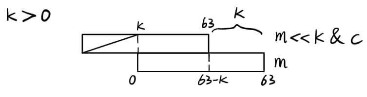
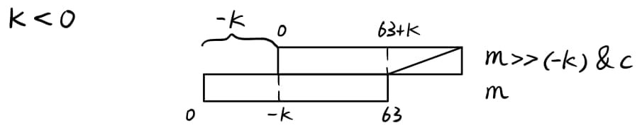

## 题目

Block cipher is used frequently.

??? note "easyxor.py"

    ```py
    #! /usr/bin/env python
    from Crypto.Util.number import bytes_to_long, long_to_bytes
    from random import randint, getrandbits


    def shift(m, k, c):
        if k < 0:
            return m ^ m >> (-k) & c
        return m ^ m << k & c


    def convert(m, key):
        c_list = [0x37386180af9ae39e, 0xaf754e29895ee11a, 0x85e1a429a2b7030c, 0x964c5a89f6d3ae8c]
        for t in range(4):
            m = shift(m, key[t], c_list[t])
        return m


    def encrypt(m, k, iv, mode='CBC'):
        assert len(m) % 8 == 0
        num = len(m) // 8
        groups = []
        for i in range(num):
            groups.append(bytes_to_long(m[i * 8: (i + 1) * 8]))
        last = iv
        cipher = []
        if mode == 'CBC':
            for eve in groups:
                cur = eve ^ last
                cur_c = convert(cur, k)
                cipher.append(cur_c)
                last = cur_c
        elif mode == 'OFB':
            for eve in groups:
                cur_c = convert(last, k)
                cipher.append(cur_c ^ eve)
                last = cur_c
        else:
            print 'Not supported now!'
        return ''.join([hex(eve)[2:].strip('L').rjust(16, '0') for eve in cipher])


    if __name__ == '__main__':
        from secret import flag
        if len(flag) % 8 != 0:
            flag += '$' * (8 - len(flag) % 8)
        length = len(flag)
        num = length // 8
        keys = [randint(-32, 32) for _ in range(4)]
        IV = getrandbits(64)
        front = flag[:length // 2]
        back = flag[length // 2:]
        cipher1 = encrypt(front, keys, IV, mode='OFB')
        cipher2 = encrypt(back, keys, IV)
        print cipher1 + cipher2
    ```

## 解题思路

- 涉及到两种分组密码工作模式：`CBC` 和 `OFB`
- 无论 `CBC` 还是 `OFB` 都可以从第二组密文开始解密（由第一组密文推出第二组 IV），期间可爆破出 `keys`

    
  
  - `CBC` -> 使用第一组密文作为从第二组开始解密的 IV，由于 `Block Cipher Decryption`，需要编写 `convert` 函数的逆过程

    
  
  - `OFB` -> 根据 Flag 格式可知第一组明文为 `ByteCTF{`，与第一组密文异或得从第二组开始解密的 IV
- 由于解密必须使用 (╥ω╥)，逆一下 `convert()` 函数，重点在逆 `shift()` 函数上

    ```py
    def unconvert(m, key):
        c_list = [0x37386180af9ae39e, 0xaf754e29895ee11a, 0x85e1a429a2b7030c, 0x964c5a89f6d3ae8c]
        for t in range(3, -1, -1):
            m = unshift(m, key[t], c_list[t])
        return m
    ```

- `shift()` 函数中移位导致部分位泄漏（当 $k == 0$ 时无法逆推）
  - 当 $k > 0$ 时，结果二进制各个位依次为 $m_0 \oplus m_k \& c，m_1 \oplus m_{k+1} \& c，...，m_{63-k} \oplus m_{63} \& c，m_{64-k}，m_{65-k}，...，m_{63}$<br>

  
  - 当 $k < 0$ 时，结果二进制各个位依次为 $m_0，m_1，...，m_{-k} \oplus m_0 \& c，m_{-k+1} \oplus m_1 \& c，...，m_{63} \oplus m_{63+k} \& c$

  
  - `unshift()` 函数
    ```py
    def unshift(m, k, c):
        if k == 0: return 0    # 返回任意值即可
        res = m
        if k < 0:
            for _ in range(64 // (-k)): # 每一轮可以计算 k 位
                res = m ^ res >> (-k) & c
        else:
            for _ in range(64 // k):
                res = m ^ res << k & c
        assert m == shift(res, k, c)
        return res
    ```

- 解密函数 `decrypt()` 改写自 `encrypt()`
    ```py
    def decrypt(c, k, iv, mode='CBC'):
        assert len(c) % 16 == 0
        num = len(c) // 16
        groups:list = []
        for i in range(num):
            groups.append(int(c[i * 16: (i + 1) * 16], 16))
        last:int = iv
        plain = []
        if mode == 'CBC':
            for eve in groups:
                cur = unconvert(eve, k)
                plain.append(cur ^ last)
                last = eve
        elif mode == 'OFB':
            for eve in groups:
                cur = convert(last, k)
                plain.append(cur ^ eve)
                last = cur
        return ''.join([long_to_bytes(eve).decode() for eve in plain])
    ```

- 四重循环爆破密钥，通过 `OFB` 或 `CBC` 模式都可以，获得密钥数组：`[-12, 26, -3, -31]`
    ```py
    cipher = "89b8aca257ee2748f030e7f6599cbe0cbb5db25db6d3990d3b752eda9689e30fa2b03ee748e0da3c989da2bba657b912"
    length = len(cipher)
    cipher1 = cipher[:length // 2]
    cipher2 = cipher[length // 2:]

    for k1 in range(-32, 33):
        for k2 in range(-32, 33):
            for k3 in range(-32, 33):
                for k4 in range(-32, 33):
                    keys = [k1, k2, k3, k4]
                    try:
                        res = decrypt(cipher1[16:], keys, int(cipher1[:16], 16) ^ bytes_to_long(b"ByteCTF{"), 'OFB')
                        # res = decrypt(cipher2[16:], keys, int(cipher2[:16], 16))
                        flag = 1
                        for i in res:
                            if ord(i) not in range(32, 127):    # 过滤含不可打印字符字符串
                                flag = 0
                        if flag:
                            print(res, keys)
                    except:
                        continue
    ```

- 从而可推出 IV 并计算 Flag
    ```py
    keys = [-12, 26, -3, -31]
    out = bytes_to_long(b"ByteCTF{") ^ int(cipher1[:16], 16)
    iv = unconvert(out, keys)
    print(decrypt(cipher1, keys, iv, 'OFB') + decrypt(cipher2, keys, iv))

    # ByteCTF{5831a241s-f30980q535af-2156547475u2t}$$$
    ```

## 参考资料

- [分组模式 - CTF Wiki](https://ctf-wiki.org/crypto/blockcipher/mode/introduction/)