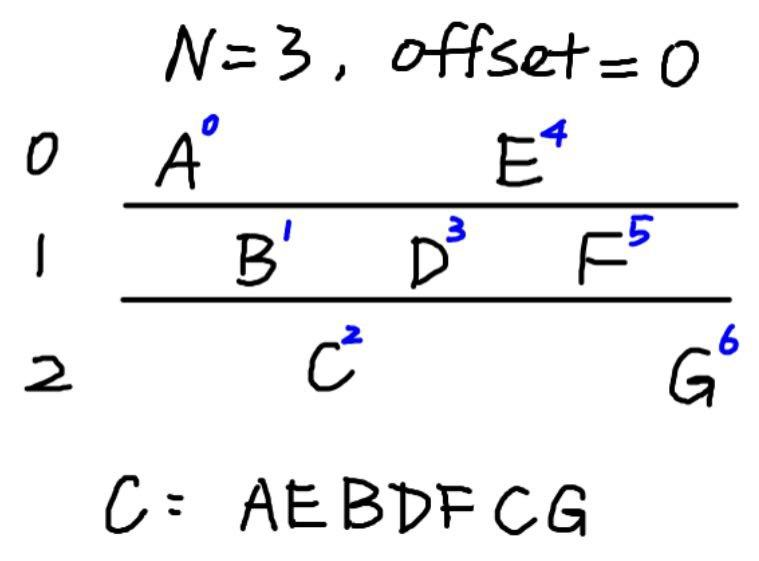
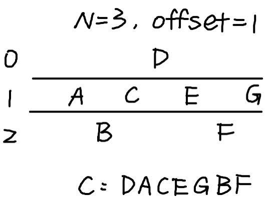
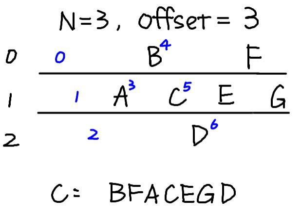

## 题目

{ea-vetgaytereoreh-na}fan--wshbestpasslds-s-hm

## 解题思路

- 由花括号和 `flag` 相关字母推测是置换密码，由此想到「栅栏密码」
- 因为 `{` 在首位，加密的偏移量显然不为 $0$
- 枚举分组长度和偏移量，当分组长度为 $4$，偏移量为 $2$ 时，解出 Flag：`flag{and-yet-swears-he-observes-the-phantasms}`

### 偏移量 Offset

- 明文消息为 $M$，加密时，栅栏密码分组长度 $N$ 可以视为 $N$ 行，偏移量 $x$ 表示从第 $x$ 行开始输入字符 

- 可以扩展到 $N \le x < 2 \times (N - 1)$（当 $x \ge 2 \times (N - 1)$ 时，与 $N \le x < 2 \times (N - 1)$ 包含的情况一致），表示从第 $x$ 个位置（按照没有偏移量时的输入位置）开始输入字符 

## 参考资料

[Rail Fence, Zig-Zag - online encoder / decoder](https://calcoolator.eu/fence-cipher-encoder-decoder-)