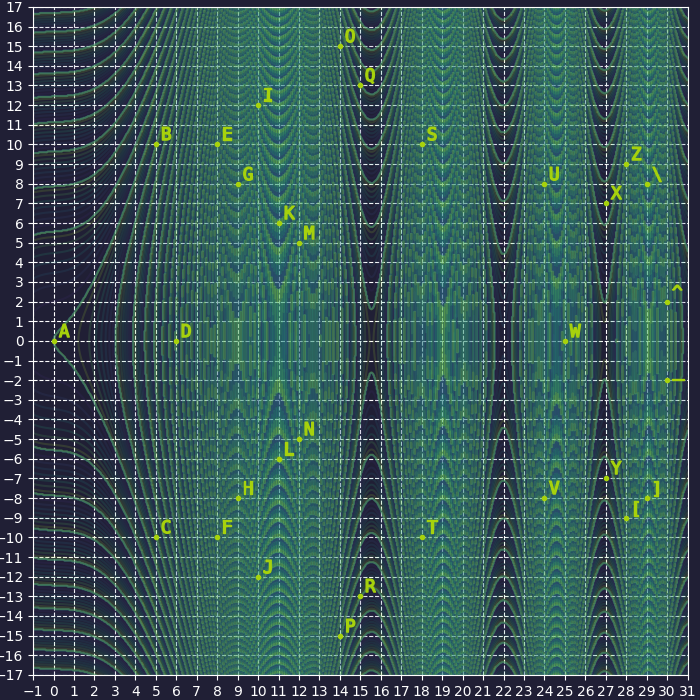

## 题目

Цезарь скривился,<br>
Замкнулся в себе.<br>
Преумножение. 

> Caesar curved, closed in on himself. Multiplication.



```
rzua]o^]tahf]ie]kiho^z]niru]ha^ogn]doak]i[]g[uff]iop^atpe[paz[[tapzetd
```

## 解题思路 [English ver.](https://sekai.team/blog/ugra-ctf-quals-2022/noteasy03/)

- 根据题目 `curved`/`closed in on himself` 和图片，推测应该是某种曲线，且所有点在曲线上都能找到对应点
- 分析密文，结合 `flag` 的格式，得到以下映射关系。再结合 `Caesar` 推测是单表代换

    ```
    r -> u
    z -> g
    u -> r
    a -> a
    ] -> _
    ```

- 排除常见的单表代换密码（都是线性的），最后想到了椭圆曲线
- 尽管点分布的形状似乎和实数域的椭圆曲线不搭边，但若考虑是在有限域，则图中点集完全符合有限域中椭圆曲线的特性
    - 同时，椭圆曲线上点的逆元可以符合加解密的映射需求
- 根据各点坐标大小可推出有限域大小为 $31$
- 通过 [在线椭圆曲线可视化工具](https://www.desmos.com/calculator/ialhd71we3) 寻找椭圆曲线系数的大致范围
    - 关键特征：三个点位于 $x$ 轴，一个点位于 $(0, 0)$
- 再结合有限域和已知点的坐标确定椭圆曲线系数 $a=-5,b=0$

    ```py
    from Crypto.Util.number import *

    ps = [(0, 0), (5, 10), (5, 21), (6, 0), (8, 10), (8, 21), (9, 8), (9, 23), (10, 12), (10, 19), (11, 6), (11, 25), (12, 5), (12, 26), (14, 15), (14, 16), (15, 13), (15, 18), (18, 10), (18, 21), (24, 8), (24, 23), (25, 0), (27, 7), (27, 24), (28, 9), (28, 22), (29, 8), (29, 23), (30, 2), (30, 29)]

    for a in range(-5, 0):
        for b in range(-4, 5):
            if 4 * a**3 + 27 * b**2:
                E = EllipticCurve(Zmod(31), [a, b])
            else: continue
            f = 1
            for p in ps:
                try: E(p[0], p[1])
                except:
                    f = 0
                    break
            if f: print(a, b)
    ```

- 根据 `Caesar` 和 `Multiplication` 推测点的映射为椭圆曲线中的点乘，系数为 $3$，然而解密的结果是一堆乱码 :(
- 最早的凯撒密码为移 $3$ 位，后来扩展为移位密码。于是尝试改变系数，当系数为 $11$ 时成功获得 Flag XD

    ```py
    from Crypto.Util.number import *

    cipher = 'rzua]o^]tahf]ie]kiho^z]niru]ha^ogn]doak]i[]g[uff]iop^atpe[paz[[tapzetd'

    E = EllipticCurve(Zmod(31), [-5, 0])
    d = {E(0, 0): 'a', E(5, 10): 'b', E(5, 21): 'c', E(6, 0): 'd', E(8, 10): 'e', E(8, 21): 'f', E(9, 8): 'g', E(9, 23): 'h', E(10, 12): 'i', E(10, 19): 'j', E(11, 6): 'k', E(11, 25): 'l', E(12, 5): 'm', E(12, 26): 'n', E(14, 15): 'o', E(14, 16): 'p', E(15, 13): 'q', E(15, 18): 'r', E(18, 10): 's', E(18, 21): 't', E(24, 8): 'u', E(24, 23): 'v', E(25, 0): 'w', E(27, 7): 'x', E(27, 24): 'y', E(28, 9): 'z', E(28, 22): '[', E(29, 8): '\\', E(29, 23): ']', E(30, 2): '^', E(30, 29): '_'}
    res = dict()

    for k, v in d.items():
        res[v] = d[11 * k]

    for c in cipher:
        print(res[c], end='')
    ```

### Flag

> ugra_in_case_of_losing_your_sanity_dial_oh_three_oijnacjfhjaghhcajgfcd