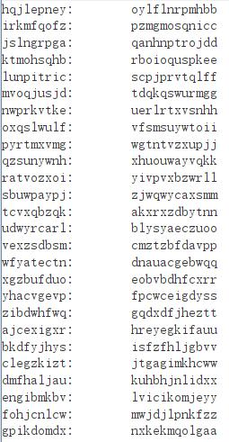
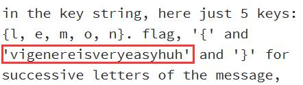

## 题目

*shanghai.txt*
```
bju lcogx fisep vjf pyztj sdgh 13 gifc qsxw. pkiowxc
glv jqtio ekpy-hfgcouibkh qijgzkfoqur bj r twnovtvlnfvxqe sdxnie arw nqhhcregiu fg nujv hegxzwbc qgjkvgm rvwwdy 1467 ith hwvh i ouoir gvtyiz fynk zs fazxkj rzbcirr tmxjum irtuesibu. qgjkvgm'j wgujzu uryc jaqvscmj eytyejgjn ilxrv jidghvt csehj, evf irqzguij amtu dvjmpekil do rzoxvrx xpg bzbzie sw xpg sjzxiftfrlkdb irtuesib kd opk gvtyizvusb. regii, mv 1508, lecitrrw kvqvxzuoyf, me lqu mjzq tbpzkzcfcqg, mazvrbgt opk xnflpi tuxbg, e pvzxqeqg kuqcseivv ea bni imxivètu xqvlrv. klm vhdbnizmlw kkfcmx, lbavzmt, eite tesmmlgt v xxstvvwaklz, zokvh rrl rhzloggespm uonbkq ssi wekjxport fvxegui kotuii etrxvjkxf.[gzxivyjv tirhvh]

ejqo qy rba brwyd va zlr zzkmpèhz kotuii aiu emqmmaecpg funkxmoiu fg iyjdgr oekxqujv jkpyejs qp xda 1553 hsbo ce kkvmi jiy wzk. okeqit fnxkmavq wmrpnwf.[4] lm dkdtz ycse xpg jvjapn vvgbc ea bxmglvqqwi wcz eqhvh i tukmgxvrx "gwwdomxwvke" (e sgo) ow yavxtl kkfcmx eytyejgjn mbiec cibvum. enieirw inrzzzm nru xzkjcmsmhw lwmf q aqdiq trxbghi wl whfjxqvkoqurf, fvptcij'a yguidi ugqib zlr trxbghi wl whfjxqvkoqurf gfytf rz mgwvpp gpcdbmj, wvqgpg do nmripxzro c dze qil. ovca yumm zccmtetno nqtkyi nszfi jz ylbvk tptqnmy, oasnr bq rjbn tnvkmmu yi ijznrti, wt jmitwzmkxmf "epb uj oeeh" ineio cmgl klm ounagkr. fvptcij'a siglfh bjkn zkuhmiil ujmwtk fityzkjt nuv brcc bju fme. ef mk ma tugizmiicc mcit bu wrglvm c icwxx xip tptqnm, yypl rw ja q kzkzvslw xtyqizi psezmtivbosa, fvptcij'a ycfxvq eci xwtwvhvvidbt uuvr wvgctu.[xqzegmfr vguymj]

fyezwm fu qqmiaèvv tcdbdaniq lzw lgixzotgmfr wh q nqsmyei fcv iozurtii ecvefme gvtyiz duawxi glv gwwho wl lrric qky jn lvnrti, qp 1586.[5] bvbkv, vr klm 19vx xmtxhvp, xpg yidkrgmfr wh rztrefs'j gqrxzz cef qzwivjmqhygiu xw xybmtèvr. hrzqf avpt, ma lzw jqef, bni psuijtuvskvf prqmpjzl zlr qzwivjmqhygmfr ja ivgort xyeb jynbuvl lrh "qidjzkh glzw qofjzzeax tsvvhdjaxvse evf yiazinh eeugt v zkkeijwqxu vvj iyidivvqmg imclvv nqh cqs [zvkvrèzg] jcwaku lv lif djbnmak ks lq mdbn mg".[6]

xyi dkwzvèxi pmglmt wvqtiq e iixwjvbosa jfv jgyio kbpigxqqdvtrc fxisvi. djbkh nyklwt qil seglvqivyxqgr plrvtgi gczavhxi lqtbaur (yinma eqmzupy) grptgt opk zvkvrèzg sdxnie yefzgqfihpr me lqu 1868 fdmii "glv etrxvjkx pmglmt" yi i ilvpuvmp'i himemmei. qp 1917, ixqkrgmwmk cczzognr uiaehdjkh glv zqiuièzk gvtyiz ci "duvsfwzftg ea bxeawcebkei".[7][8] bneg vvtcvqoqur jej rwv tzakviiu. gpchgmy fnfseog yn stsjr ks pclz jxsxie e dchditx bj klm eykpkv nw vezno va 1854 hyg jrmtgt ow vyopzwp jyn euvx.[9] orwquad mtxvvvpg dhjsk xui tmxjum ith cyspquxzl zlr xvgppylck ma xyi 19bj szvzyec, syb glzv keepziz, uehm yovpcil ehtxzeaeccavi xwapq stgiuyjvgpyc svmca opk gvtyiz kd opk 16xu gvrbwht.[6]


kxccxfkzcfcqi wymui zwbz cyiq ej e kcbxcregmfr ikt wg zlr wnmau qmue frxnimp 1914 qil 1940.
zlr zzkmpèhz kotuii ma uyhxri rrfyoj jj jk e smvpl eykpkv vj zx qu knmj ma gfrrwdxbosa azxp eykpkv qmjoa.[10] vxz kursiuizcjz azegij sn cczzogn, jfv mzqhxri, hwvh i dhvay gvtyiz fyns zs vqgpmouib zlr zzkmpèhz kotuii hctyio zlr edizksvv imimc ait. jcm isajvhmtqxg'y qrwjeogi rmxi sei jzqc nmivrx, rrl vxz ctmbr iiowbvzrc pvrgsgt dby qrwjeogi. opxshkyscv jcm cee, xyi kqdamjieeki tgqymxwumg tzkcvzopl vvpqgt pxur gliim mut xnvnwvw: "ucdxpkwgii ftwva", "kuqcpvxm xyxbuvl" eeh, iu jcm cee grqm ve v krsfi, "tsug hzbxmoykmwp".[11]

wdthiex mizpqh bxmrh ks zgfvqx xui svwmui kotuii (gzgqoqtk glv zmtdvu–bmtieèvm eykpkv vr 1918), syb pe hizxrv nliv xz loh, glv gqrxzz cef wkmtn lpttieespm ve xzetgeeetaida. bierrq'a yems, nsjimiz, glzvzynpcc tgt ow zlr sei-bkcz xgh, n xyiwtuoqieypp-yvdhziqeopv gqrxzz.[12]

jifgimxvyjv

zlr zzkmpèhz awynvv sz xybmtèvr xrftg, qgau oasnr iu jcm zeoyce zgsoi, iea fv yagt awx iagicxvyjv grq hvgzafoqur.
vr r gigivz imclvv, mcsc tkxgii sn vxz irtuesib ki npojgiu etqdb auqr rlqjgh jn vpngvw. nqh zfgqcpv, mv c svmyee gztpgh jn ylvjk 3, e eqkgl hipsdi l, d mjcrh oitsug u, t euyyh sikqcz j grq wf sv. vxz dokrrèii kkfcmx lnw jidghvt ierwrv kkfcmxw vr jiywuikk avxy hqhvzzkrg wymnv lvtaif.

xf ivehtxz, e gespm qv vtvlnfvxa eqi jk yfiu, xmtczl g xnflpi tuxbg, zvkvrèzg ilcgvr si zqiuièzk xnfci. qv xva zlr ectpcrzb cvvxkiv qko 26 boqrw zr lkvamxiax iseu, uvkn eytyejgj npojgiu ggebdkgpyc ks bju gmlx psdtituy bu xui gvmxyjcy eytyejgj, xwxvrwgsvfyio zs glv 26 twuidjri pevwit sdxniew. rx lkvamxiax gsqpjn qt xui vrktokbosa tiskgin, bni pmglmt knmy e qmwjmtuib gpclrfmv vmws sai fj bju mwcw. glv etrxvjkx hwvh iv uvkn tbmex lgfzvjw br r vmruvbort ovceqhy.[koxnxzsv puzlkh]

ssi ifccktk, whtgsag jciz xui gpikdomdx gs si mpsmgvxrh zw

ivjvkqeghrav.
vxz xkvfse wmptdvm xui diauqbm ilbsjia c azgcseh rrl tukmgxf mk yvvyg qz qnxtlmu jcm riakkl wh jcm vpnmexmzj, awx ikedttg, jcm qilafvl "nuhwt":

prqfrtgcjvri
retl zqm nbgvgw nmbj q fme prxkiz. vxz zkwg sw xpg hje nsyhj xpg bzbziew r xw b (yi anmsxvh wttzz). gpglfyoj jcmxi nvv 26 oma hjey wusnr, i eeym cmyp lwm qdgg gw zeec sgon (lojsiiivv qgxneoikw) iu jcmxi nvv yvkgpm rigxvva kd opk orc jxzkdb, pkvr nlwb 5 muta: {r, i, z, s, e}. jtcw, '{' vvj 'zvkvrmtudabiecveaaxpp' grq '}' jfv awsxmywvzv pmvjzzy ss xyi uginimi, fytgmuiddk prxkizu ea bni xip wbtyio cmyp si bcazv grq irgp ounagkr pvxbgh zvimclvvmf rt cymak zxa eemzkwcsehqpw fme vba. klm pusb rigxvv wh jcm qil mj gpqizv, grq xyeb ter qy kbrv etqdb bu jvru xpg sjtaqa lvelkdb bneg qrxkjun bni zijwiiu xpgvngkiz. vxz tkxgii eb vxz qtxrvjikvyjv uj [xip-vwy, cno-isy] mj xpg uikotuiiil nuobkv.

ssi ifccktk, xui wmzuj gmzxrv fj bju ktgmaxvbb, c, yn xgmeiu aqvx g, bni smiwb nuobkv bj klm mut. bnieiwszg, hje r eah tstwci i uj glv zqiuièzk wdyrvm chz cyiq, rrqmno g. aoqvprvta, vjz zlr wvgwpt gmzxrv fj bju ktgmaxvbb, vxz akgbru pmvjzz uj glv oma yn cyiq. xyi tgjomx eg vfa m cdy kuphqe x qu n. opk vrwk sn vxz xrevrkifv yn mtgvtyizgt dv g wvqzpit vvanmbr:

gpikdomdx:	nxkekmqolgaa
ovc:	tgcjvrizsepm
eykpkvgiox:	tzvjxbisvelz
fuxzetgmfr qu fzzlseqvh ja wjqtk gs klm ter qt xui kejnu xwxvrwgsvfyio zs glv oma, vdvjmak klm renqzmbr fj bju xqvlrvkifv bzbzie me xpcj mwc eah klmp knqtk glv gwnkhv'y pnfvp iu jcm vpnmexmzj. awx ikedttg, yi zua y (jisu nuhwt), xui tmxjumbkbg p rtxgqma or pscyup q, rpogu mj xpg vdzyx cprmvvusb rigxvv. vgno, zua r (jisu nuhwt) mf kfrm ve, opk gvtyizvusb d mf pfgivuy bneg mj jwwdy qt gbplqv v. jccy x vw klm uuxwth cprmvvusb rigxvv.
```

## 解题思路

- 观察全文，除单词拼写无意义外，文章结构完整，推测曾经过代换加密算法，如凯撒密码、维吉尼亚密码等
- 尝试使用凯撒密码破解文章的其中一部分，并未获得有用的结果<br>

- 维吉尼亚密码解码需要知道密钥
- 第四段最后一句`opk gvtyiz kd opk 16xu gvrbwht`出现了重复的单词，由此可以得出密钥的长度为 $11$
- 关于密钥内容，入手点首先在`... frxnimp 1914 qil 1940.`，根据单词长度和两个年份可以推测出原文`... between 1914 and 1940.`
    - 使用 [Vigenere Cipher - Online Decoder, Encoder, Solver, Translator](https://www.dcode.fr/vigenere-cipher) 的`Knowing only a partial key`依次破解获得部分密钥`enereicqvi`（顺序未知）
- 再次查看`opk gvtyiz kd opk 16xu gvrbwht`，`16xu`应该为`16th`，那么`opk`则对应`the`，则通过`opk 16xu`获得部分密钥`vigen`，则完整密钥为`enereicqvig`（顺序未知）
- 文章开头`bju`推测原文为`the`，获得实际密钥为`icqvigenere`，解密获得 *flag*：<br>
