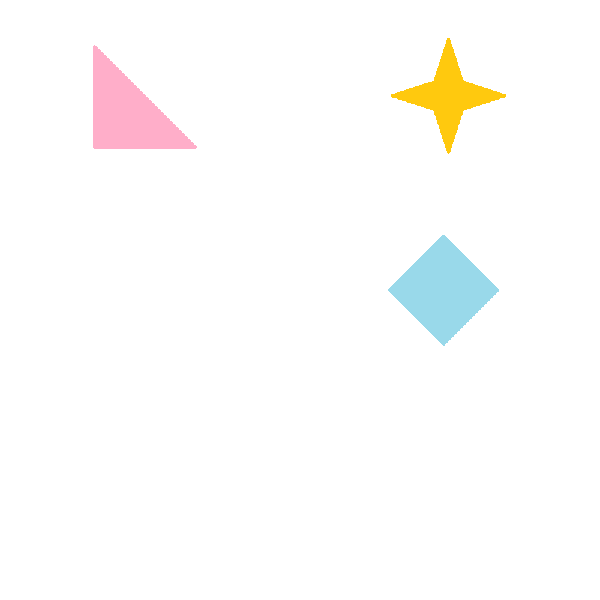
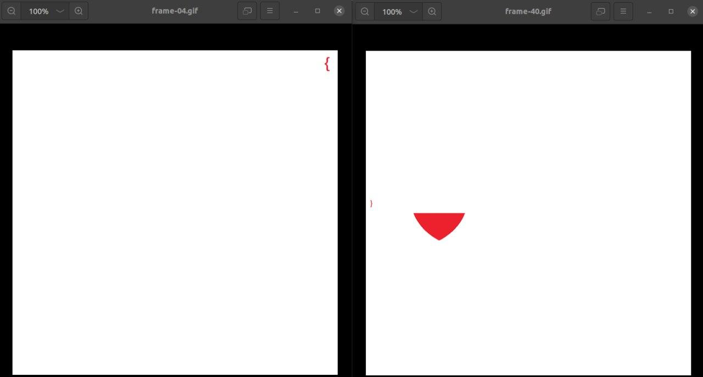

## 题目

This might be a difficult question, but I'm sure you can do it with your eyes closed.

## 解题思路

- 由 `you can do it with your eyes closed` 并结合三行两列的结构，可以联想到盲文
- 将 GIF 拆分成 JPG，可以看到花括号 

- 使用 [Braille Alphabet](https://www.dcode.fr/braille-alphabet) 查询盲文对应字符，结合花括号位置获得 Flag：`dsc{d0-you-th1nk-h3-s4w-us7132}`