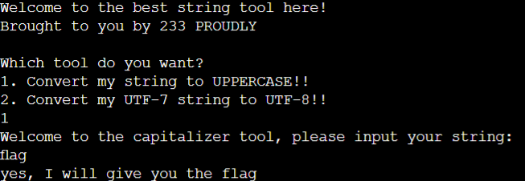
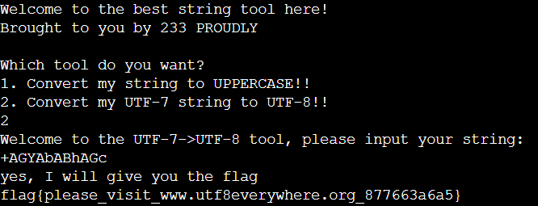

## 题目

233 同学最近刚刚学会了 Python 的字符串操作，于是写了两个小程序运行在自己的服务器上。这个工具提供两个功能：

- 字符串大写工具
- UTF-7 到 UTF-8 转换工具

233 同学的源代码
```py
import re

def to_upper(s):
    r = re.compile('[fF][lL][aA][gG]')
    if r.match(s):
        print('how dare you')
    elif s.upper() == 'FLAG':
        print('yes, I will give you the flag')
        print(open('/flag1').read())
    else:
        print('%s' % s.upper())

def to_utf8(s):
    r = re.compile('[fF][lL][aA][gG]')
    s = s.encode() # make it bytes
    if r.match(s.decode()):
        print('how dare you')
    elif s.decode('utf-7') == 'flag':
        print('yes, I will give you the flag')
        print(open('/flag2').read())
    else:
        print('%s' % s.decode('utf-7'))

def main():
    print('Welcome to the best string tool here!')
    print('Brought to you by 233 PROUDLY')
    print('')
    print('Which tool do you want?')
    print('1. Convert my string to UPPERCASE!!')
    print('2. Convert my UTF-7 string to UTF-8!!')
    choice = input()
    if choice[0] == '1':
        print('Welcome to the capitalizer tool, please input your string: ')
        to_upper(input())
    elif choice[0] == '2':
        print('Welcome to the UTF-7->UTF-8 tool, please input your string: ')
        to_utf8(input())
    else:
        print('I am confused, madam')

main()
```

读了代码之后，你惊讶地发现自己似乎可以通过构造特殊输入，使得 233 同学的工具返回 flag。

## 解题思路

### 字符串大写工具

- 对于 Unicode 来说，大小写并不一定是一一对应的 - [Myths of Unicode](https://github.com/Wisdom/Awesome-Unicode#myths-of-unicode)
- 其中有一个字符`fl`转换成大写后就可以得到`FL`
- 如果猜到经过`upper()`会将一个字符变成两个字符，也可以通过程序查找这个字符
    ```py
    for i in range(0, 65535):
        if chr(i).upper() == 'FL' or chr(i).upper() == 'LA' or chr(i).upper() == 'AG':
            print(chr(i))
            break
    ```
- 由此可获得第一个 Flag<br>


#### 大小写转换特例

- 来源：[Wisdom/Awesome-Unicode: A curated list of delightful Unicode tidbits, packages and resources.](https://github.com/Wisdom/Awesome-Unicode)
- Uppercase Transformation Collisions

    Char |	Code Point |    Output Char
    -|-|-
    ß |	0x00DF |	SS
    ı |	0x0131 |	I
    ſ |	0x017F |	S
    ff |	0xFB00 |	FF
    fi |	0xFB01 |	FI
    fl |	0xFB02 |	FL
    ffi |	0xFB03 |	FFI
    ffl |	0xFB04 |	FFL
    ſt |	0xFB05 |	ST
    st |	0xFB06 |	ST
- Lowercase Transformation Collisions

    Char |	Code Point |    Output Char
    -|-|-
    K |	0x212A |	k

### UTF-7 到 UTF-8 转换工具

- 将`flag`的 Unicode 数值（UTF-16）用二进制表示
    ```
    f: 0000 0000 ‭0110 0110‬
    l: 0000 0000 ‭‭0110 1100‬
    a: 0000 0000 ‭‭0110 0001‬
    g: 0000 0000 ‭‭0110 0111‬
    ```
- 合并后从左以六位数为一组重新编组，不足六位的用 0 补尾
    ```
    000000 00‭0110 0110‬00 000000 ‭‭011011 00‬0000 0000‭01 100001‬ 000000 000110 0111‬00
    ```
- 将每一组六位数的数值以对应的 Base64 码取代：`AGYAbABhAGc`
- 使用`+`标识开头，结尾以任何不在 Base64 里定义的字符来标识。若在 Base64 区块之后使用`-`作为结尾标识，则解码器会从下个字符继续解码，反之则以此字符作为非  Base64 的区块开头继续解码<br>

- [UTF-8 Everywhere](https://utf8everywhere.org/)

#### 参考资料

- [UTF-7 - Wikipedia](https://en.wikipedia.org/wiki/UTF-7)
- [Base64 - Wikipedia](https://en.wikipedia.org/wiki/Base64)