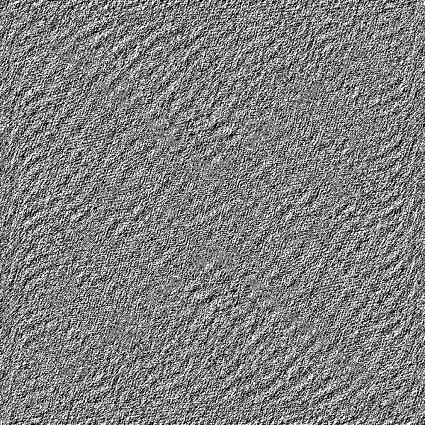
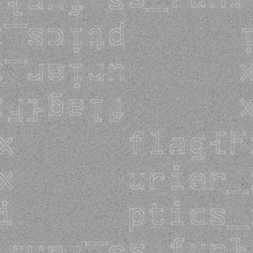
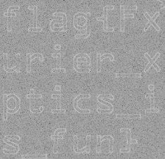

## 题目

小 P 在一教做**傅里叶光学**实验时，在实验室电脑的模拟程序里发现了这么一张的图片： 

数理基础并不扎实的小 P 并不知道什么东西成像会是这个样子：又或许什么东西都不是，毕竟这只是模拟 ... 但可以确定的是，这些看似奇怪的花纹里确实隐藏着一些信息，或许是地下金矿的藏宝图也未可知。

## 解题思路

- 题目**傅里叶光学**是重点，可以考虑图片是否经过快速傅里叶变换
- 将图片丢入工具 [Ejectamenta - WikkiMap](https://www.ejectamenta.com/Fourifier-fullscreen/)，并进行快速傅里叶逆变换，得到： 

- 拼接一下即可获得 Flag：`flag{Fxurier_xptic_is_fun}` 

## 参考资料

[Stego Tricks - HackTricks](https://book.hacktricks.xyz/stego/stego-tricks)