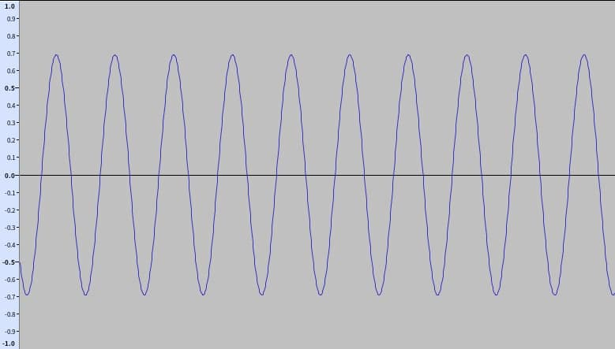

## 题目

What a mundane song, it's just the same note repeated over and over. But could there perhaps be two different notes?

## 解题思路

- 由题意推测应该有明显区别的两种波形
- 打开 `audio_frequency_stego.wav` 放大波形，不像 [Unpleasant music](unpleasant_music.md) 那样有明显的 01 波形 

- 但稍稍缩小后，就可以发现有两种不一样的波形！\\(ΦωΦ)/ 

- 根据前 8 个 01 值，可以判断密度较高的对应 1、密度较低的对应 0，并得到字母 `f`，接下来就可以放心手工获取后续部分了 (ΦˋωˊΦ) 