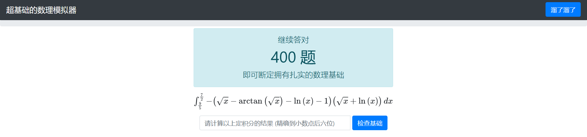
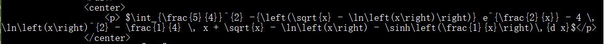
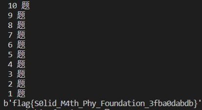

## 题目



## 解题思路

- 自己算的话一道题都算不出来(Φ皿Φ)
- 直接使用开发者工具查看网页，符号看上去都不易爬取（当时没有禁掉 JS）
- 使用`curl`获取网页，发现使用的是 *LaTex*<br>

- 使用`sympy`计算定积分，`LaTex`文本可以使用`parse_latex`转换
    ```py
    import requests
    from lxml import etree
    from sympy import *
    from sympy.parsing.latex import parse_latex

    s = requests.session()

    base_url = '<site-url>'
    token = '<user-token>'
    s.get(base_url + 'login?token=' + token)
    x = symbols('x')

    while True:
        r = s.get(base_url)
        while r.status_code != 200:
            r = s.get(base_url)
        html = etree.HTML(r.content)
        rest = html.xpath('//h1[@class="cover-heading"]')
        if rest:
            print(rest[0].text)
            exp = html.xpath('/html/body/div/div/div/center/p')[0].text[2:-1]
            tmprg = exp.split(' ')[0]
            rge = str(parse_latex(tmprg + '{d x}'))[10:] # 截掉 Integral(1
            exp = parse_latex(exp[len(tmprg):exp.find('{d x}')]).subs(symbols('e'), E)
            ans = N("Integral(" + str(exp) + rge, 15)
            s.post(base_url + 'submit', data={'ans': ans})
        else:
            break

    r = s.get(base_url)
    print(r.content)
    ```
  - `parse_latex`会将常数 ${\displaystyle e}$ 识别为符号，需要进行替换
  - `parse_latex`对于部分 *LaTex* 表达式会出现解析错误的情况，因此不能直接对原始表达式使用，如 $\int_{2}^{\frac{9}{2}} \frac{1}{4} \, x + 2 \, \sqrt{x} + \frac{2}{x} - \ln(x)\,{d x}$，可以看到↓需要计算定积分的区域划分错了
    ```cmd
    >>> parse_latex(r'\int_{2}^{\frac{9}{2}} \frac{1}{4} \, x + 2 \, \sqrt{x} + \frac{2}{x} - \ln(x)\,{d x}')
    -dx*log(x, E) + 2*sqrt(x) + x*Integral(1/4, (x, 2, 9/2)) + 2/x
    ```
- 做完 $400$ 道题就能拿到 Flag 了(ΦˋωˊΦ)<br>
