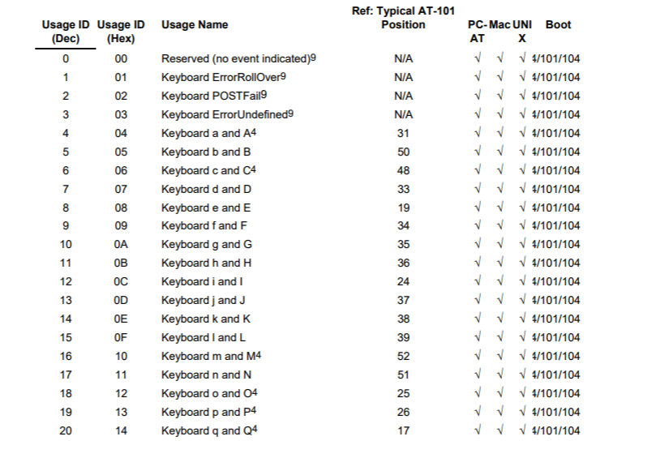

<!--more-->

## 解题思路

- 打开熟悉的`pcap`文件一看，看到了陌生的 USB 协议，登时傻眼(゜-゜)<br>

- 通过搜索了解到 USB 协议中的数据包含在`Leftover Capture Data`字段中，鼠标协议的数据长度为 $4$ 个字节，键盘协议的数据长度为 $8$ 个字节
- 由数据长度可以判断，由题目给出的`pcap`文件可以恢复出键盘的按键信息咕，其中击键信息集中在第 $3$ 个字节
- 将第三字节取出来，对照映射表得到击键序列
  - USB KEYBOARD 的映射表，[完整对照表 - USB HID usage table](https://www.freebsddiary.org/APC/usb_hid_usages.php)<br>

- XD 偷个懒咕，直接使用现有的 [UsbKeyboardDataHacker.py](https://github.com/WangYihang/UsbKeyboardDataHacker/blob/master/UsbKeyboardDataHacker.py) 进行击键序列的提取（需要下载`tshark`，用于`Leftover Capture Data`字段信息的提取）
- 提取后得到了这么个玩意（?）：
  ```
  D'`;M?!\mZ4j8hgSvt2bN);^]+7jiE3Ve0A@Q=|;)sxwYXtsl2pongOe+LKa'e^]\a`_X|V[Tx;"VONSRQJn1MFKJCBfFE>&<`@9!=<5Y9y7654-,P0/o-,%I)ih&%$#z@xw|{ts9wvXWm3~
  ```
  - `<GA>`为 Grave Accent，是`~`所在按键，将`normalKeys`的`<GA>`替换为`` ` ``，将`shiftKeys`的`<GA>`替换为`~`
- 题目叫`Difficult Programming Language`，所以是某种语言咯？
- 看了别人的 WP，了解到这是`Malbolge`所编写的程序（不知道别人怎么用咕果搜到的，反正我只搜到了 WP 23333）
- 找个[ Malbolge 在线调试器](https://lutter.cc/malbolge/debugger.html)，把代码丢进去，发现———这代码竟然还敲错了（╯‵□′）╯︵┴─┴
- 经过尝试，把`"`改成`:`就可以运行了，运行后得到 FLAG：`hctf{m4lb0lGe}`

## 相关扩展

### 鼠标协议

- 鼠标协议的数据长度为 $4$ 个字节
  - 第一个字节代表按键，0x00 表示未按键，0x01 表示敲击左键，0x02 表示敲击右键
  - 第二个字节可被看作符号位。值为正时，表示鼠标水平向右移动；值为负时，表示鼠标水平向左移动
  - 第三个字节与第二个字节相似，用于描述鼠标垂直方向的移动
- 使用 [UsbMiceDataHacker.py](https://github.com/WangYihang/UsbMiceDataHacker/blob/master/UsbMiceDataHacker.py) 绘制鼠标移动及拖动轨迹

## 参考资料

- [USB - CTF Wiki](https://ctf-wiki.github.io/ctf-wiki/misc/traffic/protocols/USB/)
- [Malbolge – lutter.cc](https://lutter.cc/malbolge/)