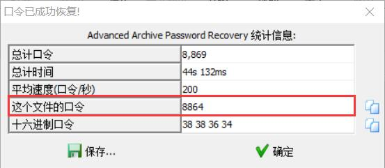
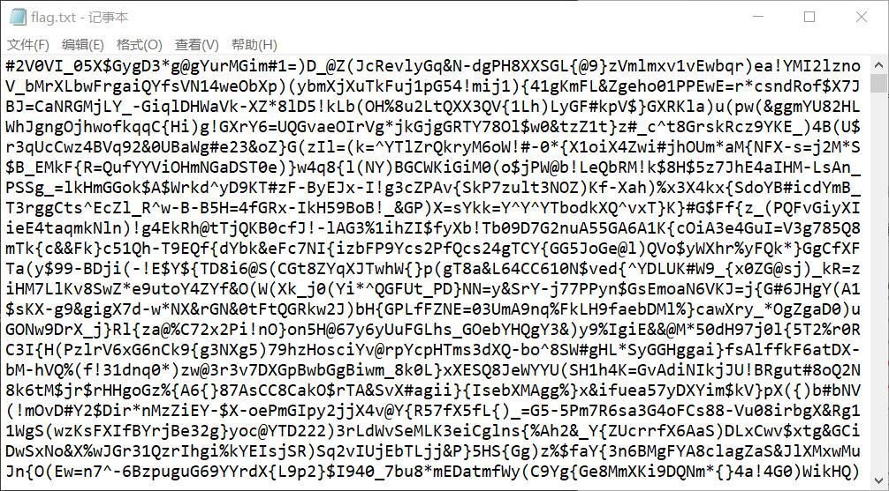

## 解题思路

- emm……是一张新垣结衣的照片【不是重点！(Φ皿Φ╬)】看看有没有藏……有的！用`dd`分离出来~
    ```bash
    $ binwalk wolaopo.jpg

    DECIMAL       HEXADECIMAL     DESCRIPTION
    --------------------------------------------------------------------------------
    0             0x0             JPEG image data, JFIF standard 1.01
    30            0x1E            TIFF image data, big-endian, offset of first image directory: 8
    137448        0x218E8         RAR archive data, first volume type: MAIN_HEAD

    $ dd if=wolaopo.jpg of=tmp.rar skip=137448 bs=1
    79776+0 records in
    79776+0 records out
    79776 bytes (80 kB, 78 KiB) copied, 1.73609 s, 46.0 kB/s
    ```
- 分离出来的压缩文件需要输入密码解压，爆破获得密码 *8864* <br>

- 解压后得到文件 *flag.txt*，文件内容……是个啥？？<br>

- 起初猜测是某种特殊的编码，咕果无果……竟然是统计字（符）频！【完全没想到】
    ```py
    f = open('flag.txt', 'r')
    content = f.read()
    f.close()
    cnt = dict()
    for i in content:
        if(i == '\n'):
            continue
        if i in cnt:
            cnt[i] += 1
        else:
            cnt[i] = 1
    ans = {k: v for k, v in sorted(cnt.items(), key=lambda item: item[1], reverse=True)}
    for i in ans:
        print(i,end='')
    ```
- 统计完后，按频率从高到低排列，成功获取 flag！
    ```bash
    $ python3 gakki.py
    GXY{gaki_IsMyw1fe}DAQOWJHNSEKUP*Z&8#294BC%^V$3@)(R-FT05=L76ohqdujlmczxnpbvtr![;,. '
    ```