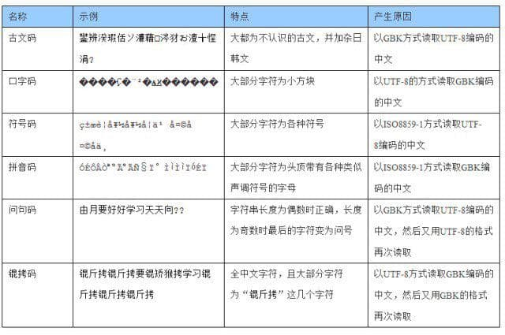
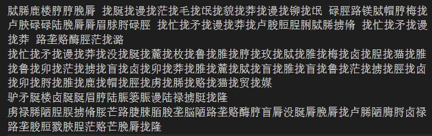
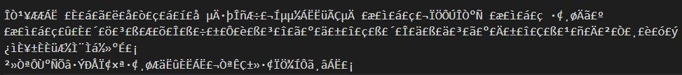
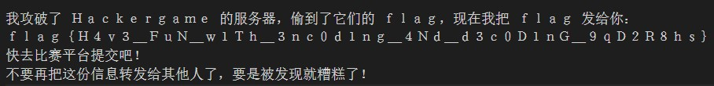

## 乱码及产生原因

## 解题思路

- 下载文件后**使用 UTF-8 打开**，得到的内容多为不常见的汉字，推测对应表格中的古文码。而古文码是『**以 GBK 方式**读取 UTF-8 编码』产生的，那么以下内容应该是以 GBK 方式读取 UTF-8 编码后再以 UTF-8 保存的结果（长度为偶数，所以不出现问号） 

- `通过编码保存` -> 选择 GBK，再使用 UTF-8 打开，得到拼音码 

- `通过编码保存` -> 选择 ISO8859-1，再使用 GBK 打开，成功获取 Flag 

- 最后要将全角字符转换为半角字符：`flag{H4v3_FuN_w1Th_3nc0d1ng_4Nd_d3c0D1nG_9qD2R8hs}`