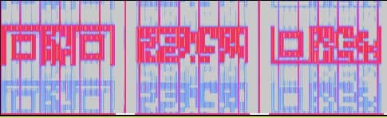
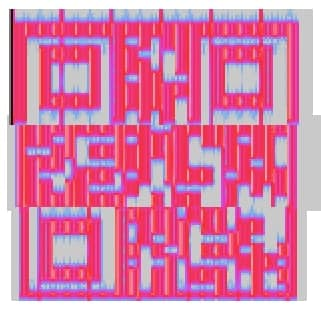
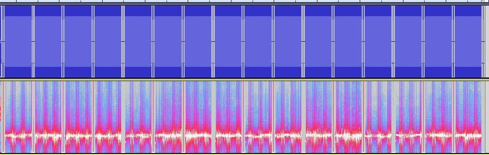
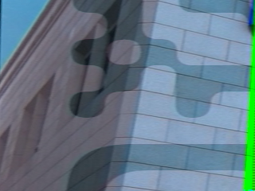

## 题目

Hearing is not believing

## 解题思路

- 查看 `hearing.wav` 频谱图，有三段被切分的二维码 

- 拼接扫码后获得一部分 Flag：`m4yB3_` 

- 剩下就是一段看上去很整齐的音频 (ŏωŏ) 

- 本来还以为会和中间的小竖线有关，因为刚好是 $8$ 的倍数，又有明显的二元区别，还能解出来 `IR` 🤧 结果跑偏了……
- 最后是 SSTV，慢扫描电视（Slow-scan television）
- Linux 下用 `qsstv` 就可以，能得到 $16$ 张图片，拼起来是一个二维码

    
    
    
    
     
    
    
    
    
     
    
    
    
    
     
    
    
    
    

- 由于没法直接扫出来，还要再手工描一下图 (╥ω╥) 获得另一部分 Flag：`U_kn0W_S57V}` 

- 拼一下：`ByteCTF{m4yB3_U_kn0W_S57V}`
 
## 参考链接

- [Decoding SSTV from a file using Linux](https://www.chonky.net/hamradio/decoding-sstv-from-a-file-on-a-linux-system)