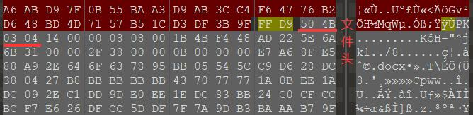
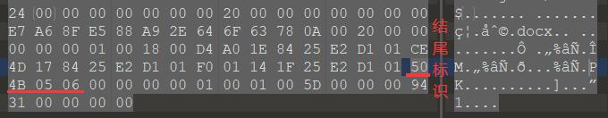

## 解题思路

- 常规流程走一遍
    ```bash
    $ file 藏藏藏.jpg
    藏藏藏.jpg: JPEG image data, JFIF standard 1.01, resolution (DPI), density 72x72, segment length 16, baseline, precision 8, 800x566, frames 3

    $ binwalk 藏藏藏.jpg

    DECIMAL       HEXADECIMAL     DESCRIPTION
    --------------------------------------------------------------------------------
    0             0x0             JPEG image data, JFIF standard 1.01
    63967         0xF9DF          End of Zip archive
    ```
- 藏有一个 ZIP 文件！但是为什么只有结尾的位置 (ŏωŏ) ？使用 *010Editor* 查看，文件还是很完整的，开头标识和结尾标识都可以找到<br>
<br>


- 使用 *010Editor* 新建十六进制文件，复制 ZIP 文件的十六进制文本，并粘贴至新文件。解压 ZIP 文件得到 *福利.docx*，内容为一个二维码，扫码获得 flag <br>
