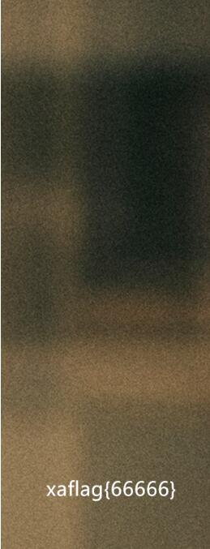

## 解题思路

- 打开图片看一眼，并无任何异常
- 先用`file`确定了这是一个 PNG 图片
- 然后用`binwalk`看了看
    ```bash
    DECIMAL       HEXADECIMAL     DESCRIPTION
    --------------------------------------------------------------------------------
    0             0x0             PNG image, 321 x 332, 8-bit/color RGBA, non-interlaced
    91            0x5B            Zlib compressed data, compressed
    ```
- 咕？zlib？之前没做过的格式……之后各种疯狂找资料看 zlib 【完全走错方向了咕！】
- 实际上这题改一下图像的高度就可以了 QWQ <br>


## 咕咕咕

- 翻了翻别人的 WP，发现会因为 CRC 错误打不开图片的咕？！（啊，被 Windows 害惨了）
- Windows 下使用`pngcheck`来弥补 QWQ
    ```bash
    pngcheck -v 1.png
    # File: 1.png (418602 bytes)
    #  chunk IHDR at offset 0x0000c, length 13
    #    321 x 332 image, 32-bit RGB+alpha, non-interlaced
    #  CRC error in chunk IHDR (computed 55900eef, expected c20f1fc6)
    # ERRORS DETECTED in 1.png
    ```