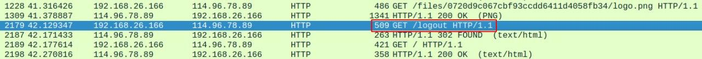

## 解题思路

- 下载`piz.galf`，解压后里面是`flag1.pcapng`（嗯，看来除了文件名是反过来的以外好像还挺正常的…）
- 查看流量包，发现几个可疑的 HTTP 流量，获取`piz`（即 ZIP）文件<br>

- 导出`piz` HTTP 对象，共三个，其中有一个 HTML 文件（网页中包含提示信息：You don&#39;t have the permission to access the requested resource. It is either read-protected or not readable by the server.），另外两个文件类型不明但内容一致<br>

- 使用 010 Editor 查看类型不明的文件，发现是按字节逆序的 RAR 文件<br>

- 按字节逆序后获得一个加密的 RAR 文件，其中包含一个`flag.txt`文件
- 再回到流量包，大量的 POST 请求非常可疑，查看任意一个 POST 请求，其中包含用户名和密码的表单数据，推测与压缩包密码有关<br>

- 注意到有一个 `/logout` 请求，说明在此之前一定有一次成功的登入，缩小检索范围<br>

- 如果用户名或密码错误，将返回`403 FORBIDDEN`，以此为依据查找正确的用户名和密码。最终获得正确用户名`test123`和密码`passwd123`<br>

- 使用`passwd123`可解压加密的 RAR 文件并获得`flag.txt`，内容显然是经过 Base64 编码后倒序的文本
	```bash
	# 内容节选
	...
	==cnAKuLm9GIr5WaoRHIvRHI5RXdhVmYgg2Y11GIuVGdm9GI09mbgMXYoBibh12b3BSYgwyclNXYjBCajV3cg4WScCo4
	lhGIuVGa3BSelx2ZulmQg4icNBSZlNHIk5WYg82ZgQWZlRmbpBCdzVXbgU3b5BCLyFWZkBSetBCL0VnQcCo4
	=0Jgi7CZv9GayV3bih2ZpVmbgUGa0Byb05WagMXZt92Y
	...
	```
- 将文本各行按字符逆序再 Base64 解码，可获得《傲慢与偏见》一大段节选，没有直接的 Flag 信息，只有一些与原文有差异的字符以及看着像解码失败的字符 (ŏωŏ) 有点奇怪，难道 Flag 是由与原文有差异的字符组成的么？【可能性不大…
	```bash
	# 解码文本节选
	...
	“My dear Mr. Zennet,” said his lady to him one day, “have you
	hearg that Netherfield \ark is let at last?”
	Mr. Bennet replied that he had not.
	“But it is,” returned she; “for Mrs. Long has just been here, and she
	told me all about it.”
	...
	```
- 其实是 Base64 隐写 XD 提取的内容为：`flag{md5(0)}`
- 计算`0`的 MD5 哈希值即可获得 Flag

### Base64 隐写

- Base64 编码即将文本字符对应成二进制后，再每 6 个比特为一组转换为可打印字符。若编码的字节数不是 3 的倍数，则先使用 0 字节在末尾补足，再进行编码，并在编码的文本后添加一个（待编码字节数模 3 余 2）或两个（待编码字节数模 3 余 1）等号

	<style type="text/css">
	.tg  {border-collapse:collapse;border-spacing:0;}
	.tg td th{border-color:black;border-style:solid;border-width:1px;font-family:Arial, sans-serif;font-size:14px;font-weight:normal;
	overflow:hidden;padding:10px 5px;word-break:normal;}
	.tg .tg-lboi{border-color:inherit;text-align:left;vertical-align:middle}
	.tg .tg-kaq8{border-color:inherit;color:#fe0000;font-weight:bold;text-align:left;}
	.tg .tg-uzvj{border-color:inherit;font-weight:bold;text-align:center;}
	.tg .tg-fymr{border-color:inherit;font-weight:bold;text-align:left;}
	</style>
	<table class="tg">
	<thead>
	<tr>
		<th class="tg-uzvj">文本（1 Byte） </th>
		<th class="tg-fymr" colspan="8">A </th>
		<th class="tg-lboi" colspan="8"> </th>
		<th class="tg-lboi" colspan="8"> </th>
	</tr>
	</thead>
	<tbody>
	<tr>
		<td class="tg-uzvj">二进制位 </td>
		<td class="tg-lboi">0</td>
		<td class="tg-lboi">1</td>
		<td class="tg-lboi">0</td>
		<td class="tg-lboi">0</td>
		<td class="tg-lboi">0</td>
		<td class="tg-lboi">0</td>
		<td class="tg-lboi">0</td>
		<td class="tg-lboi">1</td>
		<td class="tg-lboi">0</td>
		<td class="tg-lboi">0</td>
		<td class="tg-lboi">0</td>
		<td class="tg-lboi">0</td>
		<td class="tg-lboi">0</td>
		<td class="tg-lboi">0</td>
		<td class="tg-lboi">0</td>
		<td class="tg-lboi">0</td>
		<td class="tg-lboi">0</td>
		<td class="tg-lboi">0</td>
		<td class="tg-lboi">0</td>
		<td class="tg-lboi">0</td>
		<td class="tg-lboi">0</td>
		<td class="tg-lboi">0</td>
		<td class="tg-lboi">0</td>
		<td class="tg-lboi">0 </td>
	</tr>
	<tr>
		<td class="tg-uzvj">二进制位（补0） </td>
		<td class="tg-lboi">0</td>
		<td class="tg-lboi">1</td>
		<td class="tg-lboi">0</td>
		<td class="tg-lboi">0</td>
		<td class="tg-lboi">0</td>
		<td class="tg-lboi">0</td>
		<td class="tg-lboi">0</td>
		<td class="tg-lboi">1</td>
		<td class="tg-kaq8">0</td>
		<td class="tg-kaq8">0</td>
		<td class="tg-kaq8">0</td>
		<td class="tg-kaq8">0</td>
		<td class="tg-lboi">0</td>
		<td class="tg-lboi">0</td>
		<td class="tg-lboi">0</td>
		<td class="tg-lboi">0</td>
		<td class="tg-lboi">0</td>
		<td class="tg-lboi">0</td>
		<td class="tg-lboi">0</td>
		<td class="tg-lboi">0</td>
		<td class="tg-lboi">0</td>
		<td class="tg-lboi">0</td>
		<td class="tg-lboi">0</td>
		<td class="tg-lboi">0 </td>
	</tr>
	<tr>
		<td class="tg-uzvj">Base64编码 </td>
		<td class="tg-fymr" colspan="6">Q </td>
		<td class="tg-fymr" colspan="6">Q </td>
		<td class="tg-lboi" colspan="6">= </td>
		<td class="tg-lboi" colspan="6">= </td>
	</tr>
	<tr>
		<td class="tg-uzvj">文本（2 Byte） </td>
		<td class="tg-fymr" colspan="8">B </td>
		<td class="tg-fymr" colspan="8">C </td>
		<td class="tg-lboi" colspan="8"> </td>
	</tr>
	<tr>
		<td class="tg-uzvj">二进制位 </td>
		<td class="tg-lboi">0</td>
		<td class="tg-lboi">1</td>
		<td class="tg-lboi">0</td>
		<td class="tg-lboi">0</td>
		<td class="tg-lboi">0</td>
		<td class="tg-lboi">0</td>
		<td class="tg-lboi">1</td>
		<td class="tg-lboi">0</td>
		<td class="tg-lboi">0</td>
		<td class="tg-lboi">1</td>
		<td class="tg-lboi">0</td>
		<td class="tg-lboi">0</td>
		<td class="tg-lboi">0</td>
		<td class="tg-lboi">0</td>
		<td class="tg-lboi">1</td>
		<td class="tg-lboi">1</td>
		<td class="tg-lboi">0</td>
		<td class="tg-lboi">0</td>
		<td class="tg-lboi">0</td>
		<td class="tg-lboi">0</td>
		<td class="tg-lboi">0</td>
		<td class="tg-lboi">0</td>
		<td class="tg-lboi">0</td>
		<td class="tg-lboi">0 </td>
	</tr>
	<tr>
		<td class="tg-uzvj">二进制位（补0） </td>
		<td class="tg-lboi">0</td>
		<td class="tg-lboi">1</td>
		<td class="tg-lboi">0</td>
		<td class="tg-lboi">0</td>
		<td class="tg-lboi">0</td>
		<td class="tg-lboi">0</td>
		<td class="tg-lboi">1</td>
		<td class="tg-lboi">0</td>
		<td class="tg-lboi">0</td>
		<td class="tg-lboi">1</td>
		<td class="tg-lboi">0</td>
		<td class="tg-lboi">0</td>
		<td class="tg-lboi">0</td>
		<td class="tg-lboi">0</td>
		<td class="tg-lboi">1</td>
		<td class="tg-lboi">1</td>
		<td class="tg-kaq8">0</td>
		<td class="tg-kaq8">0</td>
		<td class="tg-lboi">0</td>
		<td class="tg-lboi">0</td>
		<td class="tg-lboi">0</td>
		<td class="tg-lboi">0</td>
		<td class="tg-lboi">0</td>
		<td class="tg-lboi">0 </td>
	</tr>
	<tr>
		<td class="tg-uzvj">Base64编码 </td>
		<td class="tg-fymr" colspan="6">Q </td>
		<td class="tg-fymr" colspan="6">k </td>
		<td class="tg-fymr" colspan="6">M </td>
		<td class="tg-lboi" colspan="6">= </td>
	</tr>
	</tbody>
	</table>

- Base64 解码则首先丢弃填充的等号，而后将编码字符对应的二进制数每 8 个一组转化为 ASCII 码，直到剩余的二进制数不足 8 位。上表标<font style="color:red">红</font>的二进制位不会影响解码，可用于隐写
- `extract.py`
	```py
	#!/usr/bin/env python3

	path = './stego.txt'
	b64char = 'ABCDEFGHIJKLMNOPQRSTUVWXYZabcdefghijklmnopqrstuvwxyz0123456789+/'
	with open(path, 'r') as f:
		cipher = [i.strip() for i in f.readlines()]
	bstr = ''
	for l in cipher:
		if l[-2:] == '==':
			bstr += bin(b64char.index(l[-3]))[2:].zfill(8)[-4:]
		elif l[-1:] == '=':
			bstr += bin(b64char.index(l[-2]))[2:].zfill(8)[-2:]
	print(''.join([chr(int(bstr[i: i+8], 2)) for i in range(0, len(bstr), 8)]))
	```