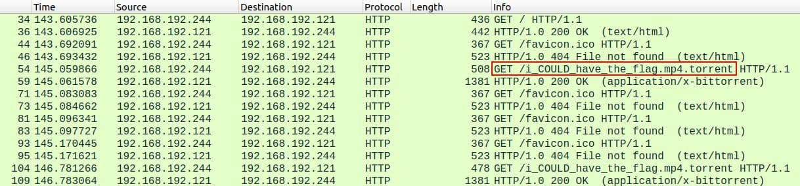
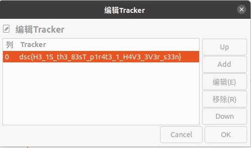

## 题目

Mr.Reed and his pirating ring has finally been caught by the police but unfortunately we dont have enough evidence to indict him.
All we could get is a network capture of his private network.Can you find any evidence to be used against him ?

## 解题思路

- 查看 `network_listen.pcap`，筛选 HTTP 流，注意到下载了一个种子文件 

- 难道信息隐藏在 MP4 里么？使用 Wireshark 导出 `i_COULD_have_the_flag.mp4.torrent`，并丢到 Deluge 尝试下载
- 发现下载迟迟没有开始，疑惑 (ŏωŏ)
- 注意到 Trackers 有报错，看看报错信息：`错误: unsupported URL protocol`，URL 有问题？
- `编辑Trackers`，打开就看到 Flag！⊙w⊙ 
