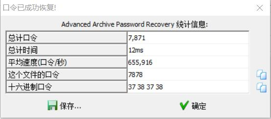
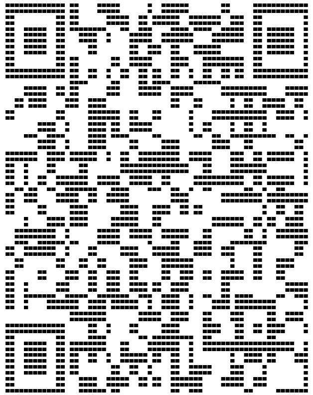

## 解题思路

- 使用`binwalk`查看，发现包含压缩文件
    ```bash
    DECIMAL       HEXADECIMAL     DESCRIPTION
    --------------------------------------------------------------------------------
    0             0x0             JPEG image data, JFIF standard 1.01
    24976         0x6190          Zip archive data, encrypted at least v2.0 to extract, compressed size: 453, uncompressed size: 5038, name: flag.txt
    25557         0x63D5          End of Zip archive
    ```
- 使用`dd if=misc03.jpg of=flag.zip skip=24976 bs=1`提取压缩包（直接使用`binwalk -e`提取会导致压缩包损坏）
- 解压时，发现需要输入密码，使用工具爆破得到密码为`7878`<br>

- `flag.txt`的内容是一个 01 矩阵，经观察发现是一个二维码，但不能直接扫描，使用 Word 进行替换，并调整行距，使用的是八号字黑体，扫描二维码即可获得 flag<br>
