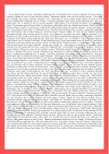

## 解题思路

- 是一个 PDF 文件<br>

- 全选，复制，粘贴到文本编辑器
    > NoFlagHere! NoFlagHere! NoFlagHere!<br>
    XXXXXXXXXXXXXXXXXXXXXXXXXXXXXXXXXXXXXXXXXXXXXXXX XXXXXXXXXXXXXXXXXXXXXXXXXXXXXXXXXXXXXXXXXXXXXXXXXXXXXX Close - but still not here !<br>
    **BABA BBB BA BBA ABA AB B AAB ABAA AB B AA BBB BA AAA BBAABB AABA ABAA AB BBA BBBAAA ABBBB BA AAAB ABBBB AAAAA ABBBB BAAA ABAA AAABB BB AAABB AAAAA AAAAA AAAAB BBA AAABB**<br>
    Lorem ipsum dolor sit amet, consectetur adipiscing elit. Cras
    ...
- 注意到仅由 A 和 B 组成的有规律的字符串，长度从 1 到 6 不等，推测为摩尔斯电码
- 将 A 替换为`.`，B 替换为`-`，可解码得有意义的结果：`CONGRATULATIONS,FLAG:1NV151BL3M3554G3`
    ```
    -.-. --- -. --. .-. .- - ..- .-.. .- - .. --- -. ... --..-- ..-. .-.. .- --. ---... .---- -. ...- .---- ..... .---- -... .-.. ...-- -- ...-- ..... ..... ....- --. ...--
    ```

## 推荐工具

[Morse Code Translator - Morse Decoder](https://morsedecoder.com/)
- 可直接在选项中设置`-`和`.`的替代字符