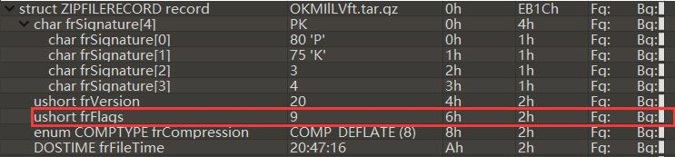

## 题目

哎？ 我的`tar zxvf`怎么不好使了？

解压密码不需要爆破

## 解题思路

- `file`查看，是 ZIP 文件，所以`tar zxvf`不好使(ŏωŏ)
    ```bash
    $ file hW1ES89jF.tar.gz
    hW1ES89jF.tar.gz: Zip archive data, at least v2.0 to extract
    ```
- 解压文件需要输入密码，但`解压密码不需要爆破`【?】……难道是伪加密？查看全局方式位标记，值为 *0x0009*，是真加密<br>

- 目光移向了可疑的文件名 (ΦˋωˊΦ) Bingo~文件名就是解压密码。然而解压了这个压缩包后得到了新的压缩包，解压新的压缩包后又得到了一个新的压缩包……(Φ皿Φ╬)
    ```bash
    #!/usr/bin/env bash

    zfile="hW1ES89jF.tar.gz"
    pass="${zfile%%.*}"
    ftype=$(file --mime-type "$zfile" | grep -P '(?=[^/]*$).*' -o)
    while [ 'zip' == "$ftype" ]; do
        old="$zfile"
        zfile=$(unzip -P "$pass" "$zfile" | grep -P '((?<=(inflating: ))|(?<=(extracting: )))(.*)\b' -o)
        pass="${zfile%%.*}"
        ftype=$(file --mime-type "$zfile" | grep -P '(?=[^/]*$).*' -o)
        rm "$old"
    done
    ```
- 最后得到一个`flag`文件
    ```bash
    $ file flag
    flag: ASCII text, with no line terminators
    $ cat flag
    BJD{wow_you_can_rea11y_dance}
    ```

## 参考资料

[compression - ZIP file decompression inflating vs extracting - Super User](https://superuser.com/questions/211291/zip-file-decompression-inflating-vs-extracting)