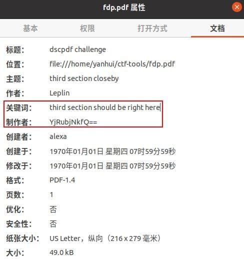

## 题目

Most of the times, what you seek is deep within the user. It starts with a writer, carries on with an actor and ends with a producer.

## 解题思路

- 打开 `fdp.pdf`，全选复制粘贴
    ```bash
    dsc{f0r3n51x_15_fun}
    dsc{n0t_h3r3_31th3r} 1  # not here
    dsc{n1c3_try}
    1
    dsc{f00t_n0t3} would just be too obvious # foot note
    ```
- 看上去 `dsc{f0r3n51x_15_fun}` 是 FLag 呢，提交 -> `Incorrect` (╥ω╥)
- 好叭，根据题目 `writer`、`actor`、`producer` 之类的看看文件属性，找到应该是 Flag 的第三部分，Base64 解码得：`b4nn3d}`<br>

- 接下来使用 010 Editor 看看吧，除了描述信息外，首先看到
    ```
    % Here's the first part of the flag:
    % DONT ESCAPE FROM JAVASCRIPT
    % `%64%73%63%7B%70%75%62%6C%31%63_`
    ```
- URL 解码得 Flag 的第一部分 `dsc{publ1c_`，以此类推，CTRL + F 找找 `second`，没有结果...
- 继续浏览，看到注释 `// There are 5 pieces to the puzzle`，所以 Flag 被拆成了**五段**咯？
- 一直看到文件末尾，(ΦˋдˊΦ) 过分！第二部分居然这么给！
    ```
    % Now you prolly tried ctrl+f but i wouldnt make it that easy, here ya go for slice #2 - (23958575899).toString(35) + String.fromCharCode(0x5F)
    ```
- 直接 开发者工具->控制台 跑一下就行：`d15pl4y_`
- 接下来就还差两个部分啦！在 Flag 第二部分的提示下面紧跟了 `PK` 压缩包头，赶紧 `binwalk` 看看
    ```bash
    $ binwalk fdp.pdf 

    DECIMAL       HEXADECIMAL     DESCRIPTION
    --------------------------------------------------------------------------------
    0             0x0             PDF document, version: "1.4"
    48629         0xBDF5          Zip archive data, at least v1.0 to extract, name: sk1/
    48691         0xBE33          Zip archive data, at least v2.0 to extract, compressed size: 95, uncompressed size: 108, name: sk1/p4.txt
    49008         0xBF70          End of Zip archive, footer length: 22
    ```
- 分离压缩包解压得到 `p4.txt`，那应该是 Flag 第四部分了
    ```c
    // p4.txt
    Caesar wasn't smart enough. He got outsmarted by Brutus lmao.
    The key is our creator
    The result is fq3gq10n_

    // 维吉尼亚密码
    // creator： alexa
    // 解密得
    ff3ct10n_
    ```
- 最后再次检查 PDF 文件，发现一串二进制字符串。开头补 `0` 凑足 8 位后再转字符得到：`0f_`
    ```
    <rdf:Description rdf:about=''
        xmlns:pdf='http://ns.adobe.com/pdf/1.3/'>
        <pdf:Author>Leplin</pdf:Author>
        <pdf:Keywords>110000 1100110 1011111</pdf:Keywords>
    </rdf:Description>
    ```
- 接下来就是拼接问题！由 `p4.txt` 文件名推测应该是在第四部分，带有 `{}` 的部分位置应该也不能随意改变，那么 `0f_` 才是实际的第三部分，而 `b4nn3d}` 是实际的第五部分
- 最终 Flag：`dsc{publ1c_d15pl4y_0f_ff3ct10n_b4nn3d}`