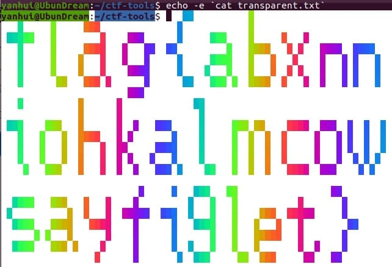

## 题目

一个透明的文件，用于在终端中展示一个五颜六色的 flag。

可能是在 cmd.exe 等劣质终端中被长期使用的原因，这个文件失去了一些重要成分，变成了一堆乱码，也不会再显示出 flag 了。

注意：flag 内部的字符全部为小写字母。

## 解题思路

- 查看 `transparent.txt`，有点眼熟啊 (ŏωŏ)
    ```bash
    # transparent.txt 节选

    [0;0H[20;58H[8;34H[13;27H[4;2H[38;2;1;204;177m
    ```

- 根据 `用于在终端中展示一个五颜六色的 flag`，再结合 [RsaCtfTool/test.sh](https://github.com/Ganapati/RsaCtfTool/blob/master/test.sh)（十分感谢！😽） 推测是终端设置颜色和格式化的控制序列，只不过语法结构有缺失
- 在所有 `[` 之前添加 `\e` 或 `\033` 或 `\x1B`
- 清空终端并执行 `` echo -e `cat transparent.txt` ``，然后全部选中（由于打印的字符为空格，选中才可见设置的字体颜色）就可以看到 Flag 了 🥳<br>


## 参考资料

- [bash:tip_colors_and_formatting - FLOZz' MISC](https://misc.flogisoft.com/bash/tip_colors_and_formatting)