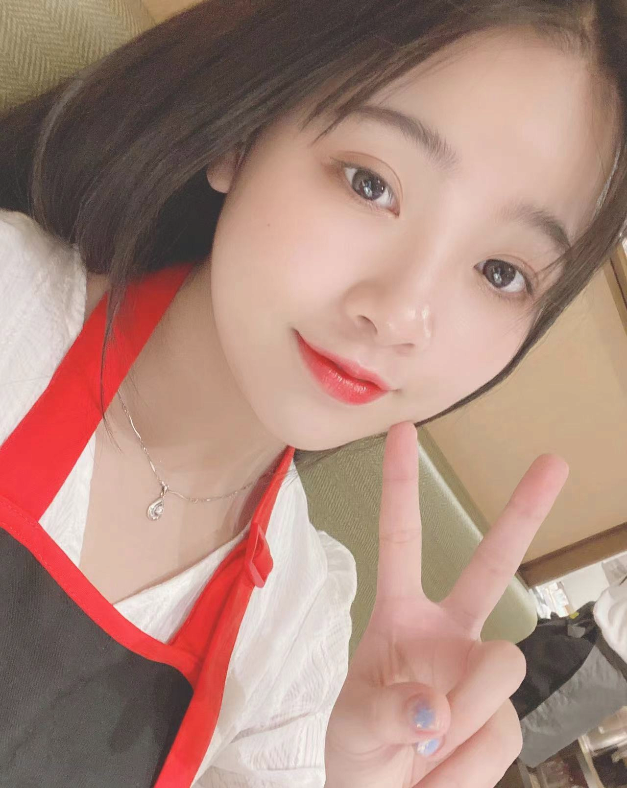
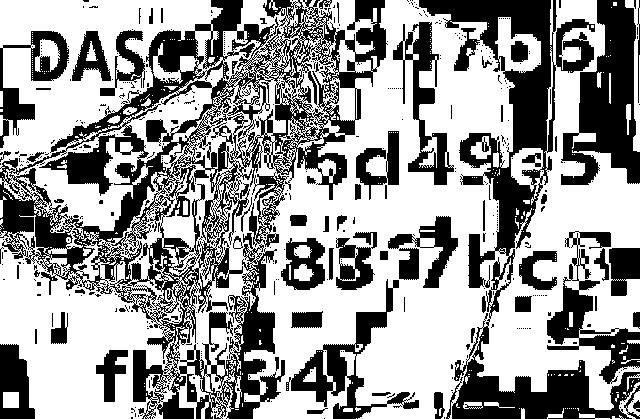
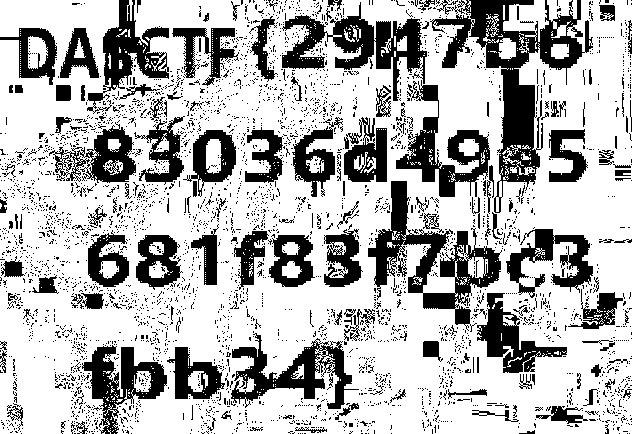

## 题目

LSB，但又不是LSB，众所周知不止RGB。yusa，我的yusa,嘿嘿



## 解题思路

- 查看图片各个位平面，在 `Red 0` 和 `Green 0` 看到不太完整的 Flag<br>

- `众所周知不止RGB`，先将图片转换为 YCbCr（R->Y，G->Cr，B->Cb），再进行颜色反转

    ```py
    import numpy
    from PIL import Image

    img = Image.open('flag.png')
    ycbcr = img.convert('YCbCr')
    img_array = numpy.ndarray((img.size[1], img.size[0], 3), 'u1', ycbcr.tobytes())
    for i in range(img.size[1]):
        for j in range(img.size[0]):
            pixel = img_array[i][j]
            pixel = [255 - pixel[0], 255 - pixel[1], 255 - pixel[2]]
    Image.fromarray(img_array).save('result.png')
    ```

- 在反转后图片的 `Red 0` 位平面可以看到完整的 Flag<br>
