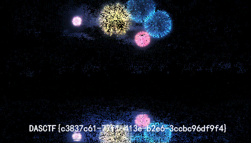

## 题目

Sakura组织即将进攻地球，此时你意外得到了该组织内某个成员的电脑文件，你能从中发现本次阴谋所用的关键道具吗。（注：题目中包含了五个彩蛋，且彩蛋对解题本身没有任何影响，快去发现吧！）

## 解题思路

- `Who_am_I.zip` 解压需要密码，暂且放到一边，先分析 `Yusa-PC.raw`

    ```bash
    # 查看目标系统信息
    $ volatility -f Yusa-PC.raw imageinfo
    Volatility Foundation Volatility Framework 2.6
    INFO    : volatility.debug    : Determining profile based on KDBG search...
            Suggested Profile(s) : Win7SP1x64, Win7SP0x64, Win2008R2SP0x64, Win2008R2SP1x64_23418, Win2008R2SP1x64, Win7SP1x64_23418
            ...

    # 查看命令行历史记录，只有一个彩蛋：yusa姐姐有好多好多的小娇妻，渣男
    $ volatility -f Yusa-PC.raw --profile=Win7SP1x64 cmdscan
    Volatility Foundation Volatility Framework 2.6
    **************************************************
    CommandProcess: conhost.exe Pid: 1344
    CommandHistory: 0x3ffde0 Application: cmd.exe Flags: Allocated, Reset
    CommandCount: 1 LastAdded: 0 LastDisplayed: 0
    FirstCommand: 0 CommandCountMax: 50
    ProcessHandle: 0x5c
    Cmd #0 @ 0x3ea130: egg4 eXVzYeWnkOWnkOacieWlveWkmuWlveWkmueahOWwj+Woh+Wmu++8jOa4o+eUtw==
    Cmd #37 @ 0x3f61c0: >
    Cmd #38 @ 0x380158: ?
    **************************************************
    CommandProcess: conhost.exe Pid: 1356
    CommandHistory: 0x3afde0 Application: DumpIt.exe Flags: Allocated
    CommandCount: 0 LastAdded: -1 LastDisplayed: -1
    FirstCommand: 0 CommandCountMax: 50
    ProcessHandle: 0x5c

    # 查看进程列表，注意到 StikyNot.exe，便签里应该会存有信息
    $ volatility -f Yusa-PC.raw --profile=Win7SP1x64 pslist
    Volatility Foundation Volatility Framework 2.6
    Offset(V)          Name                    PID   PPID   Thds     Hnds   Sess  Wow64 Start                          Exit                          
    ------------------ -------------------- ------ ------ ------ -------- ------ ------ ------------------------------ ------------------------------
    0xfffffa80024bdae0 System                    4      0     97      598 ------      0 2021-10-28 03:46:58 UTC+0000                                 
    0xfffffa8002ecdb30 smss.exe                244      4      2       29 ------      0 2021-10-28 03:46:58 UTC+0000                                 
    0xfffffa8003950340 csrss.exe               336    320      9      483      0      0 2021-10-28 03:46:59 UTC+0000                                 
    0xfffffa8003adfb30 wininit.exe             388    320      3       77      0      0 2021-10-28 03:46:59 UTC+0000                                 
    0xfffffa8003ae15d0 csrss.exe               396    380     10      328      1      0 2021-10-28 03:46:59 UTC+0000                                 
    0xfffffa8003b008f0 winlogon.exe            432    380      5      118      1      0 2021-10-28 03:46:59 UTC+0000                                 
    0xfffffa8003b6e1d0 services.exe            488    388      7      212      0      0 2021-10-28 03:46:59 UTC+0000                                 
    0xfffffa8003b04b30 lsass.exe               504    388      6      596      0      0 2021-10-28 03:46:59 UTC+0000                                 
    0xfffffa8003b03a10 lsm.exe                 512    388     10      142      0      0 2021-10-28 03:46:59 UTC+0000                                 
    0xfffffa8003bfe9f0 svchost.exe             620    488     10      360      0      0 2021-10-28 03:47:00 UTC+0000                                 
    0xfffffa8003c1ab30 vmacthlp.exe            680    488      3       53      0      0 2021-10-28 03:47:00 UTC+0000                                 
    0xfffffa8003c46b30 svchost.exe             712    488      9      270      0      0 2021-10-28 03:47:00 UTC+0000                                 
    0xfffffa8003c763e0 svchost.exe             772    488     21      502      0      0 2021-10-28 03:47:00 UTC+0000                                 
    0xfffffa8003ca4b30 svchost.exe             856    488     16      375      0      0 2021-10-28 03:47:00 UTC+0000                                 
    0xfffffa8003cb5830 svchost.exe             884    488     41     1024      0      0 2021-10-28 03:47:00 UTC+0000                                 
    0xfffffa8003d703a0 svchost.exe             348    488     13      343      0      0 2021-10-28 03:47:01 UTC+0000                                 
    0xfffffa8003d9a6e0 svchost.exe             984    488     13      382      0      0 2021-10-28 03:47:01 UTC+0000                                 
    0xfffffa8003e34910 spoolsv.exe            1212    488     12      275      0      0 2021-10-28 03:47:01 UTC+0000                                 
    0xfffffa8003e49470 taskhost.exe           1244    488      9      227      1      0 2021-10-28 03:47:01 UTC+0000                                 
    0xfffffa8003e64b30 svchost.exe            1272    488     17      332      0      0 2021-10-28 03:47:01 UTC+0000                                 
    0xfffffa8003f16630 svchost.exe            1408    488     15      239      0      0 2021-10-28 03:47:02 UTC+0000                                 
    0xfffffa8003f57b30 VGAuthService.         1468    488      3       86      0      0 2021-10-28 03:47:02 UTC+0000                                 
    0xfffffa8003f8f060 vmtoolsd.exe           1520    488     10      269      0      0 2021-10-28 03:47:02 UTC+0000                                 
    0xfffffa8004077b30 sppsvc.exe             1736    488      4      157      0      0 2021-10-28 03:47:02 UTC+0000                                 
    0xfffffa80040af890 svchost.exe            1836    488      6       93      0      0 2021-10-28 03:47:03 UTC+0000                                 
    0xfffffa80040b3560 WmiPrvSE.exe           1908    620     10      214      0      0 2021-10-28 03:47:03 UTC+0000                                 
    0xfffffa8004112520 msdtc.exe               308    488     12      144      0      0 2021-10-28 03:47:05 UTC+0000                                 
    0xfffffa8003e55810 dwm.exe                2260    856      5      243      1      0 2021-10-28 03:47:08 UTC+0000                                 
    0xfffffa8003ddeb30 explorer.exe           2276   2252     45     1400      1      0 2021-10-28 03:47:08 UTC+0000                                 
    0xfffffa80042804b0 vmtoolsd.exe           2380   2276      8      220      1      0 2021-10-28 03:47:09 UTC+0000                                 
    0xfffffa8004322890 SearchIndexer.         2552    488     13      796      0      0 2021-10-28 03:47:13 UTC+0000                                 
    0xfffffa8002954b30 svchost.exe            1232    488     13      323      0      0 2021-10-28 03:49:04 UTC+0000                                 
    0xfffffa80030cb260 wmpnetwk.exe           2792    488      9      221      0      0 2021-10-28 03:49:04 UTC+0000                                 
    0xfffffa8003c8b460 StikyNot.exe           2228   2276      8      210      1      0 2021-10-28 10:37:08 UTC+0000                                 
    0xfffffa8003ad2b30 taskhost.exe           2160    488      5      101      1      0 2021-10-29 04:10:23 UTC+0000                                 
    0xfffffa8003cca750 cmd.exe                2536   2276      1       19      1      0 2021-10-29 04:15:14 UTC+0000                                 
    0xfffffa8003b1d920 conhost.exe            1344    396      2       58      1      0 2021-10-29 04:15:14 UTC+0000                                 
    0xfffffa8002b49060 audiodg.exe            2744    772      6      141      0      0 2021-10-29 05:42:04 UTC+0000                                 
    0xfffffa800282e590 dllhost.exe            1168    620     28      354      1      0 2021-10-29 05:42:32 UTC+0000                                 
    0xfffffa8002d0a920 wab.exe                2448    820      8      154      1      0 2021-10-29 05:43:20 UTC+0000                                 
    0xfffffa80028b2b30 DumpIt.exe              820   2276      1       25      1      1 2021-10-29 05:43:42 UTC+0000                                 
    0xfffffa8003042b30 conhost.exe            1356    396      2       59      1      0 2021-10-29 05:43:42 UTC+0000                                 
    0xfffffa8002841060 dllhost.exe            1000    620      6  7536754      1      0 2021-10-29 05:44:04 UTC+0000
    ```

- `StikyNot.exe` 对应数据文件 `StickyNotes.snt`，查找并下载到本机

    ```bash
    $ volatility -f Yusa-PC.raw --profile=Win7SP1x64 filescan | grep StickyNotes.snt
    Volatility Foundation Volatility Framework 2.6
    0x000000003fb306e0     16      1 RW-r-- \Device\HarddiskVolume2\Users\Yusa\AppData\Roaming\Microsoft\Sticky Notes\StickyNotes.snt
    $ volatility -f Yusa-PC.raw --profile=Win7SP1x64 dumpfiles -Q 0x000000003fb306e0 -D .
    Volatility Foundation Volatility Framework 2.6
    DataSectionObject 0x3fb306e0   None   \Device\HarddiskVolume2\Users\Yusa\AppData\Roaming\Microsoft\Sticky Notes\StickyNotes.snt
    ```

- Linux 下不能直接查看 SNT 文件，先使用 7zip 解压。找到文件名为 `0` 的文件，添加 `.rtf` 后缀，打开后得到：`终于拿到了组织的核心密码，我不想再当卧底了，我想赶紧离开这个鬼地方。核心密码是：世界没了心跳。`，可惜不是用在 `Who_am_I.zip` 上的，继续分析 `Yusa-PC.raw`
- 组织名为 `Sakura`，看看有没有相关文件

    ```bash
    $ volatility -f Yusa-PC.raw --profile=Win7SP1x64 filescan | grep Sakura
    Volatility Foundation Volatility Framework 2.6
    0x000000003e58ada0      1      0 R--r-- \Device\HarddiskVolume2\Program Files\MSBuild\Microsoft\Windows Workflow Foundation\Sakura-didi
    0x000000003e78c6a0      1      0 R--r-- \Device\HarddiskVolume2\Users\Yusa\Desktop\Sakura文件\Sakura-公告
    0x000000003f2ae290      1      0 R--r-- \Device\HarddiskVolume2\Users\Yusa\Desktop\Sakura文件\Sakura-egg5
    0x000000003f959980      1      0 R--r-- \Device\HarddiskVolume2\Users\Yusa\Desktop\Sakura文件\Sakura-备忘录
    0x000000003faa3a20      2      0 RW-rw- \Device\HarddiskVolume2\Users\Yusa\AppData\Roaming\Microsoft\Windows\Recent\Sakura文件.lnk
    0x000000003fabc220      1      0 R--r-- \Device\HarddiskVolume2\Users\Yusa\Desktop\Sakura文件\Sakura-logo

    # 先看看公告
    $ volatility -f Yusa-PC.raw --profile=Win7SP1x64 dumpfiles -Q 0x000000003e78c6a0 -D .
    Volatility Foundation Volatility Framework 2.6
    DataSectionObject 0x3e78c6a0   None   \Device\HarddiskVolume2\Users\Yusa\Desktop\Sakura文件\Sakura-公告
    $ cat Sakura-公告 | iconv -f gbk
    全体成员注意，我们将在11月20号，对地球发起总攻，请做好准备。

    # 没啥内容...下一个
    $ volatility -f Yusa-PC.raw --profile=Win7SP1x64 dumpfiles -Q 0x000000003f959980 -D .
    Volatility Foundation Volatility Framework 2.6
    DataSectionObject 0x3f959980   None   \Device\HarddiskVolume2\Users\Yusa\Desktop\Sakura文件\Sakura-备忘录
    $ cat Sakura-备忘录 | iconv -f gbk
    2021.11.15：请组织内的人务必删除所有不必要的联系方式，防止我们的计划出现问题。

    # 再看看 didi -> 是一个加密的压缩包
    $ volatility -f Yusa-PC.raw --profile=Win7SP1x64 dumpfiles -Q 0x000000003e58ada0 -D .
    Volatility Foundation Volatility Framework 2.6
    DataSectionObject 0x3e58ada0   None   \Device\HarddiskVolume2\Program Files\MSBuild\Microsoft\Windows Workflow Foundation\Sakura-didi
    ```

- 既然提到了「联系方式」，就再探索一下

    ```bash
    $ volatility -f Yusa-PC.raw --profile=Win7SP1x64 filescan | grep contact
    Volatility Foundation Volatility Framework 2.6
    0x000000003e748f20      1      0 R--r-d \Device\HarddiskVolume2\Users\Yusa\Contacts\Yusa.contact
    0x000000003fa09070      1      0 R--r-d \Device\HarddiskVolume2\Users\Yusa\Contacts\Mystery Man.contact
    ```

- 在 `Mystery Man.contact` 中有这么一段很可疑

    ```bash
    LF2XGYPPXSGOPO4E465YPZMITLSYRGXGWS7OJOEL42O2LZFYQDSLRKXEXO56LCVB566IZ2FPW7S37K7HQK46LLUM42EJB354RTSL3IHFR6VONHEJ4S4ITZNEVHTJPNXJS62OHAECGZGCWWRVOBUXMNKMGJTTKTDZME2TKU3PGVMWS5ZVGVYUKYJSKY2TON3ZJU2VSK3WGVGHK3BVGVJW6NLBGZCDK33NKQ2WE6KBGU3XKRJVG52UQNJXOVNDKTBSM42TK4KFGVRGK3BVLFLTGNBUINBTKYTFNQ2VSVZTGVNEOOJVLJBU4NKMGZSDKNCXNY2UY4KHGVGHSZZVG52WMNSLMVCTKWLJLI2DIQ2DMEZFMNJXG54WCT2EJF3VSV2NGVGW2SJVLJVFKNCNKRIXSWLNJJUVS6SJGNMTERLZJ5KFM3KNK5HG2TSEM46Q====
    ```

- 先 Base32 解码，再 Base64

    ```bash
    $ echo LF2XGYPPXSGOPO4E465YPZMITLSYRGXGWS7OJOEL42O2LZFYQDSLRKXEXO56LCVB566IZ2FPW7S37K7HQK46LLUM42EJB354RTSL3IHFR6VONHEJ4S4ITZNEVHTJPNXJS62OHAECGZGCWWRVOBUXMNKMGJTTKTDZME2TKU3PGVMWS5ZVGVYUKYJSKY2TON3ZJU2VSK3WGVGHK3BVGVJW6NLBGZCDK33NKQ2WE6KBGU3XKRJVG52UQNJXOVNDKTBSM42TK4KFGVRGK3BVLFLTGNBUINBTKYTFNQ2VSVZTGVNEOOJVLJBU4NKMGZSDKNCXNY2UY4KHGVGHSZZVG52WMNSLMVCTKWLJLI2DIQ2DMEZFMNJXG54WCT2EJF3VSV2NGVGW2SJVLJVFKNCNKRIXSWLNJJUVS6SJGNMTERLZJ5KFM3KNK5HG2TSEM46Q==== | base32 -d
    Yusa，组织刚刚派下来一个任务，请快点完成，你只有三天时间。6L+Z5piv5L2g5Lya55So5Yiw55qEa2V577yM5Y+v5Lul55So5a6D5omT5byA57uE57uH57uZ5L2g55qE5bel5YW344CC5bel5YW35ZG95ZCN5L6d54Wn5LqG5Lyg57uf6KeE5YiZ44CCa2V577yaODIwYWM5MmI5ZjU4MTQyYmJiYzI3Y2EyOTVmMWNmNDg=
    $ echo 6L+Z5piv5L2g5Lya55So5Yiw55qEa2V577yM5Y+v5Lul55So5a6D5omT5byA57uE57uH57uZ5L2g55qE5bel5YW344CC5bel5YW35ZG95ZCN5L6d54Wn5LqG5Lyg57uf6KeE5YiZ44CCa2V577yaODIwYWM5MmI5ZjU4MTQyYmJiYzI3Y2EyOTVmMWNmNDg= | base64 -d
    这是你会用到的key，可以用它打开组织给你的工具。工具命名依照了传统规则。key：820ac92b9f58142bbbc27ca295f1cf48
    ```

- `组织给你的工具`？想必是 `Sakura-didi` 了，解压得到 `key.bmp`，暂时还分析不出啥TAT<br>


- 既然有 `key`，再看看还有没有压缩包吧！果然有！\\(ΦωΦ)/

    ```bash
    $ volatility -f Yusa-PC.raw --profile=Win7SP1x64 filescan | grep zip
    Volatility Foundation Volatility Framework 2.6
    0x000000003e444a60     15      0 R--r-d \Device\HarddiskVolume2\Windows\System32\zipfldr.dll
    0x000000003ee522e0     16      0 R--r-d \Device\HarddiskVolume2\Program Files\VMware\VMware Tools\zip.exe
    0x000000003f2f49e0     15      0 R--r-- \Device\HarddiskVolume2\Program Files\VMware\VMware Tools\zip.exe
    0x000000003f3356f0      1      0 R--rw- \Device\HarddiskVolume2\PROGRA~1\MSBuild\MICROS~1\WINDOW~1\key.zip
    ```

- 使用 `世界没了心跳` 解压，由于 Linux 和 Windows 的编码不同，需要特别注意使用中文加密的压缩包

    ```bash
    $ unzip -P "$(echo -n 世界没了心跳|iconv -f utf-8 -t gbk)" key.zip 
    Archive:  key.zip
    inflating: exp
    ```

- 终于和 `Who_am_I.zip` 有关系了！但是还要先解密 TAT

    ??? note "exp"

        ```py
        from PIL import Image
        import struct
        pic = Image.open('key.bmp')
        fp = open('flag', 'rb')
        fs = open('Who_am_I', 'wb')

        a, b = pic.size
        list1 = []
        for y in range(b):
            for x in range(a):
                pixel = pic.getpixel((x, y))
                list1.extend([pixel[1], pixel[0], pixel[2], pixel[2], pixel[1], pixel[0]])

        data = fp.read()
        for i in range(0, len(data)):
            fs.write(struct.pack('B', data[i] ^ list1[i % a*b*6]))
        fp.close()
        fs.close()
        ```

- 只能看看系统账号密码了，`YusaYusa520` 解密 `Who_am_I.zip`

    ```bash
    $ python vol.py mimikatz -f ../Yusa的秘密/Yusa-PC.raw --profile=Win7SP1x64
    Module   User             Domain           Password                                
    -------- ---------------- ---------------- ----------------------------------------
    wdigest  Yusa             YUSA-PC          YusaYusa520                             
    wdigest  YUSA-PC$         WORKGROUP
    ```

- 稍微改改 `exp` 就可以解出 `flag`，是 GIF <br>

- 其中一帧有 Flag，提取出来即可~<br>


## 参考资料

[Volatility Usage · volatilityfoundation/volatility Wiki](https://github.com/volatilityfoundation/volatility/wiki/Volatility-Usage)