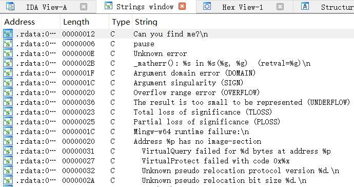
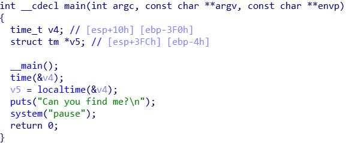
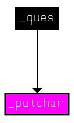
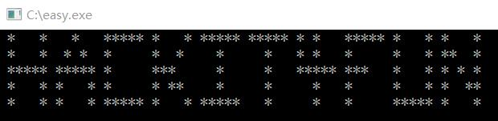

## 解题思路

- 之前没怎么做过逆向的题吼~所以当拿到题目的 EXE 文件时……当然是不知所措啊(o_ _)ﾉ
- 不知道是做啥的 EXE 文件当然不能直接运行~(<ゝωΦ)这里要用到 IDA Pro 这个（功能丰富的跨平台多处理器反汇编程序和调试器）工具
- `Shift + F12`打开`Strings`窗口，看了看，没啥东西(╥ω╥)： 

- `F5`，源代码看上去也平平无奇： 

- 前面只是熟悉一下功能(<ゝωΦ)，根据题目提示进入动态调试（环境：Windows 10）

### IDA Pro 动态调试

- 注意：需要调试的 EXE 文件所在路径不能包含中文！
- 在调试之前，先启动位于 IDA 文件夹`dbgsrv`目录下的`win32_remote.exe`，调试器选择`Remote Windows debugger`，开始调试前先下断点（`Hostname`填`127.0.0.1`） 

- 单步调了一圈没发现啥，超级失落【捂脸】
- `Ctrl + F12`调出函数调用关系图，发现可疑函数！
  - 不仅没被调用，还调用了`_putchar`函数

  
- 动态调试时将 EIP 修改至`_ques`的开始地址`0x00401520`，继续运行即可看到 flag 
