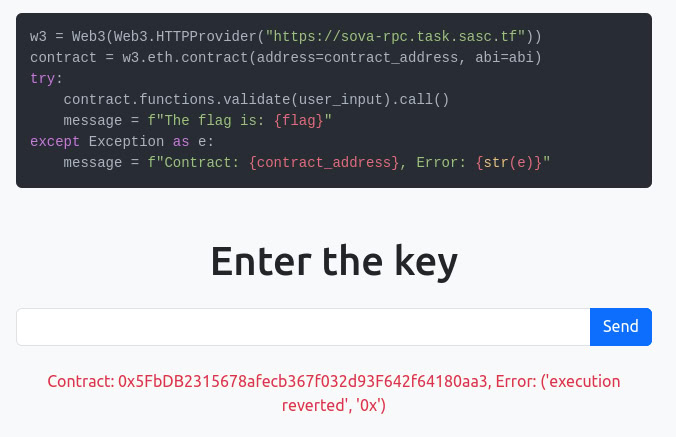

## Description

I wonder who should pay for the gas on the first date.

> https://sova.task.sasc.tf/

## Solution

- The given website provides a backend code snippet and an input box. Sending any input will return the contract address: `0x5FbDB2315678afecb367f032d93F642f64180aa3`.

    

- To solve the challenge, we need to figure out the `user_input` that lets the function `validate()` execute successfully.
- We can use the RPC URL provided in the code snippet to get the EVM bytecode of the target contract, and then use Dedaub to decompile.

    ```bash
    $ cast code --rpc-url https://sova-rpc.task.sasc.tf 0x5FbDB2315678afecb367f032d93F642f64180aa3
    ```

    [:material-download: `it_sova.code`](static/it_sova.code)

- By briefly reviewing the decompiled code, basically, the function `validate()` accepts a string parameter and verifies its validity. It then performs corresponding computations based on the values stored in the contract storage and updates memory accordingly. Finally, it checks whether the result in `MEM[0x1e0]` is equal to `0x16c11e3b4fe39c85` (note that there are some discrepancies between the actual behavior and the decompiled code).

    ```js
    function validate(string name_) public payable { 
        require(4 + (msg.data.length - 4) - 4 >= 32);
        require(name_ <= uint64.max);
        require(4 + name_ + 31 < 4 + (msg.data.length - 4));
        require(name_.length <= uint64.max);
        require(name_.data + name_.length <= 4 + (msg.data.length - 4));
        // [...]
        v6 = v7 = 0;
        while (!1) {
            v8 = uint8(STORAGE[v6]);
            v9 = STORAGE[v6] >> 8;
            if (v8 == 1) {
                MEM[v1 + (uint8(v9) << 5)] = (v9 >> 8 >> 8 << 196 >> 196) + MEM[v1 + (uint8(v9 >> 8) << 5)];
                // Unknown jump to Block 0x7abB0x42. Refer to 3-address code (TAC);
            } else if (v8 == 2) {
            // [...]
            v6 = v6 + 1;
        }
        require(11 < 17, Panic(50)); // access an out-of-bounds or negative index of bytesN array or slice
        require(128 - name_.length == 0x16c11e3b4fe39c85);
        // [...]
    }
    ```

- There are a total of 104 slots with values in the contract storage. Additionally, the computations and the locations of memory updates depend on the values read from these slots, making it difficult to directly understand the intent from the decompiled code.
- Another approach is to use Forge's debugger to observe how the function processes the user input and the pattern of memory updates. In short, the program first reverses the first 8 bytes of the input and splits them into two groups of 4 bytes each, assumed to be *x* and *y*, respectively. These two groups are then stored in four memory locations, assumed to be *A*, *B*, *C*, and *D*. Among them, *A*, *B*, and *C* hold the value *x*, while *D* holds the value *y*. Next, the program performs calculations using the values in these four memory locations in combination with masks. The final returned value is based on values stored in *C* and *D*. For details, refer to the following code:

    ```py
    input = b"ABCDEFGH"
    x, y = int(input[::-1][4:].hex(), 16), int(input[::-1][:4].hex(), 16)
    A, B, C, D = x, x, x, y

    masks = [0xf00dbabe, 0xdeadbeef, 0xbadc0ffe, 0xfeedface]

    for i in range(4):
        A ^= masks[i]
        tmp = (A << 5) | (A >> 27)
        A = (0x045d9f3b * tmp) & (2 ** 32 - 1)
        A = A ^ (A >> 16)
        C = A ^ D
        D = B
        if i < 3:
            A = B = C
    print("result =", hex((D << 32) | C))
    ```

- Next, we can infer the input based on the desired result. According to the above code, let $X[i]$ represent the result of each iteration. Given $C[i]$ and $D[i]$, we can deduce that $A[i-1]=B[i-1]=D[i]$ and $C[i-1]=B[i-1]$. Then, we can compute $A[i]$ with $A[i-1]$, and by XORing it with $C[i]$, we can obtain $D[i-1]$. Repeat the above steps until the initial values of A (B / C) and D are obtained.

    ```py
    D, C = 0x16c11e3b, 0x4fe39c85
    for i in range(3, -1, -1):
        A, B = D, D
        A ^= masks[i]
        tmp = (A << 5) | (A >> 27)
        A = (0x045d9f3b * tmp) & (2 ** 32 - 1)
        A = A ^ (A >> 16)
        D = C ^ A
        C = B
    print("input =", int.to_bytes(B, 4, 'little') + int.to_bytes(D, 4, 'little'))
    # input = b'Qy=*}OV('
    ```

### Flag

> SAS{h00t_h00t_7h1s_6uy_w1ll_c0v3r_th3_c0st5_9f03fd}
