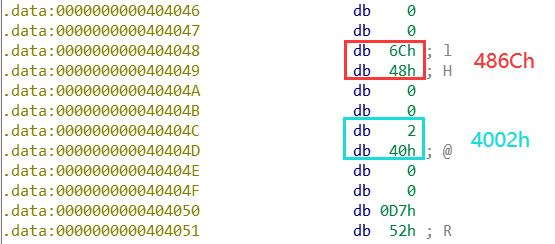
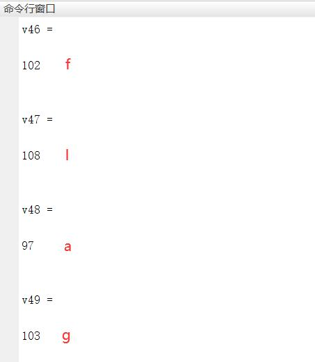

## 题目

常规逆向。

## 解题思路

- 使用 IDA Pro(64-bit) 打开`4.exe`，查看伪代码
    ```c
    _main(*(_QWORD *)&argc, argv, envp);
    memcpy(Dst, &unk_404020, 0xA8ui64);
    printf("plz input your flag:");
    scanf("%42s", &v46);
    v4 = 34 * v49 + 12 * v46 + 53 * v47 + 6 * v48 + 58 * v50 + 36 * v51 + v52;
    v5 = 27 * v50 + 73 * v49 + 12 * v48 + 83 * v46 + 85 * v47 + 96 * v51 + 52 * v52;
    v6 = 24 * v48 + 78 * v46 + 53 * v47 + 36 * v49 + 86 * v50 + 25 * v51 + 46 * v52;
    v7 = 78 * v47 + 39 * v46 + 52 * v48 + 9 * v49 + 62 * v50 + 37 * v51 + 84 * v52;
    v8 = 48 * v50 + 14 * v48 + 23 * v46 + 6 * v47 + 74 * v49 + 12 * v51 + 83 * v52;
    v9 = 15 * v51 + 48 * v50 + 92 * v48 + 85 * v47 + 27 * v46 + 42 * v49 + 72 * v52;
    v10 = 26 * v51 + 67 * v49 + 6 * v47 + 4 * v46 + 3 * v48 + 68 * v52;
    v11 = 34 * v56 + 12 * v53 + 53 * v54 + 6 * v55 + 58 * v57 + 36 * v58 + v59;
    v12 = 27 * v57 + 73 * v56 + 12 * v55 + 83 * v53 + 85 * v54 + 96 * v58 + 52 * v59;
    v13 = 24 * v55 + 78 * v53 + 53 * v54 + 36 * v56 + 86 * v57 + 25 * v58 + 46 * v59;
    v14 = 78 * v54 + 39 * v53 + 52 * v55 + 9 * v56 + 62 * v57 + 37 * v58 + 84 * v59;
    v15 = 48 * v57 + 14 * v55 + 23 * v53 + 6 * v54 + 74 * v56 + 12 * v58 + 83 * v59;
    v16 = 15 * v58 + 48 * v57 + 92 * v55 + 85 * v54 + 27 * v53 + 42 * v56 + 72 * v59;
    v17 = 26 * v58 + 67 * v56 + 6 * v54 + 4 * v53 + 3 * v55 + 68 * v59;
    v18 = 34 * v63 + 12 * v60 + 53 * v61 + 6 * v62 + 58 * v64 + 36 * v65 + v66;
    v19 = 27 * v64 + 73 * v63 + 12 * v62 + 83 * v60 + 85 * v61 + 96 * v65 + 52 * v66;
    v20 = 24 * v62 + 78 * v60 + 53 * v61 + 36 * v63 + 86 * v64 + 25 * v65 + 46 * v66;
    v21 = 78 * v61 + 39 * v60 + 52 * v62 + 9 * v63 + 62 * v64 + 37 * v65 + 84 * v66;
    v22 = 48 * v64 + 14 * v62 + 23 * v60 + 6 * v61 + 74 * v63 + 12 * v65 + 83 * v66;
    v23 = 15 * v65 + 48 * v64 + 92 * v62 + 85 * v61 + 27 * v60 + 42 * v63 + 72 * v66;
    v24 = 26 * v65 + 67 * v63 + 6 * v61 + 4 * v60 + 3 * v62 + 68 * v66;
    v25 = 34 * v70 + 12 * v67 + 53 * v68 + 6 * v69 + 58 * v71 + 36 * v72 + v73;
    v26 = 27 * v71 + 73 * v70 + 12 * v69 + 83 * v67 + 85 * v68 + 96 * v72 + 52 * v73;
    v27 = 24 * v69 + 78 * v67 + 53 * v68 + 36 * v70 + 86 * v71 + 25 * v72 + 46 * v73;
    v28 = 78 * v68 + 39 * v67 + 52 * v69 + 9 * v70 + 62 * v71 + 37 * v72 + 84 * v73;
    v29 = 48 * v71 + 14 * v69 + 23 * v67 + 6 * v68 + 74 * v70 + 12 * v72 + 83 * v73;
    v30 = 15 * v72 + 48 * v71 + 92 * v69 + 85 * v68 + 27 * v67 + 42 * v70 + 72 * v73;
    v31 = 26 * v72 + 67 * v70 + 6 * v68 + 4 * v67 + 3 * v69 + 68 * v73;
    v32 = 34 * v77 + 12 * v74 + 53 * v75 + 6 * v76 + 58 * v78 + 36 * v79 + v80;
    v33 = 27 * v78 + 73 * v77 + 12 * v76 + 83 * v74 + 85 * v75 + 96 * v79 + 52 * v80;
    v34 = 24 * v76 + 78 * v74 + 53 * v75 + 36 * v77 + 86 * v78 + 25 * v79 + 46 * v80;
    v35 = 78 * v75 + 39 * v74 + 52 * v76 + 9 * v77 + 62 * v78 + 37 * v79 + 84 * v80;
    v36 = 48 * v78 + 14 * v76 + 23 * v74 + 6 * v75 + 74 * v77 + 12 * v79 + 83 * v80;
    v37 = 15 * v79 + 48 * v78 + 92 * v76 + 85 * v75 + 27 * v74 + 42 * v77 + 72 * v80;
    v38 = 26 * v79 + 67 * v77 + 6 * v75 + 4 * v74 + 3 * v76 + 68 * v80;
    v39 = 34 * v84 + 12 * v81 + 53 * v82 + 6 * v83 + 58 * v85 + 36 * v86 + v87;
    v40 = 27 * v85 + 73 * v84 + 12 * v83 + 83 * v81 + 85 * v82 + 96 * v86 + 52 * v87;
    v41 = 24 * v83 + 78 * v81 + 53 * v82 + 36 * v84 + 86 * v85 + 25 * v86 + 46 * v87;
    v42 = 78 * v82 + 39 * v81 + 52 * v83 + 9 * v84 + 62 * v85 + 37 * v86 + 84 * v87;
    v43 = 48 * v85 + 14 * v83 + 23 * v81 + 6 * v82 + 74 * v84 + 12 * v86 + 83 * v87;
    v44 = 15 * v86 + 48 * v85 + 92 * v83 + 85 * v82 + 27 * v81 + 42 * v84 + 72 * v87;
    v45 = 26 * v86 + 67 * v84 + 6 * v82 + 4 * v81 + 3 * v83 + 68 * v87;
    for ( i = 0; i <= 41; ++i )
    {
    if ( *(&v4 + i) != Dst[i] )
    {
        printf("error");
        exit(0);
    }
    }
    printf("win");
    return 0;
    ```
- 由上述伪代码可知需要进行方程的求解，其中变量 $v4, v5, ..., v44, v45$ 的值可由循环中`if`语句得出，即 $v4 == Dst[0]$ ，$v5 == Dst[1]……$以此类推
- `Dst`数组的值来自另一个数组，数组元素数值逆序读取并将十六进制转化为十进制
  ```c
  memcpy(Dst, &unk_404020, 0xA8ui64);
  ```
  
- 使用 Matlab 进行方程的求解
    ```matlab
    syms v4 v5 v6 v7 v8 v9 v10 v11 v12 v13 v14 v15 v16 v17 v18 v19 v20 v21 v22 v23 v24 v25 v26 v27 v28 v29 v30 v31 v32 v33 v34 v35 v36 v37 v38 v39 v40 v41 v42 v43 v44 v45 v46 v47 v48 v49 v50 v51 v52 v53 v54 v55 v56 v57 v58 v59 v60 v61 v62 v63 v64 v65 v66 v67 v68 v69 v70 v71 v72 v73 v74 v75 v76 v77 v78 v79 v80 v81 v82 v83 v84 v85 v86 v87
    [v4,v5,v6,v7,v8,v9,v10,v11,v12,v13,v14,v15,v16,v17,v18,v19,v20,v21,v22,v23,v24,v25,v26,v27,v28,v29,v30,v31,v32,v33,v34,v35,v36,v37,v38,v39,v40,v41,v42,v43,v44,v45,v46,v47,v48,v49,v50,v51,v52,v53,v54,v55,v56,v57,v58,v59,v60,v61,v62,v63,v64,v65,v66,v67,v68,v69,v70,v71,v72,v73,v74,v75,v76,v77,v78,v79,v80,v81,v82,v83,v84,v85,v86,v87] = solve(v4 == 34 * v49 + 12 * v46 + 53 * v47 + 6 * v48 + 58 * v50 + 36 * v51 + v52,v5 == 27 * v50 + 73 * v49 + 12 * v48 + 83 * v46 + 85 * v47 + 96 * v51 + 52 * v52,v6 == 24 * v48 + 78 * v46 + 53 * v47 + 36 * v49 + 86 * v50 + 25 * v51 + 46 * v52,v7 == 78 * v47 + 39 * v46 + 52 * v48 + 9 * v49 + 62 * v50 + 37 * v51 + 84 * v52,v8 == 48 * v50 + 14 * v48 + 23 * v46 + 6 * v47 + 74 * v49 + 12 * v51 + 83 * v52,v9 == 15 * v51 + 48 * v50 + 92 * v48 + 85 * v47 + 27 * v46 + 42 * v49 + 72 * v52,v10 == 26 * v51 + 67 * v49 + 6 * v47 + 4 * v46 + 3 * v48 + 68 * v52,v11 == 34 * v56 + 12 * v53 + 53 * v54 + 6 * v55 + 58 * v57 + 36 * v58 + v59,v12 == 27 * v57 + 73 * v56 + 12 * v55 + 83 * v53 + 85 * v54 + 96 * v58 + 52 * v59,v13 == 24 * v55 + 78 * v53 + 53 * v54 + 36 * v56 + 86 * v57 + 25 * v58 + 46 * v59,v14 == 78 * v54 + 39 * v53 + 52 * v55 + 9 * v56 + 62 * v57 + 37 * v58 + 84 * v59,v15 == 48 * v57 + 14 * v55 + 23 * v53 + 6 * v54 + 74 * v56 + 12 * v58 + 83 * v59,v16 == 15 * v58 + 48 * v57 + 92 * v55 + 85 * v54 + 27 * v53 + 42 * v56 + 72 * v59,v17 == 26 * v58 + 67 * v56 + 6 * v54 + 4 * v53 + 3 * v55 + 68 * v59,v18 == 34 * v63 + 12 * v60 + 53 * v61 + 6 * v62 + 58 * v64 + 36 * v65 + v66,v19 == 27 * v64 + 73 * v63 + 12 * v62 + 83 * v60 + 85 * v61 + 96 * v65 + 52 * v66,v20 == 24 * v62 + 78 * v60 + 53 * v61 + 36 * v63 + 86 * v64 + 25 * v65 + 46 * v66,v21 == 78 * v61 + 39 * v60 + 52 * v62 + 9 * v63 + 62 * v64 + 37 * v65 + 84 * v66,v22 == 48 * v64 + 14 * v62 + 23 * v60 + 6 * v61 + 74 * v63 + 12 * v65 + 83 * v66,v23 == 15 * v65 + 48 * v64 + 92 * v62 + 85 * v61 + 27 * v60 + 42 * v63 + 72 * v66,v24 == 26 * v65 + 67 * v63 + 6 * v61 + 4 * v60 + 3 * v62 + 68 * v66,v25 == 34 * v70 + 12 * v67 + 53 * v68 + 6 * v69 + 58 * v71 + 36 * v72 + v73,v26 == 27 * v71 + 73 * v70 + 12 * v69 + 83 * v67 + 85 * v68 + 96 * v72 + 52 * v73,v27 == 24 * v69 + 78 * v67 + 53 * v68 + 36 * v70 + 86 * v71 + 25 * v72 + 46 * v73,v28 == 78 * v68 + 39 * v67 + 52 * v69 + 9 * v70 + 62 * v71 + 37 * v72 + 84 * v73,v29 == 48 * v71 + 14 * v69 + 23 * v67 + 6 * v68 + 74 * v70 + 12 * v72 + 83 * v73,v30 == 15 * v72 + 48 * v71 + 92 * v69 + 85 * v68 + 27 * v67 + 42 * v70 + 72 * v73,v31 == 26 * v72 + 67 * v70 + 6 * v68 + 4 * v67 + 3 * v69 + 68 * v73,v32 == 34 * v77 + 12 * v74 + 53 * v75 + 6 * v76 + 58 * v78 + 36 * v79 + v80,v33 == 27 * v78 + 73 * v77 + 12 * v76 + 83 * v74 + 85 * v75 + 96 * v79 + 52 * v80,v34 == 24 * v76 + 78 * v74 + 53 * v75 + 36 * v77 + 86 * v78 + 25 * v79 + 46 * v80,v35 == 78 * v75 + 39 * v74 + 52 * v76 + 9 * v77 + 62 * v78 + 37 * v79 + 84 * v80,v36 == 48 * v78 + 14 * v76 + 23 * v74 + 6 * v75 + 74 * v77 + 12 * v79 + 83 * v80,v37 == 15 * v79 + 48 * v78 + 92 * v76 + 85 * v75 + 27 * v74 + 42 * v77 + 72 * v80,v38 == 26 * v79 + 67 * v77 + 6 * v75 + 4 * v74 + 3 * v76 + 68 * v80,v39 == 34 * v84 + 12 * v81 + 53 * v82 + 6 * v83 + 58 * v85 + 36 * v86 + v87,v40 == 27 * v85 + 73 * v84 + 12 * v83 + 83 * v81 + 85 * v82 + 96 * v86 + 52 * v87,v41 == 24 * v83 + 78 * v81 + 53 * v82 + 36 * v84 + 86 * v85 + 25 * v86 + 46 * v87,v42 == 78 * v82 + 39 * v81 + 52 * v83 + 9 * v84 + 62 * v85 + 37 * v86 + 84 * v87,v43 == 48 * v85 + 14 * v83 + 23 * v81 + 6 * v82 + 74 * v84 + 12 * v86 + 83 * v87,v44 == 15 * v86 + 48 * v85 + 92 * v83 + 85 * v82 + 27 * v81 + 42 * v84 + 72 * v87,v45 == 26 * v86 + 67 * v84 + 6 * v82 + 4 * v81 + 3 * v83 + 68 * v87,v4==20247,v5==40182,v6==36315,v7==36518,v8==26921,v9==39185,v10==16546,v11==12094,v12==25270,v13==19330,v14==18540,v15==16386,v16==21207,v17==11759,v18==10460,v19==25613,v20==21135,v21==24891,v22==18305,v23==27415,v24==12855,v25==10899,v26==24927,v27==20670,v28==22926,v29==18006,v30==23345,v31==12602,v32==12304,v33==26622,v34==19807,v35==22747,v36==14233,v37==24736,v38==10064,v39==14169,v40==35155,v41==28962,v42==33273,v43==21796,v44==35185,v45==14877)
    ```
- 求解后，将变量 $v46, v47, ..., v86, v87$ 的值转换为 ASCII 码即可获得 FLAG【直接运行程序并输入 $v46$ 的值，得到的结果仍然是`error`】<br>
