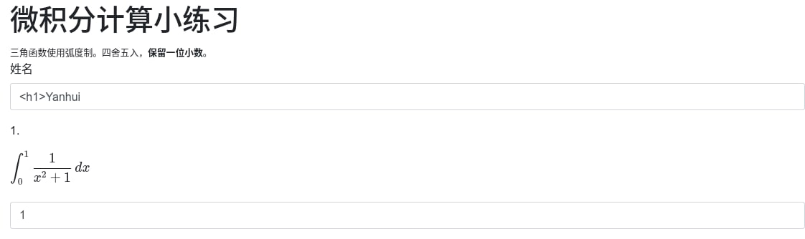
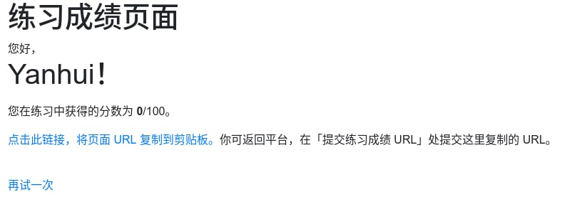

## 题目

小 X 作为某门符号计算课程的助教，为了让大家熟悉软件的使用，他写了一个小网站：上面放着五道简单的题目，只要输入姓名和题目答案，提交后就可以看到自己的分数。

[点击此链接访问练习网站](http://202.38.93.111:10056/)

想起自己前几天在公众号上学过的 Java 设计模式免费试听课，本着前后端离心（咦？是前后端离心吗？还是离婚？离。。离谱？总之把功能能拆则拆就对啦）的思想，小 X 还单独写了一个程序，欢迎同学们把自己的成绩链接提交上来。

总之，因为其先进的设计思想，需要同学们做完练习之后手动把成绩连接贴到这里来：

[点击此链接提交练习成绩 URL](http://202.38.93.111:10057/)

接收成绩链接的程序的源代码：

??? note "bot.py"

    ```py
    # Copyright 2022 USTC-Hackergame
    # Copyright 2021 PKU-GeekGame
    # 
    # Redistribution and use in source and binary forms, with or without modification, are permitted provided that the following conditions are met:
    # 
    # 1. Redistributions of source code must retain the above copyright notice, this list of conditions and the following disclaimer.
    # 
    # 2. Redistributions in binary form must reproduce the above copyright notice, this list of conditions and the following disclaimer in the documentation and/or other materials provided with the distribution.
    # 
    # 3. Neither the name of the copyright holder nor the names of its contributors may be used to endorse or promote products derived from this software without specific prior written permission.
    # 
    # THIS SOFTWARE IS PROVIDED BY THE COPYRIGHT HOLDERS AND CONTRIBUTORS "AS IS" AND ANY EXPRESS OR IMPLIED WARRANTIES, INCLUDING, BUT NOT LIMITED TO, THE IMPLIED WARRANTIES OF MERCHANTABILITY AND FITNESS FOR A PARTICULAR PURPOSE ARE DISCLAIMED. IN NO EVENT SHALL THE COPYRIGHT HOLDER OR CONTRIBUTORS BE LIABLE FOR ANY DIRECT, INDIRECT, INCIDENTAL, SPECIAL, EXEMPLARY, OR CONSEQUENTIAL DAMAGES (INCLUDING, BUT NOT LIMITED TO, PROCUREMENT OF SUBSTITUTE GOODS OR SERVICES; LOSS OF USE, DATA, OR PROFITS; OR BUSINESS INTERRUPTION) HOWEVER CAUSED AND ON ANY THEORY OF LIABILITY, WHETHER IN CONTRACT, STRICT LIABILITY, OR TORT (INCLUDING NEGLIGENCE OR OTHERWISE) ARISING IN ANY WAY OUT OF THE USE OF THIS SOFTWARE, EVEN IF ADVISED OF THE POSSIBILITY OF SUCH DAMAGE.

    from selenium import webdriver
    import selenium
    import sys
    import time
    import urllib.parse
    import os
    # secret.py will NOT be revealed to players
    from secret import FLAG, BOT_SECRET

    LOGIN_URL = f'http://web/?bot={BOT_SECRET}'

    print('Please submit your quiz URL:')
    url = input('> ')

    # URL replacement
    # In our environment bot access http://web
    # If you need to test it yourself locally you should adjust LOGIN_URL and remove the URL replacement source code
    # and write your own logic to use your own token to "login" with headless browser
    parsed = urllib.parse.urlparse(url)
    parsed = parsed._replace(netloc="web", scheme="http")
    url = urllib.parse.urlunparse(parsed)

    print(f"Your URL converted to {url}")

    try:
        options = webdriver.ChromeOptions()
        options.add_argument('--no-sandbox') # sandbox not working in docker
        options.add_argument('--headless')
        options.add_argument('--disable-gpu')
        options.add_argument('--user-data-dir=/dev/shm/user-data')
        os.environ['TMPDIR'] = "/dev/shm/"
        options.add_experimental_option('excludeSwitches', ['enable-logging'])

        with webdriver.Chrome(options=options) as driver:
            ua = driver.execute_script('return navigator.userAgent')
            print(' I am using', ua)

            print('- Logining...')
            driver.get(LOGIN_URL)
            time.sleep(4)

            print(' Putting secret flag...')
            driver.execute_script(f'document.cookie="flag={FLAG}"')
            time.sleep(1)

            print('- Now browsing your quiz result...')
            driver.get(url)
            time.sleep(4)

            try:
                greeting = driver.execute_script(f"return document.querySelector('#greeting').textContent")
                score = driver.execute_script(f"return document.querySelector('#score').textContent")
            except selenium.common.exceptions.JavascriptException:
                print('JavaScript Error: Did you give me correct URL?')
                exit(1)

            print("OK. Now I know that:")
            print(greeting)
            print(score)

        print('- Thank you for joining my quiz!')

    except Exception as e:
        print('ERROR', type(e))
        import traceback
        traceback.print_exception(*sys.exc_info(), limit=0, file=None, chain=False)
    ```

## 解题思路

- 练习网站可以输入姓名和各题的答案<br>


- 提交后跳转到成绩页面，输入姓名中的 HTML 标签并没有被过滤<br>


- 第一反应是反射型 XSS，本地试了也能获取到请求，但一直获取不到 bot 的请求，才又重新看了 `bot.py`，发现 bot 请求的是 http://web，无法访问外部网络，结合输入姓名回显，实际上应该是 DOM 型 XSS
- 直接使用 `<script>` 无法执行脚本，通过以下 payload 获取 Flag

    ```
    <p id='cookie'></p>
    ```

### Flag

> flag{xS5_1OI_is_N0t_SOHARD}