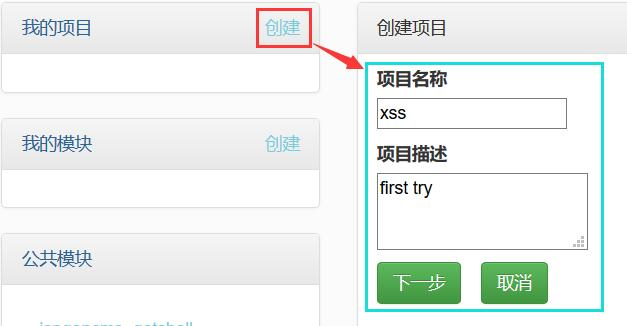
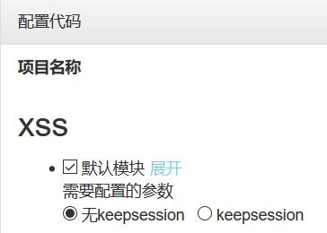
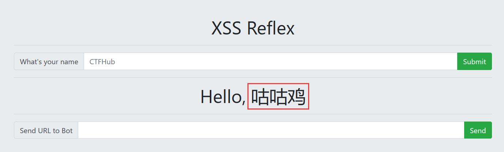
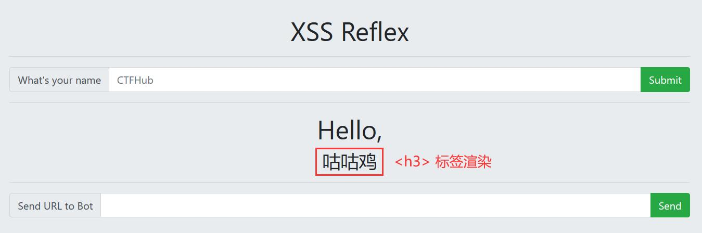
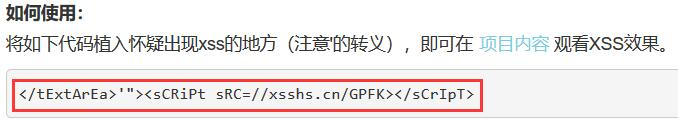
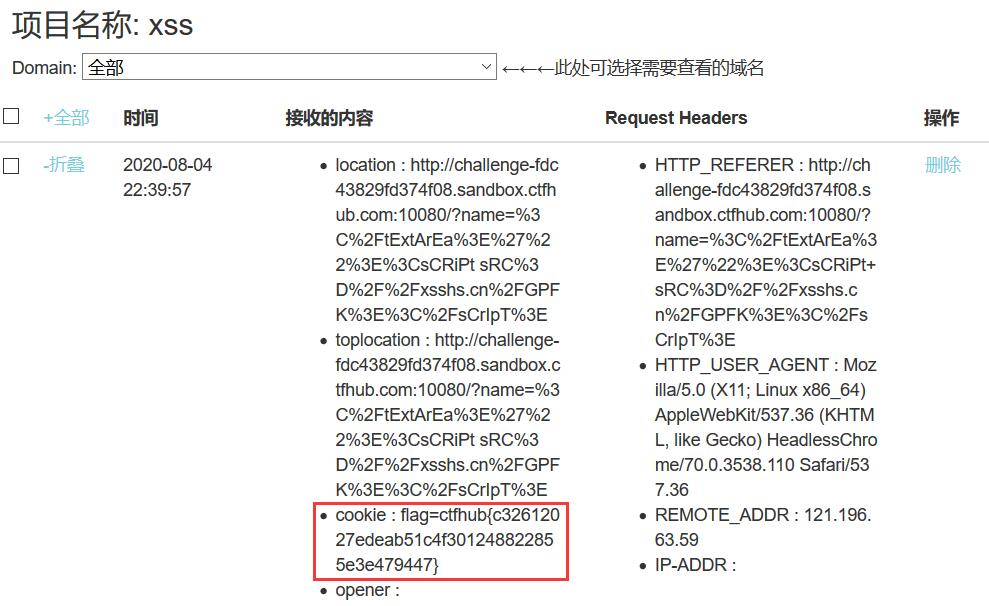

## 反射型 XSS

反射型跨站脚本（Reflected Cross-Site Scripting）是最常见，也是使用最广的一种，可将恶意脚本附加到 URL 地址的参数中。

反射型 XSS 的利用一般是攻击者通过特定手法（如电子邮件），诱使用户去访问一个包含恶意代码的 URL，当受害者点击这些专门设计的链接的时候，恶意代码会直接在受害者主机上的浏览器执行。此类 XSS 通常出现在网站的搜索栏、用户登录口等地方，常用来窃取客户端 Cookies 或进行钓鱼欺骗。

本题需要掌握的是对客户端 Cookies 的窃取。

## 解题思路

- 在 [XSS 平台](https://xsshs.cn/xss.php?do=login) 注册并登录
- 创建项目 

- 配置代码中选择默认模块就可以了(<ゝωΦ) 

- 再来看看题目对应的网站，在`What's your name`处填入内容并提交，提交内容会显示在页面上 

- 使用`<h3>`标签进行测试，证明显示的内容没有被过滤 

- `Send URL to Bot`应该是充当其他用户来对提供的链接进行访问
- 将以下内容粘贴至`What's your name`并提交表单 

- 提交表单后，复制链接并粘贴到`Send URL to Bot`提交，即可在项目内容中查看到 flag 

## 参考资料

- [XSS Cross-site Scripting Attack](https://ctf-wiki.github.io/ctf-wiki/web/xss-zh/)