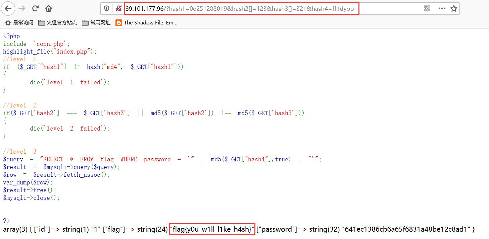

## 解题思路

- 首页给出了源码
    ```php
    <?php
    include 'conn.php';
    highlight_file("index.php");
    //level 1
    if ($_GET["hash1"] != hash("md4", $_GET["hash1"]))
    {
        die('level 1 failed');
    }
    //level 2
    if($_GET['hash2'] === $_GET['hash3'] || md5($_GET['hash2']) !== md5($_GET['hash3']))
    {
        die('level 2 failed');
    }
    //level 3
    $query = "SELECT * FROM flag WHERE password = '" . md5($_GET["hash4"],true) . "'";
    $result = $mysqli->query($query);
    $row = $result->fetch_assoc();
    var_dump($row);
    $result->free();
    $mysqli->close();
    ?>
    ```
- 在使用`==`或`!=`进行比较时，如果以`0e`开头的字符串，`0e`后跟的所有字符都是数字，那么整个字符串会按科学计数法计算，即是 $0$，暴力查找，通过 level 1
    ```php
    <?php
    $i = 0;
    while (true)
    {
        $n = "0e".($i++);
        $h = hash("md4", $n);
        if($n == $h)
        {
            printf($n);
            break;
        }
    }
    ?>
    ```
    ```bash
    $ php .\gethash1.php
    0e251288019
    ```
- level 2 出现`===`和`!==`，既判断参数的值也判断参数的类型，计算哈希的结果是字符串类型，但`md5`无法处理数组，可以使用任意两个不相等的数组绕过
- level 3 为 SQL 注入，需要绕过`md5($str,true)`，网上检索到可供使用的字符串有`ffifdyop`和`129581926211651571912466741651878684928`，经`md5`之后转 ASCII 的字符串中包含分别包含`' or '6`和`' or '8`
- 通过 level 1、2、3 即可获得 Flag<br>


## 参考资料

- [Magic Hashes | WhiteHat Security](https://www.whitehatsec.com/blog/magic-hashes/)