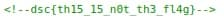

## 题目

A quick teaser to get yourself ready for the challenges to come! Just look for/at the flag and perhaps try your hand at some frontend tomfoolery?

## 解题思路

- 查看页面源码，看到不是 Flag 的无效注释<br>

- 按照题目提示看看其他前端相关的文件，在 `index.js` 发现了一段 Base64 编码的字符串【然后是 Rickroll...】
    ```js
    // aHR0cHM6Ly93d3cueW91dHViZS5jb20vd2F0Y2g_dj1kUXc0dzlXZ1hjUQ
    // since this a warmup, i'll let you know that this is base64 encoded
    // and you should check the yt comments of the decoded link
    ```
- 最终在 `styles.css` 里发现了！还给出了加密方式 (ΦˋωˊΦ)＝З
    ```css
    .contain-flag::after {
    z-index: -64209;
    caesar-cipher: +3;
    flag: "gvf{zh0frph_wr_ghfrqvwuxfwi}";
    }
    ```
- 愉快地解密，然后提交获得错误提示！What？！! :(
- 多次无修改提交后把目光集中在了特殊的 `0` 身上
- 最后需要把 `0` 改成 `o` 再解密，或者直接修改解密结果，最终 Flag：`dsc{welcome_to_deconstructf}`