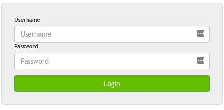
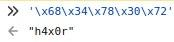

## 解题思路

- 题目只有一个登录表单<br>

- 查看 `Login` 按钮关联的 JS 代码

    ```js
    $(".c_submit").click(function(event) {
        event.preventDefault();
        var k = CryptoJS.SHA256("\x93\x39\x02\x49\x83\x02\x82\xf3\x23\xf8\xd3\x13\x37");
        var u = $("#cuser").val();
        var p = $("#cpass").val();
        var t = true;

        if(u == "\x68\x34\x78\x30\x72") {
            if(!CryptoJS.AES.encrypt(p, CryptoJS.enc.Hex.parse(k.toString().substring(0,32)), { iv: CryptoJS.enc.Hex.parse(k.toString().substring(32,64)) }) == "ob1xQz5ms9hRkPTx+ZHbVg==") {
                t = false;
            }
        } else {
            $("#cresponse").html("<div class='alert alert-danger'>Wrong password sorry.</div>");
            t = false;
        }
        if(t) {
            if(document.location.href.indexOf("?p=") == -1) {
                document.location = document.location.href + "?p=" + p;
            }
        }
    });
    ```

    - 直接把 `\x68\x34\x78\x30\x72` 丢到控制台即可获取用户名<br>


    - 接下来是判断输入密码的 AES 加密结果是否与指定字符串的值相等，由于加密的密钥和初始向量都已知，直接解密就可以了

        ```js
        var k = CryptoJS.SHA256("\x93\x39\x02\x49\x83\x02\x82\xf3\x23\xf8\xd3\x13\x37");
        var c = "ob1xQz5ms9hRkPTx+ZHbVg==";
        CryptoJS.enc.Utf8.stringify(CryptoJS.AES.decrypt(c, CryptoJS.enc.Hex.parse(k.toString().substring(0,32)), { iv: CryptoJS.enc.Hex.parse(k.toString().substring(32,64)) }))
        // Output: PassW0RD!289%!*
        ```

- 获得用户名和密码后 Login 就能获得 Flag 了 ΦωΦ

## 参考资料

- [CryptoJS - CryptoJS](https://cryptojs.gitbook.io/docs/#ciphers)