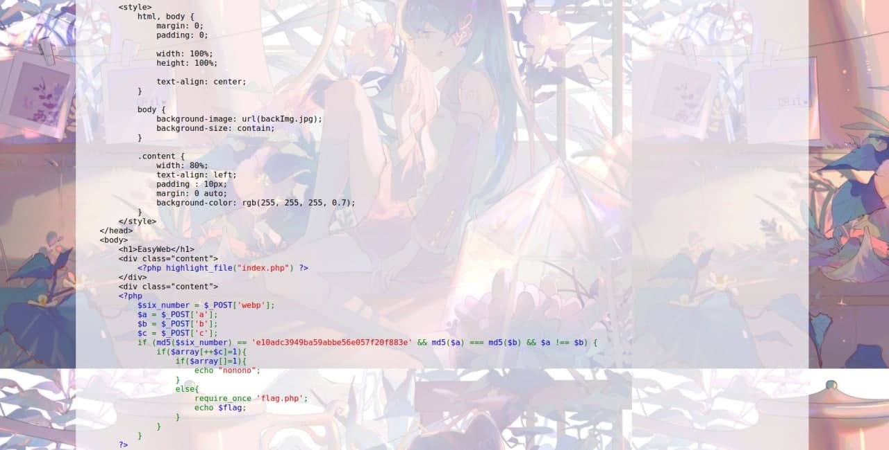

## Hint

这个图片真好看呀，没啥隐藏的东西吧

## 解题思路

- 首页是源码以及**好看**（ミク确实好看）的背景图<br>

    ```html
    <html>
        <head>
            <meta http-equiv="Content-Type" content="text/html;charset=UTF-8">
            <title>EasyWeb</title>

            <style>
                html, body {
                    margin: 0;
                    padding: 0;
                    width: 100%;
                    height: 100%;
                    text-align: center;
                }
                body {
                    background-image: url(backImg.jpg);
                    background-size: contain;
                }
                .content {
                    width: 80%;
                    text-align: left;
                    padding : 10px;
                    margin: 0 auto;
                    background-color: rgb(255, 255, 255, 0.7);
                }
            </style>
        </head>
        <body>
            <h1>EasyWeb</h1>
            <div class="content">
                <?php highlight_file("index.php") ?>
            </div>
            <div class="content">
            <?php
                $six_number = $_POST['webp'];
                $a = $_POST['a'];
                $b = $_POST['b'];
                $c = $_POST['c'];
                if (md5($six_number) == 'e10adc3949ba59abbe56e057f20f883e' && md5($a) === md5($b) && $a !== $b) {
                    if($array[++$c]=1){
                        if($array[]=1){
                            echo "nonono";
                        }
                        else{
                            require_once 'flag.php';
                            echo $flag;
                        }
                    }
                } 
            ?>
            </div>
        </body>
    </html>
    ```
- `e10adc3949ba59abbe56e057f20f883e` 在线 MD5 解码后得到 `123456`
- 关于 `md5($a) === md5($b) && $a !== $b` 可以参考 [Web - Funhash](funhash.md)，传入两个不同的数组即可
- 当数组赋值未指定键值（如`$array[]=1`）时，将取当前（上次数组重新索引后存在过的）最大整数索引值加 1，若还没有整数索引，则键值为 0
    - 64 位系统下的整数溢出
    ```php
    <?php
    $large_number = 9223372036854775807;
    var_dump($large_number);                     // int(9223372036854775807)

    $large_number = 9223372036854775808;
    var_dump($large_number);                     // float(9.2233720368548E+18)

    $million = 1000000;
    $large_number =  50000000000000 * $million;
    var_dump($large_number);                     // float(5.0E+19)
    ?>
    ```
    - `$array[++$c]=1`需要能够成功赋值，而`$array[]=1`（相当于`$array[$c+2]=1`）赋值失败才能获得`$flag`，那么`$c`的值应为 $9223372036854775806$
- 由于`$_POST`默认只能接受到`Content-Type: application/x-www-form-urlencoded`的数据，因此以 GET 请求为基础修改并发送 POST 请求时，除了修改请求方法、添加请求主体外，要记得在请求头添加`Content-Type`字段
- 获得`$flag`的内容
    ```bash
    你觉得就这么简单吗？？？，可以告诉你密码哦！
    password: xluoyyds123456@@@ 
    ```
- 密码？(ŏωŏ)密码肯定是用在别的地方啦~根据提示从`/backImg.jpg`下载背景图片（实际上下载下来的是 PNG…）
- 然后是图片类题目的「常规操作」
    ```bash
    $ binwalk backImg.png 

    DECIMAL       HEXADECIMAL     DESCRIPTION
    --------------------------------------------------------------------------------
    0             0x0             PNG image, 1054 x 745, 8-bit/color RGBA, non-interlaced
    1522188       0x173A0C        Zip archive data, encrypted at least v2.0 to extract, compressed size: 43, uncompressed size: 36, name: trueflag.txt
    1522367       0x173ABF        End of Zip archive, footer length: 22

    $ dd if=backImg.png of=res.zip skip=1522188 bs=1
    ```
- 输入密码即可获得压缩包内的 Flag：`newsctf{this_1s_veryveryveryeasyweb}`

## 参考资料

- [PHP: Integer 整型 - Manual](https://www.php.net/manual/zh/language.types.integer.php)
- [PHP: Array 数组 - Manual](https://www.php.net/manual/zh/language.types.array.php)