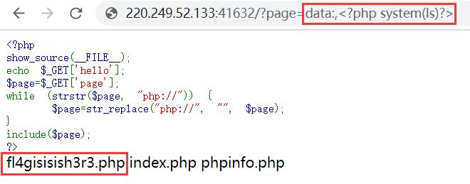
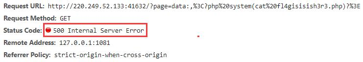
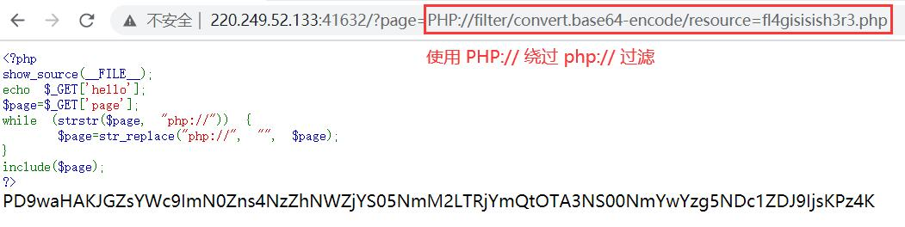

## 题目

```html
<?php
show_source(__FILE__);
echo $_GET['hello'];
$page=$_GET['page'];
while (strstr($page, "php://")) {
    $page=str_replace("php://", "", $page);
}
include($page);
?>
```

## 解题思路

- 远程文件包含，先查看当前目录下的文件，利用 Data URLs，发现可疑文件`fl4gisisish3r3.php`<br>

- 想`cat`一下`fl4gisisish3r3.php`，结果返回`500`(╥ω╥)<br>

- 利用 PHP 流 filter<br>

- Base64 解码得
    ```php
    <?php
    $flag="ctf{876a5fca-96c6-4cbd-9075-46f0c89475d2}";
    ?>
    ```

## 参考资料

[PHP Code Auditing - CTF Wiki](https://ctf-wiki.github.io/ctf-wiki/web/php/php-zh/)